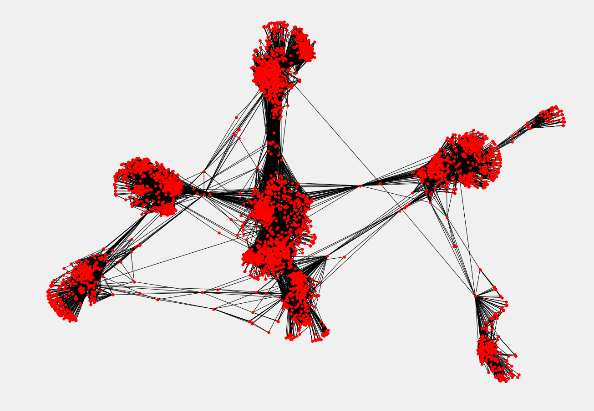

# 5大必知的图算法，附Python代码


## 1:连通分量  
  
将上图中的连通分量算法近似看做一种硬聚类算法，该算法旨在寻找相关数据的簇类。  
举一个例子：假设拥有连接世界上任意城市的路网数据，我们需要找出世界上所有的大陆，以及他们所包含的城市。我们该如何实现这一目标呢？  
基于BFS/DFS的连通分量算法能够达成这一目的，（深度优先和广度优先）.   
接下来，我们使用Networkx 实现这一算法。  


**代码**     
使用python中的Networkx模块来创建和分析图数据库。如下面的示意图所示，图中包含了各个城市和它们之间距离的信息。    
  首先，创建边的列表，料表中每个元素包含两个城市的名称，以及它们之间的距离。 

  


```python
edgelist = [['Mannheim', 'Frankfurt', 85], ['Mannheim', 'Karlsruhe', 80], ['Erfurt', 'Wurzburg', 186], ['Munchen', 'Numberg', 167], ['Munchen', 'Augsburg', 84], ['Munchen', 'Kassel', 502], ['Numberg', 'Stuttgart', 183], ['Numberg', 'Wurzburg', 103], ['Numberg', 'Munchen', 167], ['Stuttgart', 'Numberg', 183], ['Augsburg', 'Munchen', 84], ['Augsburg', 'Karlsruhe', 250], ['Kassel', 'Munchen', 502], ['Kassel', 'Frankfurt', 173], ['Frankfurt', 'Mannheim', 85], ['Frankfurt', 'Wurzburg', 217], ['Frankfurt', 'Kassel', 173], ['Wurzburg', 'Numberg', 103], ['Wurzburg', 'Erfurt', 186], ['Wurzburg', 'Frankfurt', 217], ['Karlsruhe', 'Mannheim', 80], ['Karlsruhe', 'Augsburg', 250],["Mumbai", "Delhi",400],["Delhi", "Kolkata",500],["Kolkata", "Bangalore",600],["TX", "NY",1200],["ALB", "NY",800]]
```

然后，使用Networkx创建图：


```python
import networkx as nx
```


```python
g = nx.Graph()
for edge in edgelist:
    g.add_edge(edge[0], edge[1], weight = edge [2])
```

现在，我们想从这张图中找出不同的大陆及其包含城市。我们可以使用连通分量算法来执行此操作：


```python
for i, x  in enumerate(nx.connected_components(g)):
    print('CC'+str(i)+':',x)
#输出结果对应上面的3个连通分量
```

    CC0: {'Erfurt', 'Augsburg', 'Karlsruhe', 'Kassel', 'Munchen', 'Frankfurt', 'Mannheim', 'Wurzburg', 'Numberg', 'Stuttgart'}
    CC1: {'Mumbai', 'Kolkata', 'Delhi', 'Bangalore'}
    CC2: {'ALB', 'NY', 'TX'}
    

从结果可以看出，只需要使用边缘和顶点，我们就能在数据中心找到不同的连通分量。
这个算法非常的简单

##  应用场景
1. 零售： 很多客户使用大量账户，可以利用连通分量算法寻找数据集中的不同簇类。假设使用相同信用卡的客户 ID 存在连边（edges），或者将该条件替换为相同的住址，或者相同的电话等。一旦我们有了这些连接的边，就可以使用连通分量算法来对客户 ID 进行聚类，并对每个簇类分配一个家庭 ID。然后，通过使用这些家庭 ID，我们可以根据家庭需求提供个性化建议。此外，通过创建基于家庭的分组功能，我们还能够提高分类算法的性能。
2. 财务：我们可以利用这些家庭 ID 来识别金融欺诈。如果某个账户曾经有过欺诈行为，那么它的关联帐户很可能发生欺诈行为。

## 2. 最短路径
继续第一节中的例子，我们拥有了德国的城市群及其相互距离的图表。为了计算从法兰克福前往慕尼黑的最短路径，我们需要用到 Dijkstra 算法。Dijkstra 是这样描述他的算法的：  
从鹿特丹到格罗宁根的最短途径是什么？或者换句话说：从特定城市到特定城市的最短路径是什么？这便是最短路径算法，而我只用了二十分钟就完成了该算法的设计。 一天早上，我和未婚妻在阿姆斯特丹购物，我们逛累了，便在咖啡馆的露台上喝了一杯咖啡。而我，就想着我能够做到这一点，于是我就设计了这个最短路径算法。正如我所说，这是一个二十分钟的发明。事实上，它发表于1959年，也就是三年后。它之所以如此美妙，其中一个原因在于我没有用铅笔和纸张就设计了它。后来我才知道，没有铅笔和纸的设计的一个优点就是，你几乎被迫避免所有可避免的复杂性。最终，这个算法让我感到非常惊讶，而且也成为了我名声的基石之一。

——Edsger Dijkstra
于2001年接受ACM通讯公司 Philip L. Frana 的采访时的回答


----------------
万幸的是，networkx这个包里面，已经有这个函数了。我们来试试  
代码如下：  


```python
print(nx.shortest_path(g, 'Stuttgart', 'Frankfurt',weight = 'weight'))
#最短的路径应该为
```

    ['Stuttgart', 'Numberg', 'Wurzburg', 'Frankfurt']
    


```python
print(nx.shortest_path_length(g, 'Stuttgart','Frankfurt',weight='weight'))
#最短路径的距离为：
#这也太容易了吧，我的内心毫无波动，设置还有点想吃瓜
```

    503
    

使用以下的命令可以找到所有对之间的最短路径


```python
for x in nx.all_pairs_dijkstra_path(g, weight = 'weights'):
    print(x)
```

    ('Mannheim', {'Mannheim': ['Mannheim'], 'Frankfurt': ['Mannheim', 'Frankfurt'], 'Karlsruhe': ['Mannheim', 'Karlsruhe'], 'Kassel': ['Mannheim', 'Frankfurt', 'Kassel'], 'Wurzburg': ['Mannheim', 'Frankfurt', 'Wurzburg'], 'Augsburg': ['Mannheim', 'Karlsruhe', 'Augsburg'], 'Munchen': ['Mannheim', 'Frankfurt', 'Kassel', 'Munchen'], 'Erfurt': ['Mannheim', 'Frankfurt', 'Wurzburg', 'Erfurt'], 'Numberg': ['Mannheim', 'Frankfurt', 'Wurzburg', 'Numberg'], 'Stuttgart': ['Mannheim', 'Frankfurt', 'Wurzburg', 'Numberg', 'Stuttgart']})
    ('Frankfurt', {'Frankfurt': ['Frankfurt'], 'Mannheim': ['Frankfurt', 'Mannheim'], 'Kassel': ['Frankfurt', 'Kassel'], 'Wurzburg': ['Frankfurt', 'Wurzburg'], 'Karlsruhe': ['Frankfurt', 'Mannheim', 'Karlsruhe'], 'Munchen': ['Frankfurt', 'Kassel', 'Munchen'], 'Erfurt': ['Frankfurt', 'Wurzburg', 'Erfurt'], 'Numberg': ['Frankfurt', 'Wurzburg', 'Numberg'], 'Augsburg': ['Frankfurt', 'Mannheim', 'Karlsruhe', 'Augsburg'], 'Stuttgart': ['Frankfurt', 'Wurzburg', 'Numberg', 'Stuttgart']})
    ('Karlsruhe', {'Karlsruhe': ['Karlsruhe'], 'Mannheim': ['Karlsruhe', 'Mannheim'], 'Augsburg': ['Karlsruhe', 'Augsburg'], 'Frankfurt': ['Karlsruhe', 'Mannheim', 'Frankfurt'], 'Munchen': ['Karlsruhe', 'Augsburg', 'Munchen'], 'Kassel': ['Karlsruhe', 'Mannheim', 'Frankfurt', 'Kassel'], 'Wurzburg': ['Karlsruhe', 'Mannheim', 'Frankfurt', 'Wurzburg'], 'Numberg': ['Karlsruhe', 'Augsburg', 'Munchen', 'Numberg'], 'Erfurt': ['Karlsruhe', 'Mannheim', 'Frankfurt', 'Wurzburg', 'Erfurt'], 'Stuttgart': ['Karlsruhe', 'Augsburg', 'Munchen', 'Numberg', 'Stuttgart']})
    ('Erfurt', {'Erfurt': ['Erfurt'], 'Wurzburg': ['Erfurt', 'Wurzburg'], 'Numberg': ['Erfurt', 'Wurzburg', 'Numberg'], 'Frankfurt': ['Erfurt', 'Wurzburg', 'Frankfurt'], 'Munchen': ['Erfurt', 'Wurzburg', 'Numberg', 'Munchen'], 'Stuttgart': ['Erfurt', 'Wurzburg', 'Numberg', 'Stuttgart'], 'Mannheim': ['Erfurt', 'Wurzburg', 'Frankfurt', 'Mannheim'], 'Kassel': ['Erfurt', 'Wurzburg', 'Frankfurt', 'Kassel'], 'Augsburg': ['Erfurt', 'Wurzburg', 'Numberg', 'Munchen', 'Augsburg'], 'Karlsruhe': ['Erfurt', 'Wurzburg', 'Frankfurt', 'Mannheim', 'Karlsruhe']})
    ('Wurzburg', {'Wurzburg': ['Wurzburg'], 'Erfurt': ['Wurzburg', 'Erfurt'], 'Numberg': ['Wurzburg', 'Numberg'], 'Frankfurt': ['Wurzburg', 'Frankfurt'], 'Munchen': ['Wurzburg', 'Numberg', 'Munchen'], 'Stuttgart': ['Wurzburg', 'Numberg', 'Stuttgart'], 'Mannheim': ['Wurzburg', 'Frankfurt', 'Mannheim'], 'Kassel': ['Wurzburg', 'Frankfurt', 'Kassel'], 'Augsburg': ['Wurzburg', 'Numberg', 'Munchen', 'Augsburg'], 'Karlsruhe': ['Wurzburg', 'Frankfurt', 'Mannheim', 'Karlsruhe']})
    ('Munchen', {'Munchen': ['Munchen'], 'Numberg': ['Munchen', 'Numberg'], 'Augsburg': ['Munchen', 'Augsburg'], 'Kassel': ['Munchen', 'Kassel'], 'Stuttgart': ['Munchen', 'Numberg', 'Stuttgart'], 'Wurzburg': ['Munchen', 'Numberg', 'Wurzburg'], 'Karlsruhe': ['Munchen', 'Augsburg', 'Karlsruhe'], 'Frankfurt': ['Munchen', 'Kassel', 'Frankfurt'], 'Erfurt': ['Munchen', 'Numberg', 'Wurzburg', 'Erfurt'], 'Mannheim': ['Munchen', 'Augsburg', 'Karlsruhe', 'Mannheim']})
    ('Numberg', {'Numberg': ['Numberg'], 'Munchen': ['Numberg', 'Munchen'], 'Stuttgart': ['Numberg', 'Stuttgart'], 'Wurzburg': ['Numberg', 'Wurzburg'], 'Augsburg': ['Numberg', 'Munchen', 'Augsburg'], 'Kassel': ['Numberg', 'Munchen', 'Kassel'], 'Erfurt': ['Numberg', 'Wurzburg', 'Erfurt'], 'Frankfurt': ['Numberg', 'Wurzburg', 'Frankfurt'], 'Karlsruhe': ['Numberg', 'Munchen', 'Augsburg', 'Karlsruhe'], 'Mannheim': ['Numberg', 'Wurzburg', 'Frankfurt', 'Mannheim']})
    ('Augsburg', {'Augsburg': ['Augsburg'], 'Munchen': ['Augsburg', 'Munchen'], 'Karlsruhe': ['Augsburg', 'Karlsruhe'], 'Numberg': ['Augsburg', 'Munchen', 'Numberg'], 'Kassel': ['Augsburg', 'Munchen', 'Kassel'], 'Mannheim': ['Augsburg', 'Karlsruhe', 'Mannheim'], 'Stuttgart': ['Augsburg', 'Munchen', 'Numberg', 'Stuttgart'], 'Wurzburg': ['Augsburg', 'Munchen', 'Numberg', 'Wurzburg'], 'Frankfurt': ['Augsburg', 'Munchen', 'Kassel', 'Frankfurt'], 'Erfurt': ['Augsburg', 'Munchen', 'Numberg', 'Wurzburg', 'Erfurt']})
    ('Kassel', {'Kassel': ['Kassel'], 'Munchen': ['Kassel', 'Munchen'], 'Frankfurt': ['Kassel', 'Frankfurt'], 'Numberg': ['Kassel', 'Munchen', 'Numberg'], 'Augsburg': ['Kassel', 'Munchen', 'Augsburg'], 'Mannheim': ['Kassel', 'Frankfurt', 'Mannheim'], 'Wurzburg': ['Kassel', 'Frankfurt', 'Wurzburg'], 'Stuttgart': ['Kassel', 'Munchen', 'Numberg', 'Stuttgart'], 'Karlsruhe': ['Kassel', 'Munchen', 'Augsburg', 'Karlsruhe'], 'Erfurt': ['Kassel', 'Frankfurt', 'Wurzburg', 'Erfurt']})
    ('Stuttgart', {'Stuttgart': ['Stuttgart'], 'Numberg': ['Stuttgart', 'Numberg'], 'Munchen': ['Stuttgart', 'Numberg', 'Munchen'], 'Wurzburg': ['Stuttgart', 'Numberg', 'Wurzburg'], 'Augsburg': ['Stuttgart', 'Numberg', 'Munchen', 'Augsburg'], 'Kassel': ['Stuttgart', 'Numberg', 'Munchen', 'Kassel'], 'Erfurt': ['Stuttgart', 'Numberg', 'Wurzburg', 'Erfurt'], 'Frankfurt': ['Stuttgart', 'Numberg', 'Wurzburg', 'Frankfurt'], 'Karlsruhe': ['Stuttgart', 'Numberg', 'Munchen', 'Augsburg', 'Karlsruhe'], 'Mannheim': ['Stuttgart', 'Numberg', 'Wurzburg', 'Frankfurt', 'Mannheim']})
    ('Mumbai', {'Mumbai': ['Mumbai'], 'Delhi': ['Mumbai', 'Delhi'], 'Kolkata': ['Mumbai', 'Delhi', 'Kolkata'], 'Bangalore': ['Mumbai', 'Delhi', 'Kolkata', 'Bangalore']})
    ('Delhi', {'Delhi': ['Delhi'], 'Mumbai': ['Delhi', 'Mumbai'], 'Kolkata': ['Delhi', 'Kolkata'], 'Bangalore': ['Delhi', 'Kolkata', 'Bangalore']})
    ('Kolkata', {'Kolkata': ['Kolkata'], 'Delhi': ['Kolkata', 'Delhi'], 'Bangalore': ['Kolkata', 'Bangalore'], 'Mumbai': ['Kolkata', 'Delhi', 'Mumbai']})
    ('Bangalore', {'Bangalore': ['Bangalore'], 'Kolkata': ['Bangalore', 'Kolkata'], 'Delhi': ['Bangalore', 'Kolkata', 'Delhi'], 'Mumbai': ['Bangalore', 'Kolkata', 'Delhi', 'Mumbai']})
    ('TX', {'TX': ['TX'], 'NY': ['TX', 'NY'], 'ALB': ['TX', 'NY', 'ALB']})
    ('NY', {'NY': ['NY'], 'TX': ['NY', 'TX'], 'ALB': ['NY', 'ALB']})
    ('ALB', {'ALB': ['ALB'], 'NY': ['ALB', 'NY'], 'TX': ['ALB', 'NY', 'TX']})
    

**应用**  
Dijkstra 算法的变体在 Google 地图中广泛使用，用于计算最短的路线。

## 3 最小生成树
假设我们在水管工程公司或者互联网光纤公司工作，我们需要使用最小的电线（或者管道）连接图标中的所有城市。我们如何做到这一点  
  


```python
nx.draw_networkx(nx.minimum_spanning_tree(g))
# nx.minimum_spanning_tree(g) 返回距离returns a instance of type graph

```


应用

1. 最小生成树在网络设计中有着最直接的应用，包括计算机网络，电信网络，运输网络，供水网络和电网。（最小生成树最初就是为此发明的）
2. 最小生成树可用于求解旅行商问题的近似解
3. 聚类——首先构造最小生成树，然后使用类间距离和类内距离来设定阈值，从而破坏最小生成树中的某些连边，最终完成聚类的目的
4. 图像分割——首先在图形上构建最小生成树，其中像素是节点，像素之间的距离基于某种相似性度量（例如颜色，强度等），然后进行图的分割。

## 4、 网页排序（PageRank）
  
网页排序是为谷歌提供长期支持的页面排序算法。根据输入和输出链接的数量和质量，该算法对每个页面进行打分。  
我们用Facebook的数据，（下载链接会在后面给出）
首先，利用facebook用户之间的链接，我们使用一下的方法创建图  


```python
# reading the dataset
#!ls /home/tianchi/myspace/机器学习经典算法/facebook-combined.txt
fb = nx.read_edgelist('/home/tianchi/myspace/机器学习经典算法/facebook-combined.txt', create_using = nx.Graph(), nodetype = int)
```


```python
fb

```


    <networkx.classes.graph.Graph at 0x7f6004b91be0>


```python
pos = nx.spring_layout(fb)
import warnings
import matplotlib.pyplot as plt
warnings.filterwarnings('ignore')
plt.style.use('fivethirtyeight')
plt.rcParams['figure.figsize'] = (20, 15)
plt.axis('off')
nx.draw_networkx(fb, pos, with_labels = False, node_size = 35)
plt.show()
#我透你个猴子，真好看
#别问，问就是我牛逼
```





现在，我们想要找到具有高影响力的用户。直观上来讲，Pagerank 会给拥有很多朋友的用户提供更高的分数，而这些用户的朋友反过来会拥有很多朋友。


```python
pageranks = nx.pagerank(fb)
print(pageranks)
```

    {0: 0.006289602618466542, 1: 0.00023590202311540972, 2: 0.00020310565091694562, 3: 0.00022552359869430617, 4: 0.00023849264701222462, 5: 0.00020234812068977806, 6: 0.0001800186713563964, 7: 0.00026267667111515796, 8: 0.00023737300152657913, 9: 0.0006001572433028073, 10: 0.00013504865958890368, 11: 5.2591423276218314e-05, 12: 5.2591423276218314e-05, 13: 0.0003306419576230765, 14: 0.0002886439803414604, 15: 5.2591423276218314e-05, 16: 0.0001332430576919805, 17: 0.00026000987429524483, 18: 5.2591423276218314e-05, 19: 0.0003806431405636216, 20: 0.00029297537600066995, 21: 0.0006928319433106632, 22: 0.00016385672869526863, 23: 0.00040432634048828404, 24: 0.00022824011209266322, 25: 0.000800412660519768, 26: 0.0006922746319436039, 27: 9.900477693053426e-05, 28: 0.0002552192093758929, 29: 0.00019154955480122377, 30: 0.00021219645131216383, 31: 0.0002993619581806596, 32: 0.0001478893714943048, 33: 9.172093610965164e-05, 34: 9.248443396698941e-05, 35: 7.353643512923525e-05, 36: 0.00018502677914489286, 37: 5.2591423276218314e-05, 38: 0.0001412614393849646, 39: 0.0001946835965321386, 40: 0.0004956290864477818, 41: 0.00046530604538298786, 42: 9.172093610965164e-05, 43: 5.2591423276218314e-05, 44: 0.00013694286955319684, 45: 0.00015960255279117368, 46: 0.0001331236207643235, 47: 8.030042198440289e-05, 48: 0.00029272795380994824, 49: 0.00015564790905136537, 50: 0.00015285262772959926, 51: 0.00014051490911703464, 52: 8.219518722798913e-05, 53: 0.00041525518043789304, 54: 0.00013463153953485027, 55: 0.00019740128445968694, 56: 0.0008039024292749443, 57: 0.00021380181907352502, 58: 0.0002140200122994739, 59: 0.0002239373107694795, 60: 0.00011792148178155341, 61: 9.993081338694414e-05, 62: 0.0002941181873025781, 63: 9.762401994576605e-05, 64: 0.00014304317844236682, 65: 0.0001601144329388061, 66: 0.00017891995625352093, 67: 0.0007724556453836683, 68: 0.0002148787477633319, 69: 0.00014100814467777614, 70: 7.684630684627396e-05, 71: 0.00010148330553096665, 72: 0.0002733935497308621, 73: 0.00015801614677929968, 74: 5.2591423276218314e-05, 75: 0.000176009356987589, 76: 8.258166400536363e-05, 77: 0.00012062978066488576, 78: 0.00021693170124186377, 79: 0.00015290410790864956, 80: 0.00031475366122911386, 81: 0.00010752780555275149, 82: 0.00038490009645359053, 83: 0.00014051490911703464, 84: 0.00019107773185719068, 85: 0.000182837954537027, 86: 0.00015187043333662333, 87: 0.00017267094111513356, 88: 0.00028441481196072053, 89: 0.0002288806369282809, 90: 8.919860362388565e-05, 91: 0.00023737300152657913, 92: 0.0002883115329541162, 93: 0.0001837707383731244, 94: 0.0002987810478935895, 95: 0.0001805503589372988, 96: 0.00014618512832270214, 97: 0.00010958436029004845, 98: 0.0005003246722658374, 99: 0.00029937340031369975, 100: 0.0001752037770190036, 101: 0.00026633258205467343, 102: 0.00015363536196866238, 103: 0.0001881223631174337, 104: 0.0003464079223992819, 105: 0.00018133542649702883, 106: 0.0001275482626354048, 107: 0.006936420955866114, 108: 0.0002000808794352154, 109: 0.00040147225316823176, 110: 0.00015572321196293296, 111: 0.0002934993171110267, 112: 0.00010075548047141474, 113: 0.0004217680378937479, 114: 5.2591423276218314e-05, 115: 0.000417197417735314, 116: 0.0003251861861198535, 117: 0.00011250195884281504, 118: 0.00039779999591200874, 119: 0.000731907259320906, 120: 8.99138106133918e-05, 121: 0.00017194948880466565, 122: 0.0006605240791011685, 123: 0.0002085473897771233, 124: 0.00011232974058162623, 125: 7.592166875181042e-05, 126: 0.00012734157031488408, 127: 0.00024347720956291596, 128: 0.00030676784302820773, 129: 0.00012350917911145407, 130: 0.00023000741017128028, 131: 0.00017343689435242741, 132: 0.0002084674125014289, 133: 0.00023550237804358034, 134: 0.0002190581739036281, 135: 0.0001716312351638319, 136: 0.0006337403250536818, 137: 0.00033041940276419627, 138: 7.293393505303212e-05, 139: 0.00015511284188837792, 140: 0.0002204529838231728, 141: 0.0003120021058476483, 142: 0.00045088632080613167, 143: 0.000293799058628126, 144: 0.0002911632908825187, 145: 8.919860362388565e-05, 146: 0.00014443058241554708, 147: 0.0001800186713563964, 148: 0.00024626690221384403, 149: 0.0002717075425301843, 150: 0.00019408389327919988, 151: 0.00015376030165803836, 152: 0.00012492244142269063, 153: 6.212683318297321e-05, 154: 7.932370381914374e-05, 155: 0.00010298408354995629, 156: 0.00016483892073663328, 157: 0.00010600177299096029, 158: 0.00029969062732080937, 159: 0.0002046728574167513, 160: 6.9467498708458e-05, 161: 0.00027988520181350813, 162: 0.0001696723774625653, 163: 0.00012143853497887505, 164: 7.388101008374698e-05, 165: 0.00014915412045219805, 166: 0.00010901413534460111, 167: 0.00016890007322119523, 168: 0.00016671442975985684, 169: 0.0004151646984609198, 170: 0.0005074088921908394, 171: 0.00037835546625402896, 172: 0.0004407711556279399, 173: 0.00022095845526127962, 174: 0.00013034902763874113, 175: 0.0003793293986316261, 176: 0.0001761851535387656, 177: 0.0002585099773533988, 178: 0.00018869072847033037, 179: 0.00012913236759476575, 180: 0.00027674456110132414, 181: 0.0002384926470122246, 182: 0.00011527130527604324, 183: 6.368961659823045e-05, 184: 0.0002672226937983914, 185: 0.0002961999215015277, 186: 0.0004662144739323816, 187: 0.0002298856815092933, 188: 0.0005108965045625, 189: 0.00014304317844236682, 190: 0.00010282026746515356, 191: 7.61960844371223e-05, 192: 0.00017301613709081923, 193: 0.00015747266701705384, 194: 0.0002639598416875758, 195: 0.00021693170124186377, 196: 0.00018739513217123726, 197: 0.00024333864382939508, 198: 0.0002614245993622164, 199: 0.0004970049703824462, 200: 0.0005910801200346581, 201: 0.00012897541087218093, 202: 0.00010292663043672866, 203: 0.0006010225402459134, 204: 0.00029628268979026384, 205: 8.219518722798913e-05, 206: 9.39537511359226e-05, 207: 7.058161753737583e-05, 208: 0.00010922841949088755, 209: 5.2591423276218314e-05, 210: 5.2591423276218314e-05, 211: 0.00032880769401620786, 212: 0.00021432815128277834, 213: 0.0004452988684942843, 214: 0.00034035755068928064, 215: 5.2591423276218314e-05, 216: 7.316135797264995e-05, 217: 0.00015475317259206115, 218: 0.00021693170124186377, 219: 0.00018712884076495844, 220: 0.00010976491449644481, 221: 0.00012002945878746593, 222: 0.00015971963679776215, 223: 0.00028892865618871196, 224: 0.00031577258923565563, 225: 0.00023567408245664119, 226: 0.0002702688049305354, 227: 0.0003415898214315869, 228: 8.191472452896019e-05, 229: 0.00011381076457556986, 230: 0.0002556803016803672, 231: 0.00026583921687860527, 232: 0.0002807639719424711, 233: 9.172093610965164e-05, 234: 6.156088050173824e-05, 235: 9.539300445966987e-05, 236: 0.0004103191657983792, 237: 0.00014051490911703464, 238: 0.0002629615278805076, 239: 0.0006249254018258981, 240: 8.5221027342802e-05, 241: 8.58402952860923e-05, 242: 0.00031696122939207455, 243: 0.00019283583150295113, 244: 9.172093610965164e-05, 245: 0.0001492859868693686, 246: 0.00018008523286646146, 247: 8.422336345097661e-05, 248: 0.00024881859971764787, 249: 0.0003217743429280083, 250: 8.991070265063982e-05, 251: 0.0002186577290924449, 252: 0.0006698178549665441, 253: 0.00010958436029004845, 254: 0.0002402683210084692, 255: 8.58402952860923e-05, 256: 9.172093610965164e-05, 257: 0.00022446583496597443, 258: 0.00019198419452430543, 259: 0.00023737300152657916, 260: 0.00015875277218372556, 261: 0.00041232238417424825, 262: 0.00010976491449644483, 263: 0.000174636082007916, 264: 0.00015572321196293294, 265: 0.0003001024326202495, 266: 0.00025223704114129875, 267: 7.290199927340596e-05, 268: 0.00014496217780968305, 269: 0.0001363595009711932, 270: 9.478365173272161e-05, 271: 0.0007457889296014823, 272: 0.0005026915251136312, 273: 0.00021693170124186377, 274: 0.00018391243030319894, 275: 0.00023849264701222462, 276: 0.0002129760795089638, 277: 0.0007191102550992672, 278: 0.00023782844021431928, 279: 7.048157833547912e-05, 280: 0.0004836864849742454, 281: 0.00024104410648168717, 282: 9.172093610965164e-05, 283: 0.00010627204653971693, 284: 0.00024277707976167885, 285: 0.0005108820401712708, 286: 8.314465270209088e-05, 287: 5.2591423276218314e-05, 288: 8.052346987960623e-05, 289: 0.00010767448184671686, 290: 0.00017371071670678088, 291: 0.00040847130510942697, 292: 5.2591423276218314e-05, 293: 0.00010075548047141472, 294: 7.90610085730714e-05, 295: 0.0001406410799775113, 296: 0.000174636082007916, 297: 0.00027536733766239993, 298: 0.00014487530515684444, 299: 0.00028011724599831495, 300: 0.00012385035572036354, 301: 9.758455452199636e-05, 302: 0.00027312573961154436, 303: 0.0002512793677010318, 304: 0.0005761262087429726, 305: 6.940001972682072e-05, 306: 0.00021693170124186377, 307: 0.00011532702981273608, 308: 0.0002763233517743509, 309: 0.0001716312351638319, 310: 0.0002748900516265396, 311: 0.00011389444868967976, 312: 0.000512080095393576, 313: 0.00040923994446675024, 314: 0.0001724333430201253, 315: 0.0006036352914088951, 316: 6.581490012111381e-05, 317: 0.00011894544687680495, 318: 0.00014689588991789368, 319: 0.0002288806369282809, 320: 0.0003079052496118058, 321: 9.264483661467496e-05, 322: 0.0007867992190291396, 323: 0.0004294328223425148, 324: 0.0003296617518206686, 325: 0.0004112008723720156, 326: 0.0003573420959917144, 327: 0.0001275343277989076, 328: 0.00021693170124186377, 329: 0.00039887215508337934, 330: 0.00022734496783426286, 331: 0.00024087475782315885, 332: 0.0004759881107568617, 333: 0.00017122346243625503, 334: 0.00031783678431852375, 335: 5.2591423276218314e-05, 336: 7.450715465063965e-05, 337: 0.00020454700787763102, 338: 0.00011254118253680223, 339: 0.00035337088392488884, 340: 0.0001062415404454761, 341: 0.0001547060237150074, 342: 0.00036516341178426446, 343: 0.00034645684914573835, 344: 0.00013235541919937927, 345: 0.00019837755767087979, 346: 0.00036337698446235126, 347: 0.00012427639385437277, 348: 0.0023480969727805783, 414: 0.0018002990470702262, 428: 0.0007800171933479684, 1684: 0.0063671621383068295, 1912: 0.0038769716008844974, 2814: 5.92614826904745e-05, 2838: 9.412616300685339e-05, 2885: 9.14844086337335e-05, 3003: 9.412616300685339e-05, 3173: 0.00016361053860261036, 3290: 0.00010218934785093018, 353: 0.0006135843200040693, 363: 0.0005997187647803381, 366: 0.0005863987491589501, 376: 0.0009014073664792464, 389: 0.0003982734397529576, 420: 0.00023766626442727468, 475: 0.0007853586142469624, 483: 0.0012974283300616082, 484: 0.000618903751549588, 517: 0.0006354935542122404, 526: 0.0004640796734963514, 538: 0.0005315028252191575, 563: 0.0007402839803830178, 566: 0.0005232641470441746, 580: 0.0005182120759522529, 596: 0.000364979841361992, 601: 0.00019303922647615867, 606: 0.0005412645640458649, 629: 0.00010560783373792449, 637: 0.0006673468005384602, 641: 0.0003972932300414636, 649: 8.487490306041622e-05, 651: 0.0004568833736083704, 896: 0.000581046858465082, 897: 0.00024577777689245545, 898: 0.00020644834554743395, 899: 6.820782979719053e-05, 900: 0.00012664144164796444, 901: 0.00027387912844332486, 902: 0.0002240319870480837, 903: 0.00027195283997170705, 904: 8.622663095418363e-05, 905: 0.00013518628126668174, 906: 0.00024596227546433034, 907: 8.602544938699806e-05, 908: 0.0002908612230744461, 909: 0.0001763443610945041, 910: 9.826866799463643e-05, 911: 4.2799006860415876e-05, 912: 0.00012728318142987344, 913: 0.0002574485944371577, 914: 0.0001246489707971375, 915: 0.0002285715837957689, 916: 0.00042155073063063095, 917: 0.0007331559412352088, 918: 4.2799006860415876e-05, 919: 0.00016807883770807925, 920: 9.986860943992957e-05, 921: 0.00032302842466066514, 922: 0.00014826719105621078, 923: 0.00010266838281510661, 924: 0.0003181123854132637, 925: 0.00048445676923609943, 926: 0.000102209657495408, 927: 0.00024814196901230866, 928: 0.00011502800763257399, 929: 8.709991805138604e-05, 930: 0.00032720874143332977, 931: 0.00013754558088603959, 932: 0.0002168629227312397, 933: 0.00015785707512660173, 934: 0.0002484345093697359, 935: 7.495459690145536e-05, 936: 0.0002377621403049821, 937: 9.628196372716756e-05, 938: 0.0002361051676436246, 939: 0.00016823361775247068, 940: 0.00014094245875006205, 941: 0.0002853577613802591, 942: 0.0003265502422901716, 943: 0.00012056395880675284, 944: 0.0002648345741133547, 945: 5.7820340635686784e-05, 946: 0.0004808462868290263, 947: 0.0003468492496199518, 948: 0.00024593288924623446, 949: 0.00018054254687440154, 950: 0.00011590279992571787, 951: 0.00016830874500686703, 952: 0.0002479663006015609, 953: 0.00033500805821908523, 954: 0.00028292093805197923, 955: 0.00016281199569431165, 956: 0.0001566129843512539, 957: 0.00030756080949759256, 958: 0.0002021359862021221, 959: 0.00016440541264944847, 960: 0.00031990292299102546, 961: 0.00014349431841115696, 962: 0.00019782337760932916, 963: 0.0002645360497655924, 964: 0.0002090471838507911, 965: 0.0001345611110121019, 966: 0.00032917383912957197, 967: 0.00033710699185462414, 968: 0.00024366939926893466, 969: 0.00018109397933067887, 970: 0.0001573571565734421, 971: 0.00019519211438773942, 972: 9.666502013531493e-05, 973: 0.00014546819787539705, 974: 0.00011875104533676694, 975: 0.00025885147607961057, 976: 0.00016835561555942342, 977: 0.00020658063175113263, 978: 0.0003245913712764219, 979: 0.000160484376312751, 980: 0.0003909821735516074, 981: 0.00022893197713982154, 982: 0.00023898943728226479, 983: 0.00020002521718036535, 984: 0.00022064515967865411, 985: 9.339608556313124e-05, 986: 0.00010797799474571787, 987: 9.174409785108706e-05, 988: 0.00020481298908473617, 989: 0.00018195322530312685, 990: 0.0002697420975206029, 991: 0.00016250795278429655, 992: 0.0002504028366974208, 993: 0.00044112930118303957, 994: 0.0001655460934563634, 995: 0.0002601335669397099, 996: 7.139614376553612e-05, 997: 0.00029152894799072785, 998: 7.863581356936466e-05, 999: 0.00023575298969261466, 1000: 0.00017731053369057719, 1001: 0.00023908606652052255, 1002: 0.00011513049041295974, 1003: 0.0003012121193890413, 1004: 0.0003456243919868257, 1005: 0.00012847592804797367, 1006: 0.0004130819766090034, 1007: 0.0001153999539957362, 1008: 9.461006037678737e-05, 1009: 0.00027659778183641045, 1010: 0.0002741979685878878, 1011: 0.0002372188000459627, 1012: 0.0001975604351127832, 1013: 0.00012296680328076828, 1014: 0.0004743674927784544, 1015: 0.0001851530079026346, 1016: 0.00014891397956614727, 1017: 0.0004299842159136467, 1018: 0.00025867787177658746, 1019: 0.00027914276275963504, 1020: 0.00029147427530498764, 1021: 0.00029018051059001126, 1022: 5.9296217130051714e-05, 1023: 0.00011033650985866405, 1024: 0.0002793090379268577, 1025: 0.0001971456897812757, 1026: 0.00026144336724664925, 1027: 8.962476099699392e-05, 1028: 0.00021211327965407883, 1029: 0.0003106720407140235, 1030: 0.00017676587132200148, 1031: 6.688827520224711e-05, 1032: 0.0003940051914241918, 1033: 0.000174624541262852, 1034: 5.677538772513418e-05, 1035: 0.00019562229513839198, 1036: 0.0002754977116266898, 1037: 0.00026380143986066973, 1038: 6.998849949739749e-05, 1039: 0.00010909218439714514, 1040: 0.0002164578361788249, 1041: 0.0003456830798263085, 1042: 0.00012790959069088086, 1043: 0.00018311848029952903, 1044: 0.00015293472807241615, 1045: 0.00016738377997481258, 1046: 9.037747858720843e-05, 1047: 0.00022091843481026469, 1048: 0.0003307849829623376, 1049: 0.00026811441759421075, 1050: 0.00012948770298626584, 1051: 0.0003069265394113013, 1052: 0.0004082027402606954, 1053: 0.00011669655467539639, 1054: 0.00019135840287250205, 1055: 0.0001432364577016981, 1056: 0.00022192229993578315, 1057: 9.05872985844376e-05, 1058: 8.572291853641752e-05, 1059: 0.0004699463231219344, 1060: 0.0002494003423048103, 1061: 0.00012366629639768987, 1062: 0.0001801628207582124, 1063: 9.902932052662491e-05, 1064: 0.00023917365218617903, 1065: 5.136771075973267e-05, 1066: 0.00033946979660282755, 1067: 0.0003533149214765423, 1068: 0.00017631223959639362, 1069: 9.769484641406273e-05, 1070: 0.000516456038521036, 1071: 8.120245909884616e-05, 1072: 0.0002025846735346217, 1073: 0.00011274450552647332, 1074: 0.00022341702816578687, 1075: 0.0002624928619172972, 1076: 0.00040192931295272177, 1077: 0.0001415031327049096, 1078: 0.0005069434233941202, 1079: 0.0003510529120511579, 1080: 0.00035746956609939025, 1081: 0.00016890888425411365, 1082: 0.0002716018295391539, 1083: 0.0003154618988706245, 1084: 8.582263920070492e-05, 1085: 0.0005978437664765095, 1086: 0.0006586308410766906, 1087: 0.00010573081169900839, 1088: 0.00015551383736257574, 1089: 0.00013947770969390864, 1090: 0.0001320982227128091, 1091: 0.00011221249703153786, 1092: 0.00017753139725215858, 1093: 9.383914808496173e-05, 1094: 0.0001130725738174089, 1095: 0.00016596844719041855, 1096: 4.2799006860415876e-05, 1097: 0.00029043107919105965, 1098: 0.00023334606869933525, 1099: 0.00028496356137296114, 1100: 0.00030246841303482695, 1101: 0.00035796091761789844, 1102: 0.0002615996669158582, 1103: 8.111281507684619e-05, 1104: 0.0005021739497868156, 1105: 0.00011513049041295973, 1106: 0.00021626333932468815, 1107: 0.0003995770421380192, 1108: 0.00022560179474650103, 1109: 0.0002760997883614408, 1110: 0.00026556343839401853, 1111: 0.00014662440811827503, 1112: 0.00018257635741549439, 1113: 0.00029506574662185956, 1114: 0.0002540393272859224, 1115: 0.00018463799677206268, 1116: 0.00011745739808586199, 1117: 0.000357129580286797, 1118: 0.0002812389246855117, 1119: 4.2799006860415876e-05, 1120: 0.0002517848799415945, 1121: 0.00018449576003386355, 1122: 0.000305625750191442, 1123: 0.0002487850135169597, 1124: 0.000404961909280245, 1125: 0.00033692335791498605, 1126: 0.0005661927301412855, 1127: 0.00020111991283797, 1128: 0.0003203678986378726, 1129: 0.0002867572499868538, 1130: 0.00021695552083006816, 1131: 0.00024333868463900796, 1132: 0.00040114290630736005, 1133: 8.394215523392197e-05, 1134: 0.00012764193641774768, 1135: 0.00023500580315860905, 1136: 0.00031336056677107706, 1137: 0.00023956500905618914, 1138: 0.00021171883928648342, 1139: 0.00018692356137009497, 1140: 0.00010099772150916485, 1141: 0.00015430446220093445, 1142: 0.00021818452352682227, 1143: 0.0001009085731249286, 1144: 0.00021626528983864366, 1145: 4.2799006860415876e-05, 1146: 0.0004311362514472264, 1147: 6.364481680603008e-05, 1148: 0.0003122085736533401, 1149: 0.00030618883039145643, 1150: 0.00012861299350814848, 1151: 6.713085128501084e-05, 1152: 0.00012598739478708024, 1153: 0.00039359982098898763, 1154: 0.00010740516425180536, 1155: 0.00027186370965624355, 1156: 0.0002954766329175292, 1157: 7.412594043384108e-05, 1158: 0.0003138257900201559, 1159: 0.0003858009337041251, 1160: 0.00027696029052403547, 1161: 0.0001525580506030002, 1162: 9.76196710057794e-05, 1163: 0.00029357326989572723, 1164: 0.00011112372692117538, 1165: 0.00023774380825693667, 1166: 0.0003063685641960823, 1167: 0.00020435432719955498, 1168: 8.156913349540817e-05, 1169: 0.00015855357339013954, 1170: 0.00022649904507924355, 1171: 0.00024200633345600168, 1172: 0.0003298120395816698, 1173: 0.0003922993506374338, 1174: 0.00019291007496687875, 1175: 0.0003952630295620501, 1176: 4.7072572529653175e-05, 1177: 0.00020738700433380064, 1178: 0.0001398405751772247, 1179: 0.0002824742245798413, 1180: 0.00015771249765682383, 1181: 0.00026190180481820886, 1182: 0.0002299579951934586, 1183: 0.0002355660057936211, 1184: 0.00044594950293191303, 1185: 0.000436155255007692, 1186: 0.0001535087926452121, 1187: 0.00019058115635701926, 1188: 0.00023252253086253338, 1189: 0.0002764171939373798, 1190: 0.0001973792344521003, 1191: 0.00032834742248486035, 1192: 0.00044396521442319783, 1193: 0.00012864605304467906, 1194: 0.0001020455200972126, 1195: 0.00017495491738975068, 1196: 0.00012488939910990535, 1197: 0.00018676741484247296, 1198: 0.0002453512738695081, 1199: 0.0006046332762404044, 1200: 7.32270292080428e-05, 1201: 0.0001907954385917115, 1202: 0.00016099416138802574, 1203: 0.00010792918829662194, 1204: 0.0004934679054649539, 1205: 0.00030599328009930774, 1206: 4.2799006860415876e-05, 1207: 0.00022764906199680316, 1208: 9.225307863420154e-05, 1209: 0.0002400840110062715, 1210: 0.0002662527959361039, 1211: 0.0004891572250914297, 1212: 0.00022137330016450485, 1213: 0.0001728584352313365, 1214: 0.00036440238006022054, 1215: 0.00023687811026260264, 1216: 0.00028639628185047337, 1217: 0.00028838331817818, 1218: 0.00016913175950077764, 1219: 0.0001823517016588867, 1220: 7.578039155776184e-05, 1221: 0.0003732024843607276, 1222: 0.00043236382762140756, 1223: 0.00015866069021574171, 1224: 6.734632185892268e-05, 1225: 0.00022335581309615825, 1226: 0.0002499054175572694, 1227: 0.0003891347451495123, 1228: 0.00018883628874617742, 1229: 0.00023570249884920415, 1230: 0.00036253498633886304, 1231: 0.00034867214845797027, 1232: 0.00023801476055604283, 1233: 4.955616292020414e-05, 1234: 0.00014279907402729592, 1235: 0.0004955499598163686, 1236: 0.0003212316683325721, 1237: 0.00035303117726375084, 1238: 0.0004491835163622033, 1239: 6.44480228483939e-05, 1240: 0.0001434744969135601, 1241: 0.00014088092768627908, 1242: 0.00027958118634369925, 1243: 0.0003367498702431141, 1244: 0.00011457203132793153, 1245: 0.00021133164618613248, 1246: 0.00023667927009575406, 1247: 0.00016048772071638383, 1248: 9.474074923005756e-05, 1249: 0.00013424615483533073, 1250: 0.00039254981484498154, 1251: 0.00013531497117895864, 1252: 7.279132131268566e-05, 1253: 8.120245909884615e-05, 1254: 0.00011321001359308963, 1255: 0.0003708890523081733, 1256: 0.0003930857154263292, 1257: 0.00026379118131390376, 1258: 0.0002782759608841962, 1259: 0.0003442302107847512, 1260: 0.0002667070414268487, 1261: 0.0003406571492549434, 1262: 4.5332699947320955e-05, 1263: 6.66089588936348e-05, 1264: 8.396784003692024e-05, 1265: 0.0001276292348067236, 1266: 0.0001439508508670894, 1267: 0.0003395246622273766, 1268: 0.0001261269080769583, 1269: 0.0003656061593530501, 1270: 5.623163310997624e-05, 1271: 0.0002871067131643854, 1272: 0.0002754507237652247, 1273: 0.00033765306798264527, 1274: 0.0002292680588774566, 1275: 0.0003811725880908733, 1276: 4.535448414876846e-05, 1277: 0.0005717524252620446, 1278: 0.0001419416388370759, 1279: 0.00021703151024796087, 1280: 0.0002493081361324367, 1281: 0.00021776277516093466, 1282: 0.0003380337435475858, 1283: 0.00024953625406754095, 1284: 0.00028988072723084624, 1285: 0.00018338746485295403, 1286: 0.00013572805027947313, 1287: 0.00020261266507830462, 1288: 0.0002757061989099288, 1289: 0.0002518163566987362, 1290: 0.0002700079331546176, 1291: 0.0003267347125145856, 1292: 0.00026454307940987294, 1293: 0.00015915390320103963, 1294: 0.00015919347401410473, 1295: 8.264573816377628e-05, 1296: 0.00018627975122996346, 1297: 0.00010038155887818814, 1298: 0.0003290491782421874, 1299: 0.00022624671911042427, 1300: 0.00020509501661231125, 1301: 8.090201814611159e-05, 1302: 0.00030844813741353087, 1303: 0.00025044547978628646, 1304: 0.0003037914300737618, 1305: 0.00033496389487668764, 1306: 0.00019510498374976333, 1307: 0.0002950008665298009, 1308: 0.00017357913313269225, 1309: 0.0002230748574785905, 1310: 0.00020004014303002718, 1311: 0.00018486775764211787, 1312: 0.0002681058127151503, 1313: 0.00022037259327006468, 1314: 0.00021453958274717747, 1315: 0.0002187281574618194, 1316: 0.0001763394397781185, 1317: 0.00022005486872525275, 1318: 0.00025738601757947733, 1319: 0.00022262649776441526, 1320: 0.0003858384632846437, 1321: 0.0001658349965763125, 1322: 0.00042002355528996207, 1323: 0.00024124164352257914, 1324: 0.000217026798514646, 1325: 0.00018561767839729118, 1326: 5.808584539162727e-05, 1327: 0.0002578225171954889, 1328: 0.00020916076689625208, 1329: 0.0004048201878748588, 1330: 0.00036417074829816923, 1331: 0.00041962071181784625, 1332: 0.0002721328258739908, 1333: 0.0002658567980431452, 1334: 0.0003588094159843483, 1335: 0.0003643631139242206, 1336: 0.0001774064326904007, 1337: 0.00027583270952856, 1338: 0.0004437230667678359, 1339: 0.0002995811553928503, 1340: 0.00019998190396897396, 1341: 0.00035434216959185966, 1342: 0.00010144083867098672, 1343: 0.0002598890915822993, 1344: 0.0002786516226245291, 1345: 0.000444706229205823, 1346: 6.392130505783008e-05, 1347: 0.0003609320327356506, 1348: 0.0002708579906118874, 1349: 0.00027277642515031954, 1350: 0.00017650106052978704, 1351: 0.0002086813622124575, 1352: 0.0006690772431300501, 1353: 6.649636355641702e-05, 1354: 7.136681466589654e-05, 1355: 0.0002626852175559882, 1356: 0.00018691590624782573, 1357: 0.0002267758685726611, 1358: 0.00045858392018887126, 1359: 0.00026404835296096646, 1360: 0.00034517844894093957, 1361: 0.0004212053215125311, 1362: 5.543259899733526e-05, 1363: 0.00018142968761421702, 1364: 0.00010078087628150593, 1365: 0.0001447324836711633, 1366: 0.0004297285236072958, 1367: 0.0004739846772732842, 1368: 0.00016281199569431168, 1369: 0.0002760220792685219, 1370: 0.0003256869833851937, 1371: 0.00028807586460561, 1372: 8.762841615805366e-05, 1373: 0.0003797083835733378, 1374: 0.0002652868597676199, 1375: 0.00023057585087804135, 1376: 0.0005180650615935583, 1377: 0.0005517555045777338, 1378: 0.00025897305397414873, 1379: 0.00024519040251161757, 1380: 0.0002528815236956904, 1381: 0.00014735790637253581, 1382: 0.00021661254764195493, 1383: 6.722183263956014e-05, 1384: 0.00013888859663401264, 1385: 0.0001303511162945887, 1386: 4.2799006860415876e-05, 1387: 0.00012949883279103332, 1388: 0.00025813576213616244, 1389: 0.00016002352152876434, 1390: 0.0005404067445837937, 1391: 0.0004950229194450298, 1392: 0.00018924342364817895, 1393: 0.00020487593917863567, 1394: 6.026784250834164e-05, 1395: 4.816298486380282e-05, 1396: 0.00027602909409162686, 1397: 0.00011898391044628661, 1398: 0.00016007603401582463, 1399: 0.0005031124896682366, 1400: 0.0001565687353250704, 1401: 7.70867976406291e-05, 1402: 0.00022826102159848117, 1403: 0.00014891397956614727, 1404: 0.00023990674625078994, 1405: 0.00027545826309948406, 1406: 0.0001833012767339649, 1407: 0.0001475757106936279, 1408: 0.00022553134768097888, 1409: 0.0003364433475306855, 1410: 0.00021314159307137228, 1411: 7.866073842666863e-05, 1412: 0.00016490643461655977, 1413: 0.0002868501487329899, 1414: 7.104493677087686e-05, 1415: 0.00023524721783785505, 1416: 0.0003246387966755852, 1417: 5.703371742036597e-05, 1418: 0.00015434259180580469, 1419: 0.00019387051413615892, 1420: 0.00044052248650454454, 1421: 0.00023446195712175877, 1422: 0.00011706838911806561, 1423: 0.00028929030841250017, 1424: 0.00017958485544811883, 1425: 0.0002458124690835324, 1426: 0.00030355484472775437, 1427: 0.00038574622665970003, 1428: 0.00022389665896844235, 1429: 0.0002226602510390908, 1430: 4.9378157214813366e-05, 1431: 0.000658449918146351, 1432: 0.00026518107623498964, 1433: 0.00022691733397418618, 1434: 0.00013914894578881452, 1435: 0.0002734926831444298, 1436: 0.0002007395251183983, 1437: 0.00021650941244445528, 1438: 0.00017593836133457025, 1439: 9.155262723212879e-05, 1440: 0.00016618532771341178, 1441: 0.00016001493669689403, 1442: 7.935059728172505e-05, 1443: 0.00010130450016953488, 1444: 0.0002137798896561114, 1445: 0.00010672681509065629, 1446: 0.00023294283709843788, 1447: 0.00042627966043836703, 1448: 0.0002559806064844541, 1449: 0.000288026475047747, 1450: 0.00020499969727930093, 1451: 0.00016973926757076995, 1452: 0.0002749595915384851, 1453: 0.00021321654511526273, 1454: 0.0002649816054067458, 1455: 7.020761699132413e-05, 1456: 0.00037967590267153393, 1457: 0.00019775686978148994, 1458: 0.00014692914313921805, 1459: 0.0004693489524343014, 1460: 0.0001811554009017217, 1461: 9.009626562441191e-05, 1462: 0.0003861655826987393, 1463: 6.789154841112183e-05, 1464: 0.0001797833133859858, 1465: 0.00035714080659750725, 1466: 4.2799006860415876e-05, 1467: 0.0003784789508524195, 1468: 0.00025284586166991784, 1469: 0.00042553714111860983, 1470: 0.0002426304174577409, 1471: 0.0005024648137424783, 1472: 0.0005953205894621008, 1473: 0.00034149035771362555, 1474: 7.331853986341365e-05, 1475: 0.00034183495312265736, 1476: 7.442828630617235e-05, 1477: 0.00010535527075755694, 1478: 0.00016080604005916927, 1479: 0.000387836383240857, 1480: 0.00031239491169716846, 1481: 0.0001321296775980804, 1482: 0.00034025667375277855, 1483: 0.0003013205649388051, 1484: 0.00010418308630165753, 1485: 0.0001726630468574012, 1486: 9.278407722695115e-05, 1487: 0.00035462333584401377, 1488: 0.00039136234844271454, 1489: 0.00013852369379891655, 1490: 8.698874540610197e-05, 1491: 0.00035578110149049087, 1492: 0.00011775804481402485, 1493: 0.00021588731163516708, 1494: 0.00025810681022216006, 1495: 0.0003307257300550359, 1496: 0.00033142013215924196, 1497: 0.00019180587093010735, 1498: 6.548027196780811e-05, 1499: 0.00019198895912153255, 1500: 0.00021114165902444458, 1501: 0.0001105345661375712, 1502: 0.0003537319548317353, 1503: 0.00017166579640320398, 1504: 0.00038693639018717944, 1505: 0.0005326350138835809, 1506: 7.977906909736112e-05, 1507: 0.00027183535442711255, 1508: 0.00017925718238083452, 1509: 0.00039244036959217244, 1510: 6.162951440367321e-05, 1511: 0.0002801770416039461, 1512: 0.00022543285997352123, 1513: 0.00020478565874944665, 1514: 0.00022583497311063413, 1515: 0.00034197974151646966, 1516: 0.0004398931399682929, 1517: 0.00013377925519273976, 1518: 0.00013203159542543951, 1519: 0.00015385268257684978, 1520: 0.0003554824501987937, 1521: 6.89823996395412e-05, 1522: 0.0004465716394287557, 1523: 0.000259228827761233, 1524: 0.0001436848041669418, 1525: 0.0003631146103893214, 1526: 0.0001578848652924045, 1527: 0.0001041201142916083, 1528: 0.0002434016559180252, 1529: 0.0002917728034028545, 1530: 0.000299418002330981, 1531: 0.00018377224605434646, 1532: 0.00013963396220257183, 1533: 0.00027975704615902495, 1534: 0.00028565066829643184, 1535: 0.00021595458742265064, 1536: 0.0005427539036924439, 1537: 0.0001646182275547579, 1538: 0.00022930269179544606, 1539: 0.00024181614087968872, 1540: 0.00031024091734247345, 1541: 0.0002420306857093986, 1542: 0.00018070786188726092, 1543: 0.00022311786560997776, 1544: 0.00014401356261731945, 1545: 0.0003143039832511536, 1546: 6.927202262023892e-05, 1547: 0.0003450562122995888, 1548: 0.0003089051463723264, 1549: 0.00034668202241951634, 1550: 0.00019330017094741368, 1551: 0.00048358139317174886, 1552: 9.570644825755664e-05, 1553: 0.0002387288759029382, 1554: 0.0004594350663254521, 1555: 0.0003272882931408666, 1556: 0.0001061991715217841, 1557: 0.00043578498670160084, 1558: 5.0756565791118173e-05, 1559: 0.0005279078213323423, 1560: 4.2799006860415876e-05, 1561: 0.0001844714708251247, 1562: 0.00012982184974030377, 1563: 0.00033697198143294726, 1564: 0.00015970596633550625, 1565: 0.000278058599467227, 1566: 0.0001759718715489091, 1567: 0.00030373478339828033, 1568: 0.00023615987679801627, 1569: 0.0003019628852080536, 1570: 0.00037217465231076835, 1571: 0.0002142855052585309, 1572: 0.00015220057128668914, 1573: 0.0004151426565948407, 1574: 0.0004214808175930352, 1575: 0.00014119781769057608, 1576: 0.00031118602121374904, 1577: 0.0005301520358229052, 1578: 0.00018666170016259822, 1579: 7.300972807338987e-05, 1580: 0.00025464724539187326, 1581: 4.2799006860415876e-05, 1582: 0.00021824803313353884, 1583: 0.00044501182119018306, 1584: 0.0006345434577260146, 1585: 0.00018617765809967262, 1586: 9.037747858720843e-05, 1587: 0.000254223561802639, 1588: 0.0002244197811083669, 1589: 0.0005697724164080931, 1590: 0.00031040552046066, 1591: 0.00047857976939304404, 1592: 0.00014007958555887728, 1593: 0.000301115031210909, 1594: 0.00012097622821603455, 1595: 0.00020362722680730783, 1596: 0.00035827256603478466, 1597: 0.000329315612827998, 1598: 0.0004028967107085219, 1599: 0.00011624170119823446, 1600: 0.0003478808526951376, 1601: 0.0002590731696138422, 1602: 0.00010328673715434204, 1603: 0.00040880530199082697, 1604: 0.0004465162828494892, 1605: 0.0002727684100648596, 1606: 0.00020239465678994096, 1607: 9.711491284132364e-05, 1608: 0.00034355841629702733, 1609: 0.00028395694881573743, 1610: 0.0005003641267370854, 1611: 0.000338637189228026, 1612: 0.000533117408334378, 1613: 0.00051144316126469, 1614: 0.00022962268203824749, 1615: 0.0002330895191010315, 1616: 0.00031239934792997155, 1617: 0.0003416128046572595, 1618: 0.00012591605579589902, 1619: 0.0003322960741458966, 1620: 0.0004260929273799294, 1621: 0.0005402959111513505, 1622: 0.0005030088722789562, 1623: 0.0002927779634578223, 1624: 0.0002613270140899115, 1625: 0.00017628738684777553, 1626: 0.00021636022361970651, 1627: 8.962476099699392e-05, 1628: 0.00038292989120884723, 1629: 0.00018852416267779344, 1630: 0.00042495625222702105, 1631: 8.724299911348013e-05, 1632: 0.00024293056507277544, 1633: 0.00017602401758888566, 1634: 0.00028028837768165235, 1635: 0.00018070885278193328, 1636: 0.00035617840297531156, 1637: 0.00031618071120018636, 1638: 0.00018316014383876965, 1639: 0.0002636319949550248, 1640: 0.0001031252739576164, 1641: 0.00014687577425313823, 1642: 0.00027768140357387647, 1643: 0.00029260658607534564, 1644: 0.00022733937648329442, 1645: 0.00034416479822984273, 1646: 0.00012365219581112778, 1647: 0.00024474457881603316, 1648: 0.00020910667079641928, 1649: 0.0001971349630434756, 1650: 0.00017302960382143193, 1651: 5.110828760930632e-05, 1652: 0.00024597674943933716, 1653: 0.00022591343169829322, 1654: 9.065830178848195e-05, 1655: 0.00026945765829809016, 1656: 0.00029065001460233734, 1657: 9.826866799463643e-05, 1658: 0.00012780874167853942, 1659: 0.00025147773963316185, 1660: 0.0001856736165348695, 1661: 0.00038845673563118186, 1662: 0.0004115792917375865, 1663: 0.0006645344956311115, 1664: 9.401529963756513e-05, 1665: 0.0003631195589899171, 1666: 0.0003183871777442502, 1667: 0.00022668347325922623, 1668: 0.0003498495963203511, 1669: 0.00039267433943631226, 1670: 0.00010203391912455868, 1671: 0.00023367867920389418, 1672: 0.0002083338443516852, 1673: 0.0002575075438205427, 1674: 0.00018565184323034037, 1675: 0.0003686458459638072, 1676: 0.00017967819151931114, 1677: 0.00023030374767802567, 1678: 0.00014556184518613391, 1679: 0.00018437934215107384, 1680: 0.000299284609519224, 1681: 0.00019088092730746583, 1682: 0.00019352385809176894, 1683: 0.00038008655671643914, 1685: 0.00028770871814732553, 1686: 0.00024169171225105164, 1687: 0.00039525648643362675, 1688: 0.0003348865657478898, 1689: 0.00035675242448354516, 1690: 4.844579577007397e-05, 1691: 0.0002851480684493499, 1692: 0.00031428726867583257, 1693: 8.052317586850543e-05, 1694: 0.00024865029353778625, 1695: 0.0002034262347575117, 1696: 0.00012028833479559961, 1697: 8.167490455131924e-05, 1698: 0.00018040236385602362, 1699: 0.0002760495165299242, 1700: 8.97278035339486e-05, 1701: 0.00010400246267477952, 1702: 0.0002626405283911095, 1703: 0.000483903591236227, 1704: 0.00016244696901794833, 1705: 0.00026416462966083405, 1706: 0.00023065534728998322, 1707: 0.0005128931092303408, 1708: 0.0001184618279036763, 1709: 0.0004255269187998179, 1710: 8.448599410274946e-05, 1711: 7.894585465006014e-05, 1712: 0.0003072848582326304, 1713: 6.683948717594335e-05, 1714: 0.0005151324228978028, 1715: 0.0003046019293966422, 1716: 0.0002878511440938206, 1717: 0.00040167053680760593, 1718: 0.0005256521195978914, 1719: 0.00019057857483503984, 1720: 0.0002512210364381102, 1721: 0.0003327331173251732, 1722: 0.00021330146927019467, 1723: 0.0001641830260603619, 1724: 0.00020403084458791782, 1725: 0.00038086070023348546, 1726: 0.00019574926782602343, 1727: 0.00021370721878361519, 1728: 0.00017034796110835702, 1729: 0.0003995767552811669, 1730: 0.0006613437938392166, 1731: 9.636257657957018e-05, 1732: 0.0002496189596326227, 1733: 0.0003019460069545603, 1734: 0.00017278056714013166, 1735: 0.00032101315371452715, 1736: 0.00043807852930130965, 1737: 0.00023830457681602477, 1738: 0.00018293080136277885, 1739: 0.00014067020599433988, 1740: 0.00023600311862220801, 1741: 0.0003133015041782236, 1742: 0.00038481313821824877, 1743: 0.00020683281687770207, 1744: 0.00024096154886850226, 1745: 0.00014736273074456217, 1746: 0.0005642596543666136, 1747: 0.00018950759094972224, 1748: 0.00012147341591981822, 1749: 0.00013675828417238474, 1750: 0.00036608977208320515, 1751: 0.00025870192616249713, 1752: 0.00033207344117944584, 1753: 0.00025412760066634955, 1754: 0.0001941981633391933, 1755: 4.6933267048551315e-05, 1756: 0.00014083532729386596, 1757: 0.00037398895511629086, 1758: 0.0002479315646754127, 1759: 8.583293024958689e-05, 1760: 7.138194750500268e-05, 1761: 0.00041289183975085525, 1762: 6.543625068283595e-05, 1763: 0.00021088759197986578, 1764: 0.00014129255831180914, 1765: 0.0002352601161608256, 1766: 0.0002565393806834256, 1767: 0.00023696934504001844, 1768: 0.0006160685975883842, 1769: 0.00011460393975512649, 1770: 0.0003347796406758962, 1771: 9.476270456159769e-05, 1772: 0.0002007888433353799, 1773: 0.00016481216333487478, 1774: 0.00017337472880865198, 1775: 6.188674804288173e-05, 1776: 9.826866799463641e-05, 1777: 6.998809450523341e-05, 1778: 0.00025571554061906953, 1779: 0.00017428596827479833, 1780: 0.0001320429518996401, 1781: 0.00018973876817241961, 1782: 0.00022652728799479156, 1783: 0.0006557046711928997, 1784: 0.00015461941770031202, 1785: 0.0002423728596989137, 1786: 0.00046159614487836044, 1787: 0.0003003675265597523, 1788: 0.00015705789745862518, 1789: 0.00030282114363962173, 1790: 0.00022323377725046918, 1791: 0.00039596094690705027, 1792: 8.248863005356103e-05, 1793: 0.00040861788143362765, 1794: 0.00034182045485139136, 1795: 0.000265792515357353, 1796: 0.0002171376497410208, 1797: 7.485236958668693e-05, 1798: 0.0002750478578407943, 1799: 0.00042905420514003924, 1800: 0.0006984646532952207, 1801: 0.0001653319822708798, 1802: 0.00011898740832474057, 1803: 0.00024307448023712909, 1804: 0.000544507924335705, 1805: 0.00012286798002161486, 1806: 0.0002954230180940253, 1807: 0.00031378655879212437, 1808: 0.00016037722879952472, 1809: 0.00033237744804248817, 1810: 0.0002984790030558393, 1811: 0.00020802581714196455, 1812: 0.00022562171135876469, 1813: 0.00048062132421869874, 1814: 0.0001120517059745461, 1815: 0.00018657401484393465, 1816: 0.00036878728577764306, 1817: 0.00011444442327738243, 1818: 0.00018333001958078046, 1819: 0.00027736665289547144, 1820: 0.00033608169470018, 1821: 0.00010746596533456978, 1822: 0.00013638531479827516, 1823: 0.0003664982266996297, 1824: 0.0002907763462914162, 1825: 0.0002767597758966532, 1826: 0.0002965128743345723, 1827: 0.0005855646489119554, 1828: 0.0003048581793048018, 1829: 0.00014601351419421736, 1830: 0.00011944678901266108, 1831: 0.0003361050045661161, 1832: 0.00015989943102750676, 1833: 0.0005311171738532414, 1834: 4.2799006860415876e-05, 1835: 0.0005452217677097285, 1836: 0.00011778726031945257, 1837: 0.0003049632855795691, 1838: 0.0001045171434671576, 1839: 0.0004679126768172419, 1840: 0.0001305785029762298, 1841: 0.00023972528509768546, 1842: 0.00034724021044984593, 1843: 0.000152301706817478, 1844: 0.0004161829315453614, 1845: 0.0003285828707863792, 1846: 0.00017212130050338814, 1847: 0.00022328368797239824, 1848: 0.00019439399947711084, 1849: 0.0003378147312463941, 1850: 0.0001836376248090905, 1851: 0.0001796771802091172, 1852: 0.0001459484151740429, 1853: 0.00010185962052182009, 1854: 5.552608050796205e-05, 1855: 7.441029160759654e-05, 1856: 5.649527896122791e-05, 1857: 0.0003413169852528396, 1858: 0.00020852714361578923, 1859: 0.00022772821585031599, 1860: 0.00015850982505676727, 1861: 0.00033186495143578386, 1862: 0.0002657066144415949, 1863: 0.00022651787084259544, 1864: 0.00032297159082819883, 1865: 8.307998718994011e-05, 1866: 0.00028849561482605047, 1867: 0.0003683100572831846, 1868: 0.0003541818854761426, 1869: 0.00013067949886687674, 1870: 0.00015817836183252483, 1871: 0.0004003134641938549, 1872: 0.000251906533853478, 1873: 0.00020393388700223726, 1874: 7.47443483932418e-05, 1875: 0.00015732283278386002, 1876: 0.0003863470009611244, 1877: 0.00020777758223805895, 1878: 0.00022721052942844007, 1879: 0.0004187585930437964, 1880: 0.00026006609836769315, 1881: 0.0002984013878450788, 1882: 0.0003126048526257981, 1883: 0.00012116610592074152, 1884: 0.00016857415563043552, 1885: 0.00016035165202174162, 1886: 0.0003181150342663185, 1887: 8.45392306410403e-05, 1888: 0.0007117172673725058, 1889: 0.0002215803831892535, 1890: 0.00014823676751732947, 1891: 0.00023171042759129453, 1892: 0.00011848125995158709, 1893: 0.00040194983089196035, 1894: 0.00032290772746524976, 1895: 0.0002953172710626621, 1896: 0.00013612313422335794, 1897: 0.0002259077906960176, 1898: 0.0003005240797864737, 1899: 0.0003732670170165506, 1900: 0.00011431104983562071, 1901: 0.0001265213250392914, 1902: 0.0003774796513775793, 1903: 0.00020420495504935466, 1904: 0.00022697162281041982, 1905: 0.00012352919938711754, 1906: 0.0001722668977907821, 1907: 0.0001663971207873966, 1908: 0.00011365704035169833, 1909: 0.00025813246617178054, 1910: 0.00025652722907883093, 1911: 0.0002374139061895051, 1926: 0.00046287067195155293, 1932: 0.00028969124692031787, 1939: 0.0002608581801674639, 1945: 0.00044095188932798693, 1951: 0.000327513413137173, 1955: 0.0002885035049140603, 1972: 0.00034747449129613747, 1973: 0.00032205467017193363, 1976: 0.00021434818212007645, 1991: 0.0002601884656299282, 1995: 0.00032473953971594207, 1998: 0.0002827785409404928, 2001: 0.00030665856658635923, 2004: 0.00026288635677155874, 2007: 0.0004933754393588056, 2009: 0.00023441184560671753, 2018: 0.00028618891301299885, 2024: 0.0002744294990240175, 2027: 0.00023414673587767346, 2032: 0.0004465435819263741, 2038: 0.00043013719741530034, 2039: 0.00033940799933502766, 2042: 0.0003008416089485469, 2054: 0.0004923090509451873, 2068: 0.0004317188979335933, 2071: 0.000367763653393938, 2072: 0.0003972658418693662, 2081: 0.0005178680655169713, 2102: 0.0004119790061537732, 2111: 0.0005576313541167952, 2116: 0.0003151054256371983, 2117: 0.00048679567633611384, 2127: 0.0003552402029266649, 2128: 0.0003097283166426656, 2133: 0.0005787552543302723, 2135: 0.00027635843233988236, 2138: 0.0004182978201356499, 2143: 0.0003420198718446766, 2153: 0.0004136366974734734, 2157: 0.00021119783976393194, 2171: 0.0003360021212296174, 2174: 0.0003857677805671481, 2180: 0.0003460444633494391, 2183: 0.00040029051669168486, 2187: 0.00044260522004914427, 2189: 0.0003335111438626637, 2199: 0.0005474001908566319, 2203: 0.0003261443338663845, 2223: 0.00036080885724985796, 2224: 0.0003915599071253808, 2225: 0.0002278814990481424, 2247: 0.00038917062546590616, 2250: 0.00034971975147480693, 2254: 0.00028951974663372676, 2264: 0.00024470423285843457, 2267: 0.00026981396063650143, 2268: 0.000444726951060935, 2279: 0.00038807882479350523, 2283: 0.0005182841923498441, 2284: 0.00029454065375521385, 2289: 0.000567934524620748, 2292: 0.00043168344075278836, 2302: 0.0003849853227792898, 2319: 0.0003743664545303354, 2327: 0.00039157157886327156, 2336: 0.000451564918530032, 2337: 0.00019522477051885236, 2364: 0.0003357240534425486, 2378: 0.0002613715913970774, 2384: 0.0005786731152272171, 2398: 0.0003445564740091022, 2417: 0.0002534614993102761, 2436: 0.0002927416131371268, 2445: 0.00022958327423750524, 2447: 0.00025646937327730257, 2451: 0.0003373923189983188, 2458: 0.00030883548303652737, 2459: 0.00023846049836178198, 2461: 0.00038247431151423026, 2463: 0.00038064691923382903, 2471: 0.0003965699691539873, 2472: 0.0002702562368638297, 2475: 0.0003043925241459182, 2491: 0.0003732007352106865, 2494: 0.00021657339801725572, 2498: 0.00031684956679693536, 2502: 0.000168333061444934, 2508: 0.00030518508734055685, 2510: 0.0004224994102473687, 2511: 0.00042200551567794775, 2529: 0.00015588884250341206, 2533: 0.0003044388258330857, 2538: 0.00028766519291625897, 2543: 0.0006731141618825245, 2547: 0.00018325902036690298, 2571: 0.00013255267758774687, 2583: 0.0002435335749741582, 2589: 0.00025830312610410875, 2598: 0.0004912432916381893, 2617: 0.00035332181905561877, 2629: 0.0003856482992149284, 2635: 0.00010076875418693847, 2636: 0.00020748646323739514, 2640: 0.0002860628239457769, 2643: 0.000308610947844895, 2647: 0.00025520625122657243, 2649: 0.00037398403752940266, 2653: 0.00023359102430324465, 2660: 0.00020607683232108014, 2704: 5.8725253378918545e-05, 2740: 5.8725253378918545e-05, 427: 0.00013078302787252125, 464: 0.0001143185202072382, 549: 0.00011119124915573055, 351: 0.00013000874427226874, 364: 0.0002079433006557431, 393: 0.00016461134318685152, 399: 0.00018555818243909617, 441: 0.00018555818243909617, 476: 0.00014434586029911012, 501: 0.00018555818243909617, 564: 0.00021212807566592547, 349: 8.38997209647247e-05, 350: 0.00021752660148212748, 352: 0.00017440563102495536, 354: 0.00022290928096838116, 355: 0.00031043242447720244, 356: 8.83678924609648e-05, 357: 0.00020005295873457636, 358: 4.589095897482897e-05, 359: 0.00024037949786744498, 360: 0.0003101538399625444, 361: 0.00021970473264278106, 362: 0.00016707904180331918, 365: 7.507153329642265e-05, 367: 0.00025473574866508454, 368: 0.0002441797988929268, 369: 0.0002664447632612255, 370: 0.00047640609440908826, 371: 7.116301448224884e-05, 372: 0.00017332973261022748, 373: 0.0006414598315700469, 374: 0.0004453845590521439, 375: 0.00013553559054265104, 377: 6.914291293356239e-05, 378: 0.00040607134076677475, 379: 6.644085330564616e-05, 380: 0.00014032706756079928, 381: 0.00014500160354483698, 382: 0.00012523796017357725, 383: 8.190817252736238e-05, 384: 9.44066278786371e-05, 385: 8.464582443760407e-05, 386: 9.793718299607937e-05, 387: 0.0002781800015593509, 388: 0.00026239555277581504, 390: 7.8525348027656e-05, 391: 0.0004059727621255055, 392: 0.0002617268967158593, 394: 0.0002531652423425703, 395: 0.0005136712552840664, 396: 0.00023378373562466873, 397: 0.0003864197497378336, 398: 0.00023158852588866743, 400: 0.0004652635922843624, 401: 7.38896245658646e-05, 402: 0.0003868912424474246, 403: 0.00017797406166294546, 404: 0.0003383943480966907, 405: 0.0001216456111527099, 406: 9.161629768489975e-05, 407: 0.00016241391114825166, 408: 0.000361818694369881, 409: 0.00023765324773173622, 410: 0.00014546270488602532, 411: 9.139609099801441e-05, 412: 0.0006697993596134692, 413: 0.00015609084646678762, 415: 0.00020387234598846993, 416: 0.00016560922453164715, 417: 0.0003979057173494675, 418: 0.00019055740703901607, 419: 0.0004161879835658969, 421: 0.00020168347973834876, 422: 0.0005194768046537377, 423: 0.0003894739865810366, 424: 0.00019617829183526313, 425: 0.00016962716656524849, 426: 0.00015988453812266224, 429: 0.00012461810326950184, 430: 0.00026288460343367186, 431: 0.0004662412711961123, 432: 0.00038612553324236625, 433: 0.00012446843597983194, 434: 0.0002577979016310958, 435: 0.00012133611006066588, 436: 0.0004179333616458143, 437: 0.0002166759907624274, 438: 0.0004634118571605149, 439: 0.00030014976525538455, 440: 0.00012576569867849333, 442: 0.00011571426659505636, 443: 7.076301153357585e-05, 444: 0.000326138472060914, 445: 0.0002058501220291603, 446: 0.00014932208772341297, 447: 4.589095897482897e-05, 448: 5.969012816644942e-05, 449: 0.00011449158097847739, 450: 0.00019235888127295137, 451: 0.00018689053780701417, 452: 0.0003081722278733656, 453: 0.00014539933760128349, 454: 8.846544426174569e-05, 455: 0.00032400850760202837, 456: 0.0003996170313500658, 457: 0.0002219471415125409, 458: 0.00021111624989998397, 459: 0.0001282362507579907, 460: 0.0004658187100436837, 461: 0.0003601953587437626, 462: 0.0001776469447608207, 463: 0.0003298658226017823, 465: 0.0005052462820582988, 466: 0.00011561062943863943, 467: 0.00010831815006117514, 468: 7.076301153357585e-05, 469: 0.00021999059521722822, 470: 0.00016036074263691717, 471: 0.00022184579294586102, 472: 9.672896186057539e-05, 473: 0.0002346062125458649, 474: 0.0001827700189500658, 477: 0.00014348559147868897, 478: 0.00010813244058513988, 479: 0.0002551336894795653, 480: 0.00010365303966235572, 481: 0.00023896760247197715, 482: 0.0002365293847695682, 485: 7.968301334119221e-05, 486: 0.00018700315387141714, 487: 0.00023068991729236152, 488: 0.00020118944513412295, 489: 0.0002089945660484906, 490: 0.00012961471340054543, 491: 0.00011410003910255497, 492: 0.00041709692713445606, 493: 0.00036823736280226305, 494: 0.0001723605887668945, 495: 0.00017723157264055647, 496: 0.0002880862392711472, 497: 0.000543039517021316, 498: 0.0001417162822438327, 499: 8.50474122887309e-05, 500: 0.0005489504542277074, 502: 0.00011298757177878084, 503: 0.0003748118029309211, 504: 0.0003757767937153198, 505: 0.00015665469172840093, 506: 0.00047535992663857, 507: 0.0004333717146897959, 508: 0.0001588660692041342, 509: 0.00017780381225714718, 510: 0.0002281159364312289, 511: 0.00020945017248367802, 512: 0.00020693998256482546, 513: 0.0005842000483572746, 514: 0.00041869099493424897, 515: 0.0004036627422085613, 516: 0.00022132725858718867, 518: 0.00021446337550002484, 519: 0.0002118433677710829, 520: 0.00033972942157396827, 521: 0.00012978089806084603, 522: 0.00013308436318643777, 523: 0.000307113509670797, 524: 0.00041564106355068757, 525: 0.0004428125049491746, 527: 0.0003036185860243481, 528: 0.0001359529140328455, 529: 0.000113977966014452, 530: 7.057771509762483e-05, 531: 0.0003476359688932334, 532: 0.00023978944081766028, 533: 9.542540091070592e-05, 534: 0.00010735469481940404, 535: 0.00011630257892597298, 536: 0.0001687462385459829, 537: 0.00026758429522218466, 539: 0.00021091469672903951, 540: 9.560697702129693e-05, 541: 0.00011033462798019296, 542: 0.00038967081629135683, 543: 0.00019822460082669262, 544: 0.000443792700859411, 545: 0.000315496648008514, 546: 0.0002493116029142421, 547: 0.0002669786516790119, 548: 0.00024876214948969897, 550: 4.589095897482897e-05, 551: 0.00019622637426452532, 552: 9.440662787863708e-05, 553: 0.0005733303494071276, 554: 0.00020392936769565611, 555: 0.0003020004223540938, 556: 0.0003459078669957274, 557: 0.00028087470169892967, 558: 0.0001704038240719905, 559: 0.0005205311021580356, 560: 0.00021948655902627155, 561: 0.0005164145595837137, 562: 7.787213040574956e-05, 565: 0.00015781495227813847, 567: 0.00048244265191168997, 568: 0.00013752082745957907, 569: 0.00013097933480812603, 570: 0.00026401793710488833, 571: 5.9298680651051526e-05, 572: 0.00010831815006117514, 591: 0.00031300591445302794, 656: 5.7337132186434945e-05, 669: 0.00023889804861517726, 604: 0.0002523437774586099, 645: 0.0002279616759355882, 646: 0.00012810550632409002, 666: 0.00019822293331033615, 683: 0.00023452001943615242, 587: 0.00010928203183860901, 590: 0.00015276708084737675, 614: 0.0002242213984667498, 634: 0.00015012597333858823, 680: 0.00029174131058024467, 586: 9.066121878921104e-05, 610: 7.02438447238191e-05, 652: 6.4580471869613e-05, 673: 6.4580471869613e-05, 676: 0.00014338595193409595, 620: 0.00020696163513239055, 574: 0.0001459801539142264, 630: 0.0004138683997585585, 678: 0.0002881345373513362, 593: 7.775198390294548e-05, 609: 0.00030397047649326653, 573: 0.00035047020034089044, 575: 0.00015173626943025404, 576: 0.00017129928708366028, 577: 0.00024851625270391037, 578: 0.0002689991944435571, 579: 0.00042322509322432957, 581: 8.151968784495049e-05, 582: 0.00023862706930737613, 583: 0.00027986161711086253, 584: 0.00019145155967878848, 585: 4.6783381000094134e-05, 588: 0.00017160826730099385, 589: 0.00023792931707934502, 592: 0.0004461441604567215, 594: 0.00020150425792972679, 595: 0.00021919934446924236, 597: 0.0002438663119934456, 598: 0.00018724995706658027, 599: 0.0002595428834322658, 600: 0.0002699828000456775, 602: 4.6783381000094134e-05, 603: 0.00020875571633583603, 605: 0.000207243918141652, 607: 4.6783381000094134e-05, 608: 4.6783381000094134e-05, 611: 0.00018945142674158682, 612: 0.00017936812461615163, 613: 4.6783381000094134e-05, 615: 0.00027014453283482606, 616: 0.00024410905431476122, 617: 0.00028903516610893524, 618: 0.00027197896997947, 619: 0.0002847145646993265, 621: 0.00011081588830633677, 622: 0.00017075203704376444, 623: 0.00020089622374284545, 624: 4.6783381000094134e-05, 625: 0.00024130198652989627, 626: 0.0001724296193043383, 627: 0.0002689991944435571, 628: 0.0001529306032093949, 631: 0.00015020928448422014, 632: 0.00024985135073602176, 633: 0.00017892369960074305, 635: 0.0002447476068429957, 636: 0.00027306647946141353, 638: 4.6783381000094134e-05, 639: 0.00013792490625408164, 640: 0.00025896584938324017, 642: 8.151968784495049e-05, 643: 0.0002699828000456775, 644: 0.00026665134528675315, 647: 0.00021940799155135867, 648: 5.665259153796909e-05, 650: 0.00024969437805558517, 653: 0.0002979006470680746, 654: 0.00034886953474552404, 655: 9.256309750111517e-05, 657: 0.00010908074149667121, 658: 0.0002689991944435571, 659: 0.0002689991944435571, 660: 6.864155096405713e-05, 661: 0.0002699828000456775, 662: 0.0002694167641440771, 663: 0.0001262567313617639, 664: 0.00020011530918115274, 665: 0.0002111762390785993, 667: 7.404083887811431e-05, 668: 4.6783381000094134e-05, 670: 0.00025855273276801543, 671: 7.032506653408552e-05, 672: 0.00011089269266602533, 674: 4.6783381000094134e-05, 675: 0.0002592794214305402, 677: 0.0002478495626019841, 679: 0.00010462428536230364, 681: 0.0002601036200623901, 682: 0.00017101450655323652, 684: 0.0002312311876173299, 685: 0.000197477665953685, 1967: 4.8457139022384005e-05, 3437: 0.007614586844749603, 3454: 0.00019637877107470887, 3487: 0.00018719296851147418, 3723: 0.00015547834125090876, 3861: 0.00028098192499214026, 3961: 0.0001402815185146896, 3980: 0.002170323579009993, 3989: 0.00021497849196888542, 4011: 0.00014805626624736262, 4031: 0.00035873033791546647, 686: 0.0022193592598000193, 687: 0.00029755572599685385, 688: 0.0004591957169204835, 689: 0.00015613683900778707, 690: 0.00011861232847343198, 691: 0.0001232297275724841, 692: 4.824296234898489e-05, 693: 0.000164504700892401, 694: 0.0005403322135548963, 695: 0.0004077836450650108, 696: 0.0003126312036774727, 697: 0.0005396039058182003, 698: 0.0013171153138368807, 699: 6.367129488348979e-05, 700: 0.00010275618196828718, 701: 0.00022707423561474323, 702: 0.0001577481382308642, 703: 0.00044664934463253364, 704: 8.974715732086355e-05, 705: 0.0006804288312669449, 706: 0.00019310380230119913, 707: 0.00018335474559983168, 708: 0.00033300779790721807, 709: 0.00019309456153031958, 710: 0.0001108903245643995, 711: 0.00021945604072158315, 712: 0.00022935439390876238, 713: 0.0007493481050218991, 714: 0.00025073318996729, 715: 0.00012518993811352577, 716: 0.0001537992332718468, 717: 0.00011886629681776898, 718: 0.00031434636506121966, 719: 0.0006364112720868538, 720: 0.00022613139924444482, 721: 9.065885759425402e-05, 722: 0.00016835825134722633, 723: 0.00014832524146513054, 724: 0.0004750270711316945, 725: 0.00015541984572901263, 726: 0.0003590241787371986, 727: 0.00028831397448060277, 728: 0.0003922922410538677, 729: 0.00023866272420467564, 730: 0.00018041765823583665, 731: 0.000264906350063953, 732: 0.0002584836711004556, 733: 0.0001342103410712805, 734: 0.0002670651666749726, 735: 9.072157394557107e-05, 736: 0.00023399079151097582, 737: 0.0001808157922384256, 738: 0.0002697795026196403, 739: 0.00032244550570040736, 740: 0.00013198624044925887, 741: 0.0001956739888488296, 742: 0.00019028483420791692, 743: 7.8256492880369e-05, 744: 5.863381367955621e-05, 745: 0.0005782875690103557, 746: 0.00016347261246927856, 747: 0.0005902483454317869, 748: 0.0002182194641223698, 749: 7.387506180633573e-05, 750: 5.8299032146832226e-05, 751: 0.00014489193227648913, 752: 0.0003724658279469871, 753: 0.00019770838056045012, 754: 0.0003079365075515378, 755: 0.00021764452053844066, 756: 0.00012929742924065797, 757: 0.00012068952298828946, 758: 0.00022555081269475414, 759: 0.0001304799682631975, 760: 0.0003022324839632553, 761: 0.00011148410232564484, 762: 0.00015418901686371726, 763: 0.00017820200284307194, 764: 0.00029495857886748813, 765: 0.00016881379689884812, 766: 0.0003550284354461192, 767: 0.00015493127555913768, 768: 0.0002320514233032821, 769: 0.0002234630755719946, 770: 0.00032020362469915696, 771: 0.0002563778693189257, 772: 0.00021072001671788805, 773: 0.0003589534102228261, 774: 0.0003938034580366224, 775: 7.387506180633573e-05, 776: 0.00024016164913941368, 777: 0.00020693526456509503, 778: 0.00018423934117518738, 779: 0.00020233090124891485, 780: 0.00034167436021957355, 781: 0.0005096793625708575, 782: 0.00022229653466845572, 783: 0.0002051164738633156, 784: 0.0004156685145149589, 785: 7.294934614144493e-05, 786: 0.00015083616867942655, 787: 0.0003122516260141546, 788: 9.37498293803625e-05, 789: 0.00023030911742863604, 790: 8.614121464413908e-05, 791: 0.00013957584937797842, 792: 0.0002518496171674534, 793: 0.00023347478273606155, 794: 0.00016634708735091498, 795: 0.00021521515650726458, 796: 0.0001355552069829838, 797: 0.0002861477891313247, 798: 0.00016219844547957918, 799: 0.00015999502323184683, 800: 0.0003997707224810371, 801: 4.824296234898489e-05, 802: 0.00010817657238652445, 803: 0.0002491135902866921, 804: 0.00027024649544012537, 805: 0.0006551597865718868, 806: 0.0002708950831230802, 807: 0.00022339496833599044, 808: 0.00012460971190508233, 809: 0.00020648710604004655, 810: 0.00033093449108307884, 811: 0.00014789948983515413, 812: 0.00011057147722717757, 813: 0.00014949743768534644, 814: 0.0002746124735796119, 815: 0.0003899080154422055, 816: 0.0001609621512901377, 817: 0.0002643575731007845, 818: 0.00026360877665179466, 819: 0.00039370517304090013, 820: 0.00038709801952751545, 821: 0.00011942420462194887, 822: 0.0002607052913161344, 823: 0.0005562507770790358, 824: 0.0005647556972768507, 825: 0.0001418873604332623, 826: 0.00013853104507492953, 827: 0.0004461848131914373, 828: 0.0007886905420662135, 829: 0.0003734261340169751, 830: 0.0005476944086734898, 831: 0.00017802480737639584, 832: 8.776833863351156e-05, 833: 0.000271129772555469, 834: 0.00041640478486468, 835: 0.0002221514594869355, 836: 0.00015181630315973206, 837: 0.0001603701656073428, 838: 0.0002373578981520206, 839: 0.0002637946616574896, 840: 0.0002931746469356321, 841: 6.224695657017691e-05, 842: 0.00037456699127888, 843: 0.00015610838320074324, 844: 0.00016310816974761445, 845: 0.0002458883667128811, 846: 0.00010504571572473453, 847: 0.0002791550159479915, 848: 0.0002572725184895189, 849: 0.0003222844582408882, 850: 0.00016017572646666943, 851: 7.482978352489188e-05, 852: 0.000118866296817769, 853: 0.00043390650848773804, 854: 6.644634946949033e-05, 855: 0.00011886629681776898, 856: 0.0005306093802557845, 890: 0.00012727575782739151, 857: 0.00020528646062616565, 858: 0.000157098410232756, 859: 7.854058214767702e-05, 860: 6.056242375613192e-05, 861: 0.00019157049039856183, 862: 0.0002962245631139495, 863: 0.0002136762736949516, 864: 0.00013595914578588597, 865: 0.00010015949724507686, 866: 0.00016189265325951998, 867: 0.0002275421732658162, 868: 0.00010015949724507687, 869: 0.00012625706053714277, 870: 0.00021347710894849216, 871: 0.0002008138766016399, 872: 0.00020041955940085297, 873: 0.00017495567552652005, 874: 0.00020041955940085297, 875: 5.370337804663057e-05, 876: 0.0002136762736949516, 877: 0.00012582699685543736, 878: 0.00019611719537095522, 879: 0.0001871822578469574, 880: 0.00011619205229127679, 881: 0.0002125433502066055, 882: 0.0001628210807911774, 883: 5.370337804663057e-05, 884: 0.00012161838787595392, 885: 0.00026068209329139076, 886: 0.0001674937598843317, 887: 0.00017495567552652008, 888: 0.00017806638138138624, 889: 0.0002472029895392699, 891: 5.370337804663057e-05, 892: 5.370337804663057e-05, 893: 0.00011452040576047755, 894: 0.00013444297968227622, 895: 0.00018532367740544225, 3456: 0.0004688415662977424, 3495: 0.0005510425149746679, 3586: 0.00043769062465288824, 3621: 0.00016182618774930266, 3626: 0.0001555817034440648, 3797: 0.00041573436251273827, 3501: 0.00045785729747240624, 3517: 0.00018801004038952577, 3550: 0.00021893832399442911, 3577: 0.00047472243907344667, 3592: 0.0002098390237019548, 3609: 0.0002647506295422498, 3633: 0.0005954971298687552, 3677: 0.0005047612263974336, 3684: 0.0006289221516020388, 3721: 0.0003028421115120016, 3779: 0.00024587105448210746, 3872: 0.00019386850525857728, 3948: 0.0005533685876100752, 2678: 0.000113992762112623, 2760: 0.00013495645819316642, 2822: 0.0001556948607214347, 2883: 0.0001398849115054742, 2941: 0.00012359603334063842, 2968: 0.00013691644445511657, 3005: 0.00030530597869593166, 3057: 0.00018268131208432547, 3136: 0.00045710068288296285, 3164: 0.00011985611386075947, 3222: 0.00016443912191097548, 3245: 0.00014591958389376805, 3248: 0.00027639603326811297, 3263: 0.0004768929860777631, 3278: 0.00018665088562525454, 3328: 0.000162311329483074, 3361: 0.00015140056911702786, 3440: 0.0002703275132649546, 3525: 0.00036278540744804884, 3540: 0.00032994966196919133, 3556: 0.0001701432609332243, 3561: 0.0002020301394360431, 3651: 0.0003103974376858949, 3674: 0.0003901157614720047, 3692: 0.0003555148048198303, 3741: 0.0001884273247362456, 3750: 0.0002976845074523659, 3756: 0.0005878095982168295, 3830: 0.0011844348977671688, 3851: 0.000532319502203318, 3877: 0.0004956352502773184, 3886: 0.00028791517785686365, 3943: 0.00023915951855306205, 3962: 0.00036714505985428714, 2677: 0.00016875172878858091, 2826: 0.00011923970710282352, 2724: 0.0005271676016145349, 2752: 8.709320599001899e-05, 2775: 0.00021257765192956644, 2869: 0.00040162836910985223, 2892: 0.00022117592305260082, 2962: 0.00020866394149640313, 3001: 0.0002899039743510688, 3019: 0.000500070315066624, 3100: 0.00024345413502045444, 3162: 0.00042262260064623104, 3168: 0.0003635717502208224, 3233: 0.00046495279965793116, 3295: 0.00035453510948008586, 3304: 0.00019681613932700083, 3331: 0.00028044057520194913, 3366: 0.0004443521620176841, 3404: 0.00015269865369779478, 3406: 0.0004129976955752873, 3412: 0.00033775930128818323, 2813: 0.0002445245033764026, 2971: 6.82316855886028e-05, 3034: 0.00029860496719115383, 3178: 0.000216123047770278, 3410: 0.00014652988410298023, 3420: 0.00019638072444845417, 2976: 0.0002590986373968886, 3011: 0.0003068005099080111, 3179: 0.0003910342215479242, 3289: 0.00015795726717489545, 1920: 0.00036665221616317045, 1941: 0.0005334723030162654, 1948: 0.00032666447326078934, 1959: 0.00036903193469583595, 2028: 0.00032664759744767586, 2047: 0.000841029154597401, 2053: 0.0003498643778772975, 2065: 0.00010364310554450124, 2087: 0.0004760795534840444, 2125: 0.0003704675112274913, 2132: 0.00030464130638801037, 2134: 0.00026982432495295896, 2148: 0.0002823682867653908, 2149: 0.00039597262535406066, 2169: 0.00033624447399782263, 2191: 0.0002714493693088476, 2194: 0.0003331792265448045, 2196: 0.0003328395897131373, 2198: 0.00019011136803329475, 2239: 0.00016000215351331335, 2266: 0.0004547583504373501, 2282: 0.0004743788124140049, 2285: 0.00018624657399484652, 2293: 0.00017846453115684586, 2315: 0.00023247151803314166, 2328: 0.0005092577599624839, 2332: 0.00031694961502471585, 2333: 0.00048684777771174385, 2338: 0.0003274387548009635, 2347: 0.0006288535706462461, 2351: 0.0003326956400474153, 2368: 0.00026928315413433414, 2372: 0.00032590989352848166, 2385: 0.00020287881914990807, 2399: 0.0002684832686677472, 2420: 0.0002498809853902924, 2496: 9.602616578875357e-05, 2501: 0.0002508303383594225, 2509: 0.00041648051405540165, 2512: 0.0003188515695697842, 2516: 0.00027875039489347797, 2530: 0.00011770912697292743, 2542: 0.00036999866943756286, 2555: 0.0004078040405366792, 2567: 0.000347316447388017, 2592: 0.00037726018386376376, 2597: 0.0003254029910257715, 2608: 0.0003221987029322914, 2642: 0.00045188146162157615, 2725: 0.00010361876609507568, 2734: 0.0002599346548866956, 2764: 0.0002399662988656507, 2964: 0.00016804841468728743, 3020: 0.0003438325128074371, 3062: 0.000253749285591604, 3079: 0.0002450747846428553, 3165: 9.242399932002791e-05, 3205: 0.00015184968829397652, 3258: 0.00029984186848733025, 3386: 0.0003108394902098318, 3409: 0.0001423193614220856, 2693: 0.0001931827636747984, 2979: 0.0001747597248675703, 3101: 0.0006674953821990664, 3265: 0.0002805743180121754, 3385: 0.0003838925906092498, 1913: 0.00010510350909022417, 1916: 0.0002611241431605707, 1940: 0.0002876845759234058, 1947: 0.0003724807891289865, 1954: 0.000330295625851887, 1994: 0.00020608303269783803, 2002: 0.00027120716237046466, 2010: 0.0002644685404476146, 2026: 0.00028216692834684204, 2052: 0.00032460798744034567, 2062: 0.00024800890489762284, 2101: 0.00024455599041457135, 2137: 0.00016197334652869554, 2144: 0.0002529737329614253, 2151: 0.00026843330329395754, 2163: 0.00012329699712524035, 2176: 0.00042284158282081236, 2215: 0.00019741670277897494, 2241: 0.00036131200295898335, 2246: 0.00030222972982641664, 2273: 0.0002862898749232129, 2294: 0.00038172686763883126, 2295: 0.00010214813377651703, 2298: 9.784557963910558e-05, 2343: 0.0002507170705012072, 2344: 0.00038037234146667327, 2355: 0.00013898615469686473, 2377: 0.0002969765860174167, 2389: 0.0001437127775460199, 2394: 0.0003049122521299968, 2413: 9.987355035697874e-05, 2419: 0.0003744731365400382, 2465: 0.0001978684383301533, 2468: 0.00036634489702468896, 2519: 0.00013413418148008774, 2544: 0.00012386932819136962, 2582: 0.0003151470231256405, 2588: 0.0002918931484677832, 2594: 0.000314625065809979, 2605: 8.854260073306131e-05, 2609: 0.0001663437365025561, 2616: 0.0003247304316744289, 2903: 0.0001051235134800823, 2938: 0.0001682080706371687, 2999: 0.0003132209166370502, 3201: 0.0004932697260766548, 3319: 0.00018933228166644612, 3355: 0.0003051400370510704, 3097: 0.000290862814772521, 2707: 0.00013262702442530733, 3111: 0.0003275548773642842, 3186: 0.00018678258742594648, 2661: 0.0005311500553368944, 2662: 0.0002557345805138727, 2663: 0.00020552412907569992, 2664: 0.0003740429329825699, 2665: 0.0003428425665549128, 2666: 0.00028364501905286916, 2667: 0.00017701120439636415, 2668: 0.00028127828104646034, 2669: 0.00043076614212371077, 2670: 0.0002568425586787772, 2671: 0.00010574436362292455, 2672: 0.0002302685103063399, 2673: 0.00016759108213826622, 2674: 0.00037602082255475594, 2675: 0.00027326821311218227, 2676: 0.0003781393700158688, 2679: 0.00042102797899795516, 2680: 0.00025313620357794844, 2681: 0.00022333640332093937, 2682: 0.0001522530889833321, 2683: 0.00038788427833542357, 2684: 0.00018453239384273683, 2685: 0.00012554564209162086, 2686: 0.00019148872567196742, 2687: 0.0001510655166357122, 2688: 0.00012680198500671607, 2689: 0.00030891715348347156, 2690: 0.0002537379239139801, 2691: 0.00010262348308650565, 2692: 7.033680337617346e-05, 2694: 0.000422423807540332, 2695: 8.870357961975926e-05, 2696: 0.00017144585156738523, 2697: 0.00015591103827863862, 2698: 0.0003157806571791528, 2699: 0.0001831527188294874, 2700: 0.0001549290728292036, 2701: 0.00017277722151339963, 2702: 0.000194407394675895, 2703: 0.00024243418863287996, 2705: 0.00014984505787946347, 2706: 0.00032762786196254066, 2708: 0.00021299543734273912, 2709: 0.00012501276604381947, 2710: 0.0001247376118390321, 2711: 0.00024813137600406167, 2712: 0.00025802219461499686, 2713: 0.00022271307669973874, 2714: 5.909685316465828e-05, 2715: 0.00024446816465548187, 2716: 0.0005625051162588028, 2717: 0.00024922169982707296, 2718: 0.0002775617725651336, 2719: 0.0005426574877278272, 2720: 0.0002962560147020246, 2721: 0.00010574436362292455, 2722: 5.411095196286969e-05, 2723: 0.00011412749596834864, 2726: 0.0001551745242613738, 2727: 0.0001294539702411058, 2728: 0.00029127338763301747, 2729: 0.00032699740021037893, 2730: 0.0006266833149576965, 2731: 0.00017568605340025347, 2732: 0.00017808458389766954, 2733: 0.00016368546778215584, 2735: 0.00016708947957532017, 2736: 7.564659698815497e-05, 2737: 0.000159752785016099, 2738: 0.00042596644307272234, 2739: 0.00024376064655141596, 2741: 0.00028020857370439643, 2742: 0.0006208216382096991, 2743: 0.0002546878863252739, 2744: 0.0001284426235691869, 2745: 0.00020597685134572864, 2746: 9.93188451633408e-05, 2747: 0.00012318862485515675, 2748: 0.00043960641511763774, 2749: 0.00025427935198574756, 2750: 0.0003796848719368169, 2751: 0.0002396328216251248, 2753: 0.0002991153473019822, 2754: 0.0005655666421479617, 2755: 0.0003941206724683677, 2756: 0.0002302705976508525, 2757: 0.00037516824302028423, 2758: 0.0003448394292889579, 2759: 0.00016613007632779018, 2761: 0.0001688569939853553, 2762: 0.00017582065459893797, 2763: 0.00031447540020565495, 2765: 0.0002637959598581728, 2766: 0.00011241891557670261, 2767: 0.00010148602928929839, 2768: 0.0002156531868487682, 2769: 0.0001169642737749421, 2770: 0.0002312682170779689, 2771: 0.00016021954490467929, 2772: 0.00026244209283063217, 2773: 0.0002725915396917901, 2774: 0.00015905631643127723, 2776: 0.0001348906074221464, 2777: 0.0003775659053271449, 2778: 0.0005206432887380886, 2779: 0.0001646587321109622, 2780: 0.00038300033984308584, 2781: 0.0003985266065736996, 2782: 0.00043939097520909903, 2783: 0.00023444138411160044, 2784: 0.00022957365120713065, 2785: 0.0002931842166491119, 2786: 0.0004664836476012924, 2787: 0.0003264696755566392, 2788: 6.568026546710653e-05, 2789: 0.0001749735851340814, 2790: 0.00010215924245225812, 2791: 0.00013253455555647546, 2792: 0.00010262348308650565, 2793: 0.0005354436765603439, 2794: 0.00012601393224459585, 2795: 0.00020423023905052947, 2796: 0.0003361907203501701, 2797: 0.00018102552093391365, 2798: 5.373683202074864e-05, 2799: 0.00016587616639844986, 2800: 0.0003730966030974845, 2801: 0.00010594944018212153, 2802: 9.210367415477799e-05, 2803: 0.0001911083841689736, 2804: 9.049944175920488e-05, 2805: 0.000134113589966326, 2806: 0.0002761748400739315, 2807: 0.00018069601502125943, 2808: 7.10905737667879e-05, 2809: 0.0001646804835103398, 2810: 0.0002896288940374176, 2811: 8.134196300375541e-05, 2812: 0.00020648352603312253, 2815: 0.00026577413539131007, 2816: 0.0001089489743952657, 2817: 0.00013530540770155454, 2818: 0.0001567019988120729, 2819: 0.00018655583215715368, 2820: 0.00015295025233651193, 2821: 0.00011370259711161393, 2823: 0.00023241485071639304, 2824: 0.00010574436362292453, 2825: 0.00017043889701708984, 2827: 0.0003403386297773687, 2828: 0.0004151537635870415, 2829: 0.0002273126934458009, 2830: 0.0001712065070717355, 2831: 0.00016032627792218106, 2832: 0.00022922424258846647, 2833: 0.00044183421017882383, 2834: 0.0001318426411179655, 2835: 0.00021692052990562066, 2836: 0.0002732944348880671, 2837: 0.00013529937655815016, 2839: 0.0006164365020273616, 2840: 0.00022618690848714849, 2841: 0.00026501633457765277, 2842: 4.3996951131635546e-05, 2843: 0.00023504696674132904, 2844: 0.0002207609031847774, 2845: 0.00018513614651056662, 2846: 0.00019295987295203337, 2847: 0.00012139383960052248, 2848: 0.00018308345998113392, 2849: 0.0004296930019654932, 2850: 0.00017069616649709798, 2851: 0.00018312781913324203, 2852: 8.290788138871653e-05, 2853: 0.0003344566948582083, 2854: 0.0002115779871853359, 2855: 5.9585665375477487e-05, 2856: 0.00016416092130204225, 2857: 6.178131645568159e-05, 2858: 0.00016759120776006369, 2859: 0.00015993918977485097, 2860: 5.6542659544151256e-05, 2861: 0.00022577929270751982, 2862: 0.0003286224681105368, 2863: 0.0006335200977397435, 2864: 0.00034427377141656016, 2865: 0.0003223892258837695, 2866: 0.0003574279178700807, 2867: 0.000367019453534975, 2868: 0.000176814908910794, 2870: 0.0001890640781882106, 2871: 0.00029404982478713925, 2872: 0.0003437132625359687, 2873: 0.00034347880036463934, 2874: 0.00023839113816367675, 2875: 0.00030913904560128663, 2876: 0.00012240173283880717, 2877: 0.00047105837889214807, 2878: 0.00010821041452689379, 2879: 0.00021774077552494422, 2880: 0.0003069481830244612, 2881: 0.0003047931423991411, 2882: 0.00010742436524774914, 2884: 8.057803976498665e-05, 2886: 0.00016533115343032086, 2887: 0.00021251562028567502, 2888: 0.00013280893105970833, 2889: 0.00024831155995124865, 2890: 0.0004169384000959002, 2891: 0.0001337600416869362, 2893: 0.00011238578432479401, 2894: 0.00036059235708119493, 2895: 9.890287762298273e-05, 2896: 0.0002490193774847864, 2897: 0.000254617727304801, 2898: 9.910864097805705e-05, 2899: 8.237874134033054e-05, 2900: 0.00010964192084075784, 2901: 0.00045676208200044944, 2902: 0.00015833869856357474, 2904: 0.00044602194470570305, 2905: 0.0003366949526568512, 2906: 0.00040830777368403546, 2907: 0.0001752812758036486, 2908: 0.0001449652810084732, 2909: 0.00036534060770104364, 2910: 0.0003704771148821419, 2911: 0.0003136188446977882, 2912: 0.0002812833028426984, 2913: 0.00034478701676918873, 2914: 0.00027618226172520177, 2915: 0.000427446284922281, 2916: 0.00038965524328405196, 2917: 0.00011144522587980598, 2918: 0.00017252942506914965, 2919: 0.00032737118285061537, 2920: 0.00034455824292807736, 2921: 0.0002832162745048974, 2922: 7.072224653671588e-05, 2923: 0.000152626157952476, 2924: 0.00020737946385278785, 2925: 0.0003626513338762759, 2926: 0.00014228408826443537, 2927: 0.00042020282011467604, 2928: 0.0004019749981323655, 2929: 0.00023965262171851985, 2930: 0.00017808458389766954, 2931: 0.000264711519560449, 2932: 0.00029248791874803926, 2933: 0.00017810553522232286, 2934: 0.0001875447375862707, 2935: 0.0001550759831690238, 2936: 0.0003597163634218625, 2937: 0.0003552785012762431, 2939: 0.0003746410568617106, 2940: 0.00029581520273891035, 2942: 9.94789607773379e-05, 2943: 0.0003812737635353914, 2944: 0.0004889080462353033, 2945: 0.00026256195205969716, 2946: 0.0003396391041621059, 2947: 0.0001486285128615537, 2948: 0.00013931710988885753, 2949: 0.0002768800770579753, 2950: 0.0003053427134253876, 2951: 0.0006728882867537071, 2952: 6.135315058180441e-05, 2953: 0.0001793488192049967, 2954: 0.0001349698561023457, 2955: 0.000330375590380432, 2956: 0.0004330368761538308, 2957: 0.00014535844760501536, 2958: 0.0002888890756541097, 2959: 0.00023185990503617676, 2960: 0.0004140353581906269, 2961: 0.00010301678482316645, 2963: 5.9558784573944855e-05, 2965: 0.00013982822752149436, 2966: 0.00047929482252548117, 2967: 0.00014198378002321687, 2969: 0.00032594378307995253, 2970: 0.0002437990208053897, 2972: 0.0002306157196604871, 2973: 0.00039773524261796226, 2974: 0.000274427018853334, 2975: 6.980601871186415e-05, 2977: 0.00017777541517989122, 2978: 0.00021475743434705693, 2980: 6.965007374290448e-05, 2981: 0.00014518106434105674, 2982: 0.00020573585136756742, 2983: 0.00022686078650846324, 2984: 0.0001786799391127572, 2985: 0.00027353630169386564, 2986: 0.0004415628049074457, 2987: 0.00015447490790639474, 2988: 0.0003016270941676041, 2989: 0.0003396131691929041, 2990: 0.0001189069952409249, 2991: 0.00032813633496759715, 2992: 0.0004028201871669962, 2993: 0.0002717736078560641, 2994: 0.00030806683035341934, 2995: 0.00012971108679828394, 2996: 0.00027517815607051984, 2997: 0.0001782769851989447, 2998: 5.7332379105935927e-05, 3000: 0.0004157884422457045, 3002: 0.0004904508913707009, 3004: 0.00025515666747725205, 3006: 4.916237492585448e-05, 3007: 0.00017330245390956858, 3008: 0.00021745041812683413, 3009: 0.00014758370042203075, 3010: 0.00023462356077870388, 3012: 0.00015364637827564338, 3013: 0.000177628851442568, 3014: 0.0002163929507137397, 3015: 0.00010191503159534055, 3016: 0.0002035193837033982, 3017: 0.00042773034385332865, 3018: 0.00022742304118253078, 3021: 0.00027436741845915434, 3022: 0.0003592431409075988, 3023: 0.00019427730906804443, 3024: 0.00012633687362286153, 3025: 0.0002908292135316518, 3026: 0.00045028789396269554, 3027: 0.00043362677896242516, 3028: 0.00017346547941954937, 3029: 0.00025289819023571655, 3030: 8.947854067326462e-05, 3031: 4.3996951131635546e-05, 3032: 0.00018401080549024964, 3033: 0.0003972314882676496, 3035: 0.0004866013839250801, 3036: 0.00022307965456294464, 3037: 0.00010262348308650565, 3038: 0.0005084194827407168, 3039: 0.00015440036717030085, 3040: 0.00023917321582893195, 3041: 0.0001904953257583917, 3042: 0.00014563581091242298, 3043: 0.00014734684386975876, 3044: 7.111370146845114e-05, 3045: 0.0001168644096798879, 3046: 0.0002456337874548746, 3047: 0.00023483425871757735, 3048: 0.0001418893744767934, 3049: 0.0004067185252964128, 3050: 0.0001447204850098427, 3051: 0.0005658730400097422, 3052: 0.00026304140095032556, 3053: 0.00020151725020067972, 3054: 0.000383947041806276, 3055: 0.00015905631643127723, 3056: 0.0003570019720034533, 3058: 0.0001213356649567443, 3059: 8.0051907248834e-05, 3060: 0.00044054844641249684, 3061: 0.0001567713179122404, 3063: 0.0001515069615689174, 3064: 0.00029185720596372694, 3065: 0.0002506615597065385, 3066: 0.0002040666382439827, 3067: 0.00012693878882705722, 3068: 0.00014619049675750973, 3069: 0.00014535887655097338, 3070: 0.0003367563961649832, 3071: 4.3996951131635546e-05, 3072: 0.00038387467200324133, 3073: 0.0002978247983975509, 3074: 0.00015905631643127723, 3075: 0.00018297939833476513, 3076: 0.00049216241051734, 3077: 0.00046411353891822986, 3078: 0.00043229776893023887, 3080: 0.00020961167494750333, 3081: 0.0002338124359341996, 3082: 0.0006214442563998059, 3083: 0.00015500533597911546, 3084: 0.00039227610526015335, 3085: 0.00025013476028364474, 3086: 0.00028781547777907896, 3087: 0.0003770742243047456, 3088: 9.939955197072473e-05, 3089: 0.0003196863294947339, 3090: 0.0005384250159182708, 3091: 0.00010574436362292453, 3092: 8.949765908540968e-05, 3093: 0.00013463470257463748, 3094: 7.321099358335154e-05, 3095: 0.00013821684211136147, 3096: 0.0003410260542800956, 3098: 0.00029978065538470964, 3099: 0.00011121827997145713, 3102: 0.0002682037126494925, 3103: 0.00017256806999412565, 3104: 0.00041317115638648264, 3105: 0.00022893921288361926, 3106: 0.00034622162842597366, 3107: 0.0003643763166551336, 3108: 0.0002861631338212484, 3109: 0.0001382432151717946, 3110: 0.00014771870895907802, 3112: 9.993447614339297e-05, 3113: 0.00038361554623019537, 3114: 0.0002642814167427021, 3115: 0.0003446897873305336, 3116: 0.0005608391141785073, 3117: 0.0003356725625246554, 3118: 0.00029681295952281513, 3119: 0.00033891797302653103, 3120: 0.00038167361364407025, 3121: 8.70591990248961e-05, 3122: 0.00018370325144627804, 3123: 0.00019159240757784865, 3124: 0.00022578150064588668, 3125: 5.119961595471707e-05, 3126: 0.00014041113460846544, 3127: 0.00015905631643127723, 3128: 0.0001619738063797466, 3129: 0.00019120169232148343, 3130: 0.0001264653252986547, 3131: 0.00017808458389766954, 3132: 0.0004423831878136727, 3133: 0.00010430426872044159, 3134: 5.1039785431180744e-05, 3135: 0.0001892513819450624, 3137: 0.00029309066483725423, 3138: 0.0001743489606846012, 3139: 0.00018542646645523735, 3140: 0.00045518628241150076, 3141: 0.00022445202863025952, 3142: 0.00026200574328944323, 3143: 6.621919592415213e-05, 3144: 0.00014575799745936437, 3145: 0.0003921173326832483, 3146: 0.0003386633104259776, 3147: 0.00013530540770155452, 3148: 0.00020802187104038773, 3149: 0.000304760325502023, 3150: 0.0005023583384445414, 3151: 0.0001251585041473549, 3152: 0.00047846765543257144, 3153: 0.0001170271231198558, 3154: 0.0005815612831276757, 3155: 0.00016210648272813424, 3156: 0.00012992409197195318, 3157: 0.00014544463966015937, 3158: 0.00026269729009338925, 3159: 9.151209866939114e-05, 3160: 0.00019787330288061284, 3161: 8.05161441625809e-05, 3163: 0.00013272985053231707, 3166: 0.00020440431056023553, 3167: 0.00015256469153263912, 3169: 0.00032732343894216085, 3170: 0.00016512866874557238, 3171: 0.00016672759903497563, 3172: 0.00041099251226050235, 3174: 0.000333718309773407, 3175: 7.333621701096264e-05, 3176: 0.00022705742787134338, 3177: 0.00030444882413671874, 3180: 0.00017808458389766954, 3181: 0.00017808458389766954, 3182: 0.0003883150089571954, 3183: 4.3996951131635546e-05, 3184: 0.0003013235643845546, 3185: 0.00045821855092369033, 3187: 0.00028651165717895696, 3188: 0.00031572013863331443, 3189: 0.00015584732382370166, 3190: 0.00012647806473003133, 3191: 0.0002713827138243857, 3192: 0.00013003601766195617, 3193: 0.00016384786382425643, 3194: 0.00013579627604999822, 3195: 0.00033052931136500044, 3196: 0.00030898998701741145, 3197: 9.212650309721138e-05, 3198: 0.0005080156558767623, 3199: 0.00015524749320047722, 3200: 0.00022746580038714292, 3202: 8.597837007992825e-05, 3203: 0.0002248651054687411, 3204: 0.00028314246922008543, 3206: 0.0002833377107773736, 3207: 0.0003082159746823488, 3208: 0.000141887545492624, 3209: 0.00017020133503012667, 3210: 0.00012654769428271128, 3211: 0.0002064977517907669, 3212: 0.0002295313993770049, 3213: 0.00020046565088223284, 3214: 0.000454268755517058, 3215: 0.00018691254304910776, 3216: 0.0001434462116946995, 3217: 7.751601673207655e-05, 3218: 0.000183703251446278, 3219: 0.00028388792633426247, 3220: 0.0002617279162072171, 3221: 0.00022801183703077767, 3223: 0.00018837042456007973, 3224: 0.0003245878085772295, 3225: 0.00019781211891213162, 3226: 0.00035686601300069835, 3227: 7.801447894794148e-05, 3228: 0.00018688320129250365, 3229: 0.00013503978528009772, 3230: 4.3996951131635546e-05, 3231: 0.00022689018502524054, 3232: 0.0004719190275847754, 3234: 0.00019090972294346606, 3235: 8.085634943870218e-05, 3236: 0.00017529195823004053, 3237: 0.00017280647680622798, 3238: 0.00020732127552215926, 3239: 0.00033273201102614443, 3240: 0.0003842932793835335, 3241: 0.0001675700157958419, 3242: 0.00014196377405090797, 3243: 0.0001497497289101408, 3244: 0.00014278145396182508, 3246: 0.00013713195864501537, 3247: 0.00035221433948414, 3249: 0.00012802058113131127, 3250: 0.00017180577208351057, 3251: 0.00019499426796008236, 3252: 0.0004565786623734, 3253: 0.00035457455943099087, 3254: 0.00011842656031044834, 3255: 0.00025288832061515123, 3256: 0.0005037927694072382, 3257: 0.00022507545882284884, 3259: 0.00023582388854517922, 3260: 0.0001893640185116859, 3261: 0.00032030181558027654, 3262: 0.00016420918294799685, 3264: 0.00025043845240983764, 3266: 0.00010728724833673115, 3267: 0.0004068891476808507, 3268: 7.667181264573598e-05, 3269: 0.00010986049991765158, 3270: 7.659794867281497e-05, 3271: 0.0001265488875335209, 3272: 0.00028800401976275465, 3273: 0.00021386881938266882, 3274: 0.0004124256000658104, 3275: 0.00025040832405769906, 3276: 0.000166682362129563, 3277: 0.00038611347678224936, 3279: 0.00021323746041711775, 3280: 0.0006038645538969095, 3281: 0.0001036714046233646, 3282: 5.028203169702008e-05, 3283: 0.00021872097921100568, 3284: 0.00031566548010711966, 3285: 0.00022151185796116666, 3286: 0.00014589097537379733, 3287: 0.00030643033025925376, 3288: 0.00028684560610815193, 3291: 0.0006636532449854325, 3292: 0.00011964383963724559, 3293: 0.0002896267888798451, 3294: 0.0001522663468086705, 3296: 0.0002560752546164905, 3297: 0.00034038468155010937, 3298: 0.0002799165737598192, 3299: 0.000366989556852558, 3300: 0.00017687548031659756, 3301: 0.00020692875046394855, 3302: 0.00046299073235290953, 3303: 0.00022815932552432944, 3305: 7.416439357923756e-05, 3306: 0.00016287800794583473, 3307: 0.00016667584522700216, 3308: 0.00011653741426154901, 3309: 0.0002349585792359505, 3310: 8.820934701520843e-05, 3311: 0.0001589420660162195, 3312: 0.00015319437511578126, 3313: 0.0002288318096015462, 3314: 0.00021972749001081978, 3315: 0.00010606742589428116, 3316: 0.000226957943892867, 3317: 8.509541713898463e-05, 3318: 0.00026446088895929533, 3320: 0.0006258879880523718, 3321: 0.00040700585635972385, 3322: 0.00014041113460846544, 3323: 7.907715564279837e-05, 3324: 0.0004338663100987457, 3325: 0.0002510003090856038, 3326: 0.00013937747498624816, 3327: 0.0003970065914013374, 3329: 0.00017022385355686294, 3330: 0.0005180245764773491, 3332: 0.0003480616037587247, 3333: 8.378674275788291e-05, 3334: 9.763524116603173e-05, 3335: 0.00037787324990861917, 3336: 0.00012664511606292353, 3337: 0.00018474270357876204, 3338: 0.00012906700602147004, 3339: 0.00033153488286448375, 3340: 0.00015015257056675253, 3341: 0.00023885799502559505, 3342: 0.00043056192275083715, 3343: 0.00014165033397138627, 3344: 0.000412220485714606, 3345: 0.0003873836789749607, 3346: 0.0002697587122927946, 3347: 0.0004208964469442124, 3348: 0.00037519126511994226, 3349: 0.00011974739120105354, 3350: 0.00046262587602792694, 3351: 0.0004487327140394188, 3352: 0.00011100554184856437, 3353: 0.00038873206215354764, 3354: 0.000183703251446278, 3356: 0.00017071510251222586, 3357: 0.00012677291986686357, 3358: 0.00010972222388927672, 3359: 0.00015349362838212342, 3360: 0.0004492514880621377, 3362: 0.0003588865640020059, 3363: 0.0005929920269574418, 3364: 0.00024055127150208452, 3365: 0.00035977342215574105, 3367: 9.740353480375036e-05, 3368: 0.00012814399368537405, 3369: 0.0003329442565846718, 3370: 7.62544506336099e-05, 3371: 0.00013880589561653022, 3372: 0.00015833869856357477, 3373: 0.00015071374714585903, 3374: 0.00016384525202812445, 3375: 5.9166110139752444e-05, 3376: 0.00012198682472339877, 3377: 0.00020818911104520977, 3378: 0.0003451470674860385, 3379: 0.00019036738496858003, 3380: 0.00016143460103843705, 3381: 0.0002973790015102374, 3382: 0.00022986728842841158, 3383: 0.00016634740831242615, 3384: 0.0002396191338729819, 3387: 0.00043470553607131166, 3388: 9.663549112045489e-05, 3389: 9.48805906667135e-05, 3390: 0.00015770255162976443, 3391: 0.0002917361124258631, 3392: 0.000160959648405393, 3393: 0.00015783543144662045, 3394: 0.00021605088513174597, 3395: 0.00027310314954299676, 3396: 0.000438222349537825, 3397: 0.0006443413667682791, 3398: 0.00010710227779154449, 3399: 0.00018538335056305315, 3400: 0.00020401248408840608, 3401: 0.00012198682472339877, 3402: 0.00017262732844499084, 3403: 0.0003340781617480108, 3405: 0.00014950576871136998, 3407: 7.667181264573598e-05, 3408: 5.118505628450468e-05, 3411: 0.0003740568648380192, 3413: 5.877486373084911e-05, 3414: 0.00012060862810807851, 3415: 0.00021847919546000514, 3416: 0.00029148917208223884, 3417: 0.00040595503123576636, 3418: 0.00010249005954202997, 3419: 0.0003498826262250063, 3421: 0.0001562464996504977, 3422: 0.00025028778250687616, 3423: 0.00021789618473152828, 3424: 9.349476876000166e-05, 3425: 0.0001357346024735143, 3426: 0.0005336866768163026, 3427: 0.00012906700602147004, 3428: 9.648111700679539e-05, 3429: 7.481957445699397e-05, 3430: 0.00015058521871921454, 3431: 0.00019076299401670535, 3432: 9.077046416008138e-05, 3433: 0.0003060915249504181, 3434: 0.0005671585743594183, 3435: 0.00024263220473120595, 3436: 7.165427617343715e-05, 2003: 0.00018212625022175048, 2031: 0.0002630384690249579, 2155: 0.00017852119096579947, 2185: 9.445646070700735e-05, 2325: 0.0003384622270583907, 2330: 0.00016768617481438688, 1914: 0.00025063892613242376, 1915: 0.00012841081436741313, 1917: 0.00034546844027585194, 1918: 0.0002968055263453244, 1919: 0.0002891659552280176, 1921: 0.00021432957142914923, 1922: 0.0001597963629933568, 1923: 0.00025931181906066475, 1924: 7.621882425605381e-05, 1925: 0.000241148554469701, 1927: 0.00028627763854908685, 1928: 0.00013896879149229182, 1929: 0.00027868801017176726, 1930: 0.00012393481769426822, 1931: 0.00021182518220750024, 1933: 0.00012376575402229883, 1934: 0.0001287604565736156, 1935: 0.0002633044815754155, 1936: 0.00020990974368814827, 1937: 7.424834273707883e-05, 1938: 0.000343550881813416, 1942: 0.00012582740964717386, 1943: 0.0003520378206372901, 1944: 0.00016556871133776565, 1946: 0.0003464008100033503, 1949: 9.852726615505926e-05, 1950: 9.52663213723463e-05, 1952: 9.199746152391458e-05, 1953: 0.00023418981834049686, 1956: 0.00015270332658187964, 1957: 0.00021609164870757194, 1958: 0.00019214786367041965, 1960: 0.0003660486227111154, 1961: 0.00011452541306176262, 1962: 0.0003398350741887334, 1963: 0.00017666400880739016, 1964: 0.0005423813474175569, 1965: 0.0001622471169958047, 1966: 0.0003296220819862259, 1968: 0.0001901792138169283, 1969: 4.978655406948008e-05, 1970: 0.0002637533523017189, 1971: 0.00032306089930674427, 1974: 8.61085094839471e-05, 1975: 0.00030759753588402726, 1977: 9.123834283703577e-05, 1978: 0.00014821209617358404, 1979: 0.00032323101026732984, 1980: 0.0003017717349247493, 1981: 0.0001948717147765984, 1982: 0.00011777943474128801, 1983: 0.0003752103982209149, 1984: 0.0003292059446849332, 1985: 0.000436074770734344, 1986: 0.00028776340125477443, 1987: 0.0001428099104762119, 1988: 0.00021601824335000272, 1989: 0.00017931182747724534, 1990: 0.0001891754052517186, 1992: 0.00016439217881350038, 1993: 0.0003744155067768435, 1996: 8.040977847095287e-05, 1997: 0.0002539181334526449, 1999: 0.00018744805988201796, 2000: 0.00018565618009452417, 2005: 0.0002865372483321635, 2006: 0.00027601855896789974, 2008: 8.741954210903527e-05, 2011: 0.00021608568132159783, 2012: 0.00010391163794345291, 2013: 7.816783406179401e-05, 2014: 8.494323745636821e-05, 2015: 8.511918039682111e-05, 2016: 0.00011727603162647265, 2017: 0.00012925914843779746, 2019: 9.042384144587498e-05, 2020: 0.00029120168535311903, 2021: 8.992504869819456e-05, 2022: 0.0002618983050856128, 2023: 0.00021895388695674292, 2025: 0.00017396108698398865, 2029: 0.00017260808156454476, 2030: 0.0003395947414409236, 2033: 0.0003160697818297702, 2034: 0.0001491186937538577, 2035: 0.00025857475059533434, 2036: 0.00014045458592481678, 2037: 0.00034235152005074017, 2040: 0.0002911670296310459, 2041: 0.0001356180973643705, 2043: 0.00031851760138412445, 2044: 9.342740023264584e-05, 2045: 0.0003204511178093238, 2046: 0.00023436238938718656, 2048: 9.675480678466336e-05, 2049: 0.00031818295764093326, 2050: 0.00014123605114545486, 2051: 0.00012300433584624742, 2055: 0.00015781109539282848, 2056: 0.00024971674939151047, 2057: 0.00015495228252317757, 2058: 0.00017517996768435804, 2059: 0.00034743882022949055, 2060: 0.00022164152837896172, 2061: 0.0002585808192162156, 2063: 0.000266910672369342, 2064: 0.00033995384529049064, 2066: 8.249336065782252e-05, 2067: 0.0001168652182596962, 2069: 0.00032081883177093924, 2070: 0.00013486340623158137, 2073: 0.00035402442483806163, 2074: 0.000296056407936892, 2075: 0.00017555625352671663, 2076: 0.00017836327183294427, 2077: 0.00023859792127674796, 2078: 0.00037076760405799805, 2079: 4.152690288358557e-05, 2080: 9.994014903853512e-05, 2082: 0.00017053005466890022, 2083: 0.0002748323484132142, 2084: 0.0002833103085986813, 2085: 0.00019515632030169463, 2086: 0.0002566091569487609, 2088: 0.0003621184050898666, 2089: 0.00021126150944952613, 2090: 0.00034194315276041027, 2091: 0.0002932819769510211, 2092: 0.00014066279436460776, 2093: 0.0003293790702390329, 2094: 0.00013909855278320294, 2095: 0.00028649905079352516, 2096: 0.00010395455808345667, 2097: 0.00020989149361259562, 2098: 0.0002259501065011574, 2099: 0.00011964060246852712, 2100: 9.712359053479546e-05, 2103: 0.0003395349060168818, 2104: 0.0003280143686259133, 2105: 0.00012457194990987108, 2106: 0.00010523843841445455, 2107: 0.0003187721468607237, 2108: 0.00029937178729676943, 2109: 0.0002535895929665908, 2110: 0.00016378101692316398, 2112: 0.00029713405757854177, 2113: 0.0001461857490057929, 2114: 0.00014939234759682782, 2115: 0.00025628126356641237, 2118: 0.000340961736372923, 2119: 0.00015496631816713094, 2120: 0.00023077230269453422, 2121: 0.0002928790172390809, 2122: 0.00027055744225801666, 2123: 0.00036831950905056476, 2124: 0.0003094241296436341, 2126: 0.0004666052745535206, 2129: 0.0003439255551427312, 2130: 0.00011829521409606883, 2131: 0.0003614636003279411, 2136: 0.0001575702599192111, 2139: 0.00032343327979462365, 2140: 0.00031251416209052683, 2141: 0.00013653759757458758, 2142: 0.0004277102806485088, 2145: 0.00025115714359476765, 2146: 0.00022576188506867156, 2147: 0.00013164752184354503, 2150: 0.00035307176720402166, 2152: 0.00019199585104242073, 2154: 0.00029700881855588505, 2156: 0.00027588886621713785, 2158: 0.00010901423555479015, 2159: 0.0002551923451094474, 2160: 0.00023472431795726432, 2161: 0.00027095443061167366, 2162: 0.00014494978060666845, 2164: 0.00018797457544170819, 2165: 0.00024701595597100706, 2166: 9.650031170124582e-05, 2167: 0.00010633841769032854, 2168: 8.331938721013232e-05, 2170: 0.00018550666883768375, 2172: 0.000353159439619535, 2173: 0.00027431700361110344, 2175: 7.227152964127759e-05, 2177: 7.22518724161193e-05, 2178: 6.671164929532706e-05, 2179: 0.00018991773839571347, 2181: 0.00017637717873025843, 2182: 7.378116153607423e-05, 2184: 0.0003414838331727235, 2186: 0.00011753583631421317, 2188: 0.0003527971514607599, 2190: 0.0003066490043028281, 2192: 0.00022169524797103463, 2193: 0.00014441407420954938, 2195: 4.152690288358557e-05, 2197: 0.0001949868282432665, 2200: 0.00031780771732169475, 2201: 0.0003435892213273718, 2202: 0.0002580544858726086, 2204: 9.744221377884029e-05, 2205: 9.223390850700424e-05, 2206: 0.00038046381738464764, 2207: 0.00019947588406664176, 2208: 9.290245102349465e-05, 2209: 0.00018033584314197356, 2210: 0.0002021103870274415, 2211: 0.00027574924998300846, 2212: 0.00026171982306065413, 2213: 0.0002029703526495714, 2214: 0.00018717278785539075, 2216: 0.000252183703542887, 2217: 0.00017802196602248514, 2218: 0.0003746216782917844, 2219: 6.106751868781454e-05, 2220: 0.0003518649851524958, 2221: 0.00016677639596792695, 2222: 0.00019020656848627038, 2226: 0.00022755674878802368, 2227: 9.8163292878702e-05, 2228: 0.000275654933791749, 2229: 0.0003878705594247029, 2230: 6.932332932772109e-05, 2231: 0.00030569802846825106, 2232: 0.0002923244979436741, 2233: 0.0004207238598343882, 2234: 0.00010700688367277342, 2235: 0.000256301795742183, 2236: 0.0003234250996754274, 2237: 0.00023732232302917995, 2238: 0.00014460581522288447, 2240: 0.0003657299617330149, 2242: 0.00019644200363147046, 2243: 0.00020512949705565222, 2244: 0.00036166272551785625, 2245: 0.0001374302268307726, 2248: 0.00017274946443526367, 2249: 0.00010304748319787577, 2251: 0.0001096392123889346, 2252: 6.840153722910185e-05, 2253: 0.0002906709236474458, 2255: 0.00012139286902063912, 2256: 7.812553092381845e-05, 2257: 0.0002884328116514475, 2258: 0.00011987604290484953, 2259: 0.00022188524429962245, 2260: 0.00018880881559581858, 2261: 0.00024425106822249353, 2262: 7.934078765229374e-05, 2263: 0.000117410837434655, 2265: 0.00010137388572291403, 2269: 4.152690288358557e-05, 2270: 0.00010211405110567639, 2271: 0.00032970778285376813, 2272: 0.00015368759796726957, 2274: 0.0001406597964595196, 2275: 0.00033539451417543566, 2276: 0.00028586203455214663, 2277: 0.00015156741964424556, 2278: 0.00032751768078249655, 2280: 0.0002078868939438236, 2281: 0.00017038072886364604, 2286: 0.00021556900881402927, 2287: 0.00015230931500967223, 2288: 0.00010156940543377922, 2290: 0.0003319939246777494, 2291: 0.00012431507134925764, 2296: 0.0001905389205703514, 2297: 0.0002113453770878256, 2299: 0.0002861077269053551, 2300: 0.00025984017965013966, 2301: 0.00017032752963705067, 2303: 0.00010170328680752993, 2304: 0.0002339538855735659, 2305: 8.513715340129309e-05, 2306: 0.00021841838627406165, 2307: 0.00026208813009494204, 2308: 0.00028728561424049747, 2309: 0.00036985088134901717, 2310: 0.00012337898044979283, 2311: 0.0001244050491168096, 2312: 9.68463339381371e-05, 2313: 0.0007541077515661327, 2314: 0.00017775491309515807, 2316: 0.0001209667992933329, 2317: 0.0003253560021500844, 2318: 0.0001979494167916506, 2320: 0.00017282096995420895, 2321: 0.00012112535839319959, 2322: 0.00029485499403962453, 2323: 0.00033270817644318886, 2324: 0.0003687475268452295, 2326: 0.0003276388309725283, 2329: 0.00023823622732963893, 2331: 0.0003466888869871093, 2334: 0.0002733576892300784, 2335: 0.00029433671471125667, 2339: 0.00033540255721706106, 2340: 0.0003583922002504053, 2341: 0.000251930592310565, 2342: 0.0002701837000848909, 2345: 0.00022924968589328366, 2346: 0.00020057205815518592, 2348: 0.00028149800200999973, 2349: 0.0001867797481940227, 2350: 0.00010447709513952085, 2352: 0.0003067383539467448, 2353: 0.0001770941835022859, 2354: 0.0003227925181488311, 2356: 0.0003123321834178941, 2357: 0.00014936408568553687, 2358: 7.776384413740294e-05, 2359: 0.0002712856957461831, 2360: 0.00013542672791386781, 2361: 0.0003757097936782594, 2362: 0.0001384752012955109, 2363: 0.00030574881773908017, 2365: 0.000285650498174695, 2366: 0.00019796436643454104, 2367: 0.00021160421046391358, 2369: 0.00035775255363652375, 2370: 0.0002908086926006314, 2371: 0.0003083081055932352, 2373: 0.0001324324224675614, 2374: 0.00030619346457061355, 2375: 9.915515220584569e-05, 2376: 0.00033513484027839516, 2379: 0.0001622246391734733, 2380: 5.6852653458044406e-05, 2381: 0.0003204774850644642, 2382: 5.605737002748923e-05, 2383: 8.554970576680515e-05, 2386: 0.00026040296491456163, 2387: 0.0001541661039065729, 2388: 8.443097849779912e-05, 2390: 0.00017863960478509225, 2391: 0.00018254906939600983, 2392: 0.00018860899754636538, 2393: 0.0001159628760241706, 2395: 0.0003312003166205988, 2396: 0.00023783738092699602, 2397: 0.000308600626354878, 2400: 0.00010387446106050092, 2401: 0.00019044517060350815, 2402: 0.00015326347276577228, 2403: 0.0001632412699652027, 2404: 0.00031949877454338536, 2405: 0.0001943580140022163, 2406: 0.00021237989835402673, 2407: 0.00018177889438446393, 2408: 0.00028252359469571484, 2409: 0.0003263510213383288, 2410: 0.00038237686096144507, 2411: 0.00028628003765684344, 2412: 0.00030128228872723927, 2414: 0.00033374300567500946, 2415: 0.00015892271978130268, 2416: 0.00019020895952435513, 2418: 0.00022405365977594624, 2421: 0.00017839981965875714, 2422: 8.88158297633606e-05, 2423: 0.0003029637830096237, 2424: 0.00012158097377222282, 2425: 0.00019163351403459535, 2426: 0.0001690987620421977, 2427: 9.241896611945719e-05, 2428: 0.000353261531617351, 2429: 0.0001966804275532673, 2430: 0.0002752763839770673, 2431: 8.969238378104757e-05, 2432: 0.0001279413690909684, 2433: 0.0002787318726693449, 2434: 0.00030040692133185995, 2435: 0.00015939548667017305, 2437: 0.00012028804858159203, 2438: 0.00024002947734229476, 2439: 0.000153906941071441, 2440: 0.0002813256451661122, 2441: 7.600293360776142e-05, 2442: 4.514258903288242e-05, 2443: 0.0001407531442919865, 2444: 0.00017153772599041032, 2446: 0.00029629216738654525, 2448: 0.00029592202924103023, 2449: 0.00013934689641913507, 2450: 0.00016756410372766956, 2452: 8.066458097609621e-05, 2453: 0.0001269179144746121, 2454: 7.692608964579464e-05, 2455: 0.0001668892333138324, 2456: 0.00013588210633504468, 2457: 4.152690288358557e-05, 2460: 0.0003106959198949326, 2462: 0.0002042808032957443, 2464: 0.0003638794713717962, 2466: 0.0001236527797525819, 2467: 0.0002459752043636486, 2469: 0.00025368562972877284, 2470: 4.152690288358557e-05, 2473: 0.00020006002917488037, 2474: 0.00022756028969076234, 2476: 0.0001155576633714973, 2477: 0.000218173513713363, 2478: 0.0002299228325165715, 2479: 0.0001695617744392911, 2480: 0.0001501387561243313, 2481: 7.302683665282047e-05, 2482: 0.0002977140463359639, 2483: 8.690287632186711e-05, 2484: 0.0002405919641014659, 2485: 0.00025803548678187625, 2486: 0.00018617272419452932, 2487: 0.000170380728863646, 2488: 0.00033876476177034534, 2489: 0.0002136792899706546, 2490: 0.00014952572154004138, 2492: 0.00032399605493414995, 2493: 6.0448314997432565e-05, 2495: 0.0002705621975737641, 2497: 0.00022901378128841623, 2499: 0.0002131062666253346, 2500: 0.0003281716895789276, 2503: 0.0001552185193467338, 2504: 0.0002800884129218388, 2505: 7.499699360052042e-05, 2506: 0.00024408503616806928, 2507: 0.000366834279678942, 2513: 0.00015825602675929786, 2514: 8.504658380415671e-05, 2515: 0.00014265745888127843, 2517: 6.954863668382893e-05, 2518: 0.000172219691890641, 2520: 0.0003047092176839817, 2521: 0.0002662929773116225, 2522: 7.851016136549707e-05, 2523: 0.00015869419304618385, 2524: 6.326383918211022e-05, 2525: 0.00017559859957666843, 2526: 0.0003782437940832844, 2527: 9.631010156576722e-05, 2528: 0.00011848061564938713, 2531: 0.00012159330886067317, 2532: 0.00020701980310587728, 2534: 0.00017299519010568847, 2535: 0.0001926525790119377, 2536: 0.0001454548883872495, 2537: 0.0003055979843883914, 2539: 0.00026185623674001554, 2540: 0.00025076804768954416, 2541: 5.6057370027489236e-05, 2545: 7.154555070027437e-05, 2546: 0.000270487843469408, 2548: 0.0001245288671171282, 2549: 0.0002941755145307067, 2550: 0.00031173886839756684, 2551: 0.0002941918987740536, 2552: 0.0002178707866193342, 2553: 0.000321262366480919, 2554: 0.00018646102109632834, 2556: 0.00024966722920986866, 2557: 0.00016508986972238265, 2558: 0.0002979193569923423, 2559: 0.0003021829359025976, 2560: 0.00037915784421932127, 2561: 0.00029093774829586457, 2562: 0.00014602315461255923, 2563: 0.0002149986394742694, 2564: 0.0003439218380908625, 2565: 8.040977847095287e-05, 2566: 0.00016066813310521924, 2568: 7.308537775006844e-05, 2569: 4.152690288358557e-05, 2570: 0.00022404369641569152, 2572: 9.056793896992967e-05, 2573: 0.0002828532551799552, 2574: 0.00020409922318406445, 2575: 0.0002687739396417025, 2576: 0.00012508641688954966, 2577: 0.00019400161092232492, 2578: 0.0003006315610699211, 2579: 0.00022317977622561807, 2580: 7.548132456101789e-05, 2581: 0.0001645266352916543, 2584: 8.106934614953923e-05, 2585: 0.00021736782226884486, 2586: 0.00033748843837242456, 2587: 0.00019779295336472006, 2590: 0.00035790628894071045, 2591: 0.00019156058686126996, 2593: 0.0003340832838773083, 2595: 8.690287632186712e-05, 2596: 4.152690288358557e-05, 2599: 7.534759693761468e-05, 2600: 0.0003337668675753902, 2601: 0.00034506850459642977, 2602: 0.00036418987435830023, 2603: 0.00024802163496387663, 2604: 0.0003613823406295115, 2606: 0.00015869401229696913, 2607: 0.0003539384833033086, 2610: 0.00025395271703171254, 2611: 0.0003931158989398101, 2612: 0.00015954315726743402, 2613: 8.905932654679762e-05, 2614: 0.0001861572701106523, 2615: 0.00033686511195112474, 2618: 0.0002181054584799941, 2619: 0.00030272780882628056, 2620: 0.00028404842363934996, 2621: 0.00010291818010033153, 2622: 0.0001936829949699883, 2623: 0.0002500642423650339, 2624: 0.0003482721230530199, 2625: 0.0003367962588455916, 2626: 0.00019765012279644373, 2627: 0.0002192377321183, 2628: 0.00024354381510994494, 2630: 0.0003166371615699261, 2631: 0.00023007827104619958, 2632: 0.00010222345073652276, 2633: 0.0002231567367186183, 2634: 9.8630737218461e-05, 2637: 0.00017821201225139163, 2638: 0.00030246135780902727, 2639: 0.00020217837777959937, 2641: 0.00011494714841155682, 2644: 0.00024524616144311627, 2645: 0.0002827898717948094, 2646: 0.00026071394573820187, 2648: 0.00025740110722946455, 2650: 0.00019167760805340433, 2651: 8.545083430983014e-05, 2652: 0.00017768504476263584, 2654: 0.0002782232568941255, 2655: 0.0003062256220880669, 2656: 0.00015761040182439288, 2657: 0.00027425168464077695, 2658: 0.0001991679862992922, 2659: 0.00035514696950222793, 3438: 0.0002469423623809963, 3439: 0.00021008250906591708, 3441: 0.000135963183134987, 3442: 0.0005605586259375686, 3443: 0.0002816762942974771, 3444: 0.0001250740095726828, 3445: 0.0001290943788394007, 3446: 0.00022898454539060567, 3447: 0.00014201772456277838, 3448: 0.0004260322763815383, 3449: 0.0004189648066230523, 3450: 0.00018391544809238507, 3451: 4.8992498789610155e-05, 3452: 0.0001717448992814967, 3453: 4.8992498789610155e-05, 3455: 0.00045225933693327045, 3457: 9.454434768414215e-05, 3458: 0.00023368084174237572, 3459: 0.000208940370379451, 3460: 0.00033453997415946763, 3461: 0.00010983747885979757, 3462: 0.00020450802016752553, 3463: 0.00027512515716200507, 3464: 0.00037750862346792847, 3465: 0.00025279271796691964, 3466: 0.0003233788672904499, 3467: 6.898230907944108e-05, 3468: 0.0003447200485825834, 3469: 0.00033783971666115516, 3470: 0.00021220154074654956, 3471: 0.00024907953741791993, 3472: 0.00020611724346571717, 3473: 0.00026835717690629944, 3474: 0.00022890191894340563, 3475: 0.00030561272780875947, 3476: 0.00023753635747712329, 3477: 0.00011793710067618681, 3478: 0.00025751937308850166, 3479: 0.00023239634391977106, 3480: 0.0002552230711493842, 3481: 0.00021893044277956772, 3482: 0.0001888694036775349, 3483: 0.00018823798447831954, 3484: 0.0001704382213974675, 3485: 0.00019649513740972182, 3486: 0.0003313353038997677, 3488: 0.00041884170537655825, 3489: 0.00011640832043702793, 3490: 0.00030407328726519777, 3491: 0.00023010946555597744, 3492: 0.00012252309135805424, 3493: 0.00022402220739003341, 3494: 8.408168555372208e-05, 3496: 0.00025088433238335916, 3497: 0.00023695932616794958, 3498: 0.00022342926048890863, 3499: 0.00027115821382937795, 3500: 0.00029494409537411914, 3502: 0.00016181762413244264, 3503: 0.00016443606514900328, 3504: 0.00015783705167674733, 3505: 0.00032501536615653955, 3506: 0.0005305926468414513, 3507: 0.0001408929418561484, 3508: 0.00032633411236698736, 3509: 0.00024972529055960617, 3510: 0.00024960061358971907, 3511: 0.00029999512055793717, 3512: 0.00015682056768567416, 3513: 0.00014833834417768971, 3514: 0.0003705555496568788, 3515: 0.00015945183102741365, 3516: 0.00021867271599389722, 3518: 0.0003033448497047277, 3519: 0.00026286933865667, 3520: 0.00013276745042601902, 3521: 0.0006627279128844714, 3522: 0.00013739483845464913, 3523: 0.00021893044277956772, 3524: 0.00020700007040289154, 3526: 0.00035289749042755216, 3527: 0.00022155380242069007, 3528: 0.00032915963356099575, 3529: 0.0004066867872891838, 3530: 0.00016567154501046248, 3531: 0.00019120908862700026, 3532: 0.00020831504746075263, 3533: 0.00018861423306934622, 3534: 0.0002826985580496321, 3535: 0.00024968680423426484, 3536: 0.0002489944727298302, 3537: 0.00010154338977089439, 3538: 0.0003172941099059323, 3539: 0.0001748768126662555, 3541: 0.00019734156296700745, 3542: 0.00031498715254610403, 3543: 0.00013307091487801785, 3544: 0.00011703289383490545, 3545: 0.0007271573982528102, 3546: 0.0003355630170176037, 3547: 0.00018466073676274896, 3548: 0.0001378825023405378, 3549: 0.00030248292919549097, 3551: 0.00017292968556456372, 3552: 0.00010219188829290643, 3553: 0.0004044024749496391, 3554: 0.00026227845040086684, 3555: 0.00025583763383358856, 3557: 0.00028499375399608073, 3558: 0.0004172473645024473, 3559: 0.00027248142908683153, 3560: 8.139116192571873e-05, 3562: 0.00023239634391977106, 3563: 0.00018769852138900362, 3564: 0.00023268698238614573, 3565: 9.219297396998665e-05, 3566: 0.00016730080447929213, 3567: 0.00022503714063905954, 3568: 0.00040908872884347537, 3569: 0.0002876821074634497, 3570: 4.8992498789610155e-05, 3571: 0.0002740069973041895, 3572: 0.00011573466337593437, 3573: 0.00022974428224617, 3574: 0.00016337966969576427, 3575: 6.919041329220906e-05, 3576: 0.00038788832754655593, 3578: 0.00022981221234060872, 3579: 0.00025279271796691964, 3580: 0.00019782167518963027, 3581: 0.0001952599067392859, 3582: 7.102098608158433e-05, 3583: 0.00015953148416709569, 3584: 0.0005542182672670158, 3585: 0.00017542292972574038, 3587: 0.0002571612830006128, 3588: 8.373185886649043e-05, 3589: 6.275007359399874e-05, 3590: 0.00031771483320217156, 3591: 0.00022129455960802423, 3593: 0.0005088418042644506, 3594: 0.0001915196447400073, 3595: 0.0002253371929953366, 3596: 0.0007657185486816217, 3597: 6.929361250309546e-05, 3598: 0.00016463525282146824, 3599: 0.0003883704528186001, 3600: 0.00012125972688424684, 3601: 0.0002560359449485502, 3602: 0.00021774637938870613, 3603: 0.00011316465779268351, 3604: 0.0006983538389218124, 3605: 0.00036284975070464834, 3606: 0.00012772672836477078, 3607: 0.00013329862941908324, 3608: 0.00024109053719232186, 3610: 0.00024803443228519435, 3611: 0.0005063236363520551, 3612: 0.0002700504975455626, 3613: 0.00023239634391977103, 3614: 0.00014926180295235904, 3615: 0.0002548834091189626, 3616: 0.00026746126363696396, 3617: 0.0004058822300793699, 3618: 0.00020346946227253385, 3619: 8.707537275083892e-05, 3620: 0.00019546188826994904, 3622: 0.0001715912580925457, 3623: 0.00022958209897897604, 3624: 0.0002897107701795363, 3625: 0.00036705161356560915, 3627: 0.00019278138002869297, 3628: 0.00033711907286182495, 3629: 0.0004386681377651845, 3630: 0.00017362449614477326, 3631: 0.00013789117108487946, 3632: 0.0001296040365852464, 3634: 0.00026976056422148466, 3635: 0.00026535924443732537, 3636: 0.00030087513387508065, 3637: 0.00010746809345572837, 3638: 0.00024410058198619534, 3639: 0.00019096151410464155, 3640: 0.00038116345907634823, 3641: 0.0001621160976509958, 3642: 0.00023731694809055778, 3643: 0.0002762115068653886, 3644: 0.0001893632896970331, 3645: 0.00023085837264158663, 3646: 0.0002057610023072302, 3647: 0.00017956990796034967, 3648: 0.00026316040268378613, 3649: 0.00023239634391977103, 3650: 4.8992498789610155e-05, 3652: 0.0001422142931411321, 3653: 0.00010433911495057227, 3654: 0.0001423907329638806, 3655: 0.00022951733926089178, 3656: 0.00022609780325961917, 3657: 0.00021224297256202938, 3658: 0.0001713522893721169, 3659: 0.00016383057875454568, 3660: 0.00011335886220286869, 3661: 0.00011570086859491422, 3662: 0.00034570511439831626, 3663: 0.00018758996191137666, 3664: 0.00017642825810279975, 3665: 0.0001290044783971289, 3666: 0.00012979035724783804, 3667: 0.0002370703956992594, 3668: 0.00015230274979554116, 3669: 0.00014775117038639675, 3670: 0.00022642673083827662, 3671: 0.0001448651846244182, 3672: 0.0004667894883407924, 3673: 9.072132265188362e-05, 3675: 0.00022565861157708032, 3676: 0.00011640832043702793, 3678: 9.898925013722326e-05, 3679: 0.00028226623998961324, 3680: 0.0004946145486299924, 3681: 0.00012116094532841971, 3682: 0.00019685712226843652, 3683: 0.00018395745831725207, 3685: 0.00020615274238131956, 3686: 7.356378591488454e-05, 3687: 0.0002998818197087307, 3688: 6.010360472238058e-05, 3689: 7.006962228094717e-05, 3690: 0.00035858185830697385, 3691: 8.139116192571873e-05, 3693: 0.00029254072267204426, 3694: 0.00010312134612426456, 3695: 0.00023239634391977103, 3696: 0.00023155890926209678, 3697: 0.0002169330609239891, 3698: 0.0002429359643375657, 3699: 8.809747928974581e-05, 3700: 0.00014775117038639675, 3701: 0.0002481705394674318, 3702: 0.00034725219755751347, 3703: 0.00017365993193109962, 3704: 5.843694107045329e-05, 3705: 0.00043785543285410625, 3706: 0.00028667038830764433, 3707: 0.00023752679605621002, 3708: 0.0002385979306794184, 3709: 4.8992498789610155e-05, 3710: 0.00031223517497823384, 3711: 0.00032624752605981387, 3712: 0.00010514890060404448, 3713: 0.0003083774179642773, 3714: 0.00029464678026313364, 3715: 0.0001828917691705501, 3716: 0.00016376674128443304, 3717: 8.139116192571873e-05, 3718: 0.000299418848834354, 3719: 0.00027771058751785974, 3720: 0.0002228799370536042, 3722: 0.00039197314263139, 3724: 0.000108604916829422, 3725: 0.0002980689205145497, 3726: 0.00019874760655517313, 3727: 0.00014764405716086412, 3728: 0.0003344387068346228, 3729: 4.8992498789610155e-05, 3730: 0.00026445207333916025, 3731: 0.0003671120703166112, 3732: 6.308760230288926e-05, 3733: 8.772389838707992e-05, 3734: 0.00044812576386285286, 3735: 0.00020372439047646276, 3736: 0.0001400221155782938, 3737: 0.00036453078094330444, 3738: 0.0003651248462598844, 3739: 0.00024017430337509694, 3740: 0.00032989079037416304, 3742: 0.00013047163321990393, 3743: 0.0002980689205145497, 3744: 8.139116192571873e-05, 3745: 0.0001468663087398378, 3746: 8.535810324389811e-05, 3747: 0.0003167692215709602, 3748: 4.8992498789610155e-05, 3749: 0.0001469024761827901, 3751: 0.00015310866487856453, 3752: 0.0002491294376167898, 3753: 0.00030282158972241846, 3754: 0.00012699892417732643, 3755: 0.00011009381753708084, 3757: 0.0002686053726810602, 3758: 0.0004954232921812445, 3759: 0.0002941254167409647, 3760: 0.00020055241610631127, 3761: 0.0002587680992621071, 3762: 0.00017875951408426833, 3763: 0.0001681476764019998, 3764: 0.00035356115712684925, 3765: 7.513253699643694e-05, 3766: 0.00016412791740111292, 3767: 0.00014814226085018483, 3768: 0.00027845127881190237, 3769: 0.00017758232332481437, 3770: 0.00014677830246939314, 3771: 0.00014604535282413414, 3772: 0.00013132724780220382, 3773: 0.00018659827075989406, 3774: 0.00028758784732951293, 3775: 0.0001670708624947958, 3776: 0.00028109002072563226, 3777: 0.00014281792706302544, 3778: 0.00018088718697967078, 3780: 0.00018773093144796313, 3781: 9.34919948972951e-05, 3782: 0.0003766055648432005, 3783: 0.00020322506063722917, 3784: 0.00015638600557033649, 3785: 0.00019606601443402632, 3786: 0.00024721431335787225, 3787: 0.00012909484461043444, 3788: 0.0001375289452725528, 3789: 0.00019887856134778693, 3790: 0.00040625774353418673, 3791: 0.0003170557465991791, 3792: 0.00019439125382323628, 3793: 0.000537246655465373, 3794: 0.0003842495041632025, 3795: 8.762933037540066e-05, 3796: 0.00013730845805834345, 3798: 4.8992498789610155e-05, 3799: 0.00028729191863419504, 3800: 0.00043759971137923324, 3801: 9.129874499357537e-05, 3802: 0.00021149345025588327, 3803: 0.00026726426294634517, 3804: 0.00043942334928626255, 3805: 9.420738200447063e-05, 3806: 0.00014448925367111615, 3807: 7.026723858322403e-05, 3808: 6.8930993721856e-05, 3809: 0.00025341974062052634, 3810: 0.00038960761994588205, 3811: 8.566389989117836e-05, 3812: 0.0001545425314774637, 3813: 0.00014775117038639675, 3814: 0.0001740397116463532, 3815: 0.00019265599980610194, 3816: 7.716518967432702e-05, 3817: 0.0001461153902940988, 3818: 0.0001780342470462451, 3819: 0.00021280708084590682, 3820: 4.8992498789610155e-05, 3821: 0.0003295800702318122, 3822: 0.0003323328012310123, 3823: 0.0002119554418060247, 3824: 0.00044216225400416987, 3825: 0.0003780175566241585, 3826: 0.00035516477376904465, 3827: 0.0001300166229254391, 3828: 0.0002668304898296286, 3829: 0.0004342499598189424, 3831: 0.0002659412858730691, 3832: 0.00014071770459582456, 3833: 0.0003507254723022378, 3834: 0.00011223600352769787, 3835: 0.0003085431236249167, 3836: 0.00033867657718184956, 3837: 0.0002650665285362242, 3838: 0.0005467591412082397, 3839: 9.945379087685887e-05, 3840: 0.00017006558081013502, 3841: 0.0003191826286607048, 3842: 0.0003968171901960337, 3843: 0.0001237843179136852, 3844: 0.00012481676979055517, 3845: 0.00020082435663608178, 3846: 8.535810324389811e-05, 3847: 0.00022310980537717333, 3848: 0.00014104940120334593, 3849: 0.00012507400957268276, 3850: 0.00025832561299178543, 3852: 0.0002196373641705317, 3853: 4.8992498789610155e-05, 3854: 6.398315980650711e-05, 3855: 0.00019373152395516465, 3856: 4.8992498789610155e-05, 3857: 0.0001835963885303517, 3858: 0.0002949369729931139, 3859: 0.00010634486228982302, 3860: 0.00033415901391888384, 3862: 0.00024164564650749922, 3863: 0.00022927441872042304, 3864: 0.00014775117038639675, 3865: 7.995813253228577e-05, 3866: 0.00023475083786086122, 3867: 0.00031513960260734497, 3868: 0.0002828656481199598, 3869: 0.0003593743508208599, 3870: 0.00030173943635814507, 3871: 0.00014251462206271218, 3873: 0.0003547348146492688, 3874: 0.00022499058907300912, 3875: 7.030180199942762e-05, 3876: 0.00013297654525562216, 3878: 0.00014820771900937566, 3879: 6.398315980650711e-05, 3880: 0.00015216051479791128, 3881: 0.0002272392825186358, 3882: 8.343756797092906e-05, 3883: 0.00023239634391977103, 3884: 0.0003109508650558488, 3885: 7.488655760061946e-05, 3887: 0.00012514653683308392, 3888: 0.00016598553589941445, 3889: 0.00015887063667648698, 3890: 9.543148882602012e-05, 3891: 0.00026739735428222904, 3892: 0.00021110949180308406, 3893: 0.00011002618640083126, 3894: 0.000201497988338692, 3895: 0.00018618425873603124, 3896: 0.00024487893995606597, 3897: 9.584566347329161e-05, 3898: 0.00024958871789084396, 3899: 0.00012988596981690313, 3900: 0.00037283381119683425, 3901: 0.00015200673367878374, 3902: 0.0003910109256033017, 3903: 0.0002177016394705305, 3904: 0.0001428200118932981, 3905: 0.00017676672401688038, 3906: 0.00047830925394958516, 3907: 0.00031358440451622173, 3908: 0.00012993041917037945, 3909: 0.0002560769716189564, 3910: 8.984639401949445e-05, 3911: 0.00014775117038639675, 3912: 0.00023883559941629239, 3913: 0.0001822242100872117, 3914: 0.00012631515324451815, 3915: 0.00026857492811470406, 3916: 0.000131907994946753, 3917: 0.0002404843758693073, 3918: 0.0005435546513824041, 3919: 0.00019096151410464155, 3920: 0.00024311385948575862, 3921: 0.0003683495127654281, 3922: 6.835218860835528e-05, 3923: 0.00016924518505774048, 3924: 0.0004383519516754313, 3925: 0.00011622869341800624, 3926: 0.00039181066137351333, 3927: 0.00031938525822660307, 3928: 6.516806478584638e-05, 3929: 0.00017567723002959778, 3930: 0.0004651476949017558, 3931: 0.0002864725284229993, 3932: 0.0001851494730231624, 3933: 0.0003252449689223507, 3934: 0.00012665130368852428, 3935: 4.8992498789610155e-05, 3936: 0.00010350225238069794, 3937: 0.0001861012312792963, 3938: 0.0007266014687561135, 3939: 0.0001066386160504247, 3940: 0.00013442717347752022, 3941: 0.0001175827112301002, 3942: 6.126980368661086e-05, 3944: 0.00015308734470591734, 3945: 0.0004024774488028447, 3946: 9.34919948972951e-05, 3947: 0.0003560437594378336, 3949: 0.00026253857882780024, 3950: 0.0002337328604373987, 3951: 0.00037978521951497157, 3952: 0.0001067611538676698, 3953: 9.354907506403329e-05, 3954: 0.00011123786740200003, 3955: 7.048686842537691e-05, 3956: 0.00030432438881139803, 3957: 0.0002782180493996354, 3958: 0.00013467880622172306, 3959: 5.9718300015479995e-05, 3960: 0.0002556577599625041, 3963: 0.00014807143445855913, 3964: 0.00022673292519764026, 3965: 9.004062367041861e-05, 3966: 0.00042639854817947515, 3967: 0.00024064602812412392, 3968: 0.00043540485259101745, 3969: 0.0002802483112924497, 3970: 0.00010685540717664347, 3971: 0.0004417186569417968, 3972: 0.00022746057744746665, 3973: 0.00011685806312881162, 3974: 4.8992498789610155e-05, 3975: 0.0002389400716452276, 3976: 0.00018291965651798736, 3977: 0.00010304010218819729, 3978: 7.916766014741023e-05, 3979: 0.00019314128320538026, 3981: 0.00025093882802617337, 3982: 0.0004162662904271515, 3983: 9.70715536863934e-05, 3984: 6.837293984426776e-05, 3985: 0.0002054466540337551, 3986: 0.0002891027493570553, 3987: 0.000119230055610259, 3988: 0.00022949499718425727, 3990: 0.0001905970596452106, 3991: 0.00012656616987024587, 3992: 0.00012533933786715835, 3993: 0.00020431410376590137, 3994: 0.00033736733585346525, 3995: 0.00028775520922264686, 3996: 0.00016882204528932693, 3997: 0.00032812980330658437, 3998: 0.0004337331851304984, 3999: 0.00017766334646375758, 4000: 0.0002996231842967884, 4001: 0.000119230055610259, 4002: 0.0002451110609066777, 4003: 0.00016961813417473658, 4004: 0.00031778059975441284, 4005: 0.00013242380479205898, 4006: 0.00010102528006899561, 4007: 0.0001905970596452106, 4008: 6.837293984426776e-05, 4009: 0.000303595535667247, 4010: 6.837293984426776e-05, 4012: 0.000119230055610259, 4013: 0.0002070801845865993, 4014: 0.0003679135579799656, 4015: 6.837293984426776e-05, 4016: 0.0001905970596452106, 4017: 0.00030427652943941963, 4018: 0.0002229562796543096, 4019: 0.00024993999526097305, 4020: 0.0002700492563603438, 4021: 0.0003348492195882218, 4022: 6.837293984426776e-05, 4023: 0.000539819524918666, 4024: 6.837293984426776e-05, 4025: 0.0001905970596452106, 4026: 0.00028222422697950965, 4027: 0.0002691261965646986, 4028: 0.00010421749925373485, 4029: 0.000119230055610259, 4030: 0.0005541491718074534, 4032: 0.00010102528006899561, 4033: 0.00012393582217351765, 4034: 9.382776060909729e-05, 4035: 6.837293984426776e-05, 4036: 0.00010611456987554195, 4037: 0.00014840681459023686, 4038: 0.00029591962635985527}
    

接来下，我们需要排序


```python
import operator
sorted_pagerank = sorted(pageranks.items(), key = operator.itemgetter(1), reverse = True)
print(sorted_pagerank)
```

    [(3437, 0.007614586844749603), (107, 0.006936420955866114), (1684, 0.0063671621383068295), (0, 0.006289602618466542), (1912, 0.0038769716008844974), (348, 0.0023480969727805783), (686, 0.0022193592598000193), (3980, 0.002170323579009993), (414, 0.0018002990470702262), (698, 0.0013171153138368807), (483, 0.0012974283300616082), (3830, 0.0011844348977671688), (376, 0.0009014073664792464), (2047, 0.000841029154597401), (56, 0.0008039024292749443), (25, 0.000800412660519768), (828, 0.0007886905420662135), (322, 0.0007867992190291396), (475, 0.0007853586142469624), (428, 0.0007800171933479684), (67, 0.0007724556453836683), (3596, 0.0007657185486816217), (2313, 0.0007541077515661327), (713, 0.0007493481050218991), (271, 0.0007457889296014823), (563, 0.0007402839803830178), (917, 0.0007331559412352088), (119, 0.000731907259320906), (3545, 0.0007271573982528102), (3938, 0.0007266014687561135), (277, 0.0007191102550992672), (1888, 0.0007117172673725058), (1800, 0.0006984646532952207), (3604, 0.0006983538389218124), (21, 0.0006928319433106632), (26, 0.0006922746319436039), (705, 0.0006804288312669449), (2543, 0.0006731141618825245), (2951, 0.0006728882867537071), (252, 0.0006698178549665441), (412, 0.0006697993596134692), (1352, 0.0006690772431300501), (3101, 0.0006674953821990664), (637, 0.0006673468005384602), (1663, 0.0006645344956311115), (3291, 0.0006636532449854325), (3521, 0.0006627279128844714), (1730, 0.0006613437938392166), (122, 0.0006605240791011685), (1086, 0.0006586308410766906), (1431, 0.000658449918146351), (1783, 0.0006557046711928997), (805, 0.0006551597865718868), (3397, 0.0006443413667682791), (373, 0.0006414598315700469), (719, 0.0006364112720868538), (517, 0.0006354935542122404), (1584, 0.0006345434577260146), (136, 0.0006337403250536818), (2863, 0.0006335200977397435), (3684, 0.0006289221516020388), (2347, 0.0006288535706462461), (2730, 0.0006266833149576965), (3320, 0.0006258879880523718), (239, 0.0006249254018258981), (3082, 0.0006214442563998059), (2742, 0.0006208216382096991), (484, 0.000618903751549588), (2839, 0.0006164365020273616), (1768, 0.0006160685975883842), (353, 0.0006135843200040693), (1199, 0.0006046332762404044), (3280, 0.0006038645538969095), (315, 0.0006036352914088951), (203, 0.0006010225402459134), (9, 0.0006001572433028073), (363, 0.0005997187647803381), (1085, 0.0005978437664765095), (3633, 0.0005954971298687552), (1472, 0.0005953205894621008), (3363, 0.0005929920269574418), (200, 0.0005910801200346581), (747, 0.0005902483454317869), (3756, 0.0005878095982168295), (366, 0.0005863987491589501), (1827, 0.0005855646489119554), (513, 0.0005842000483572746), (3154, 0.0005815612831276757), (896, 0.000581046858465082), (2133, 0.0005787552543302723), (2384, 0.0005786731152272171), (745, 0.0005782875690103557), (304, 0.0005761262087429726), (553, 0.0005733303494071276), (1277, 0.0005717524252620446), (1589, 0.0005697724164080931), (2289, 0.000567934524620748), (3434, 0.0005671585743594183), (1126, 0.0005661927301412855), (3051, 0.0005658730400097422), (2754, 0.0005655666421479617), (824, 0.0005647556972768507), (1746, 0.0005642596543666136), (2716, 0.0005625051162588028), (3116, 0.0005608391141785073), (3442, 0.0005605586259375686), (2111, 0.0005576313541167952), (823, 0.0005562507770790358), (3584, 0.0005542182672670158), (4030, 0.0005541491718074534), (3948, 0.0005533685876100752), (1377, 0.0005517555045777338), (3495, 0.0005510425149746679), (500, 0.0005489504542277074), (830, 0.0005476944086734898), (2199, 0.0005474001908566319), (3838, 0.0005467591412082397), (1835, 0.0005452217677097285), (1804, 0.000544507924335705), (3918, 0.0005435546513824041), (497, 0.000543039517021316), (1536, 0.0005427539036924439), (2719, 0.0005426574877278272), (1964, 0.0005423813474175569), (606, 0.0005412645640458649), (1390, 0.0005404067445837937), (694, 0.0005403322135548963), (1621, 0.0005402959111513505), (4023, 0.000539819524918666), (697, 0.0005396039058182003), (3090, 0.0005384250159182708), (3793, 0.000537246655465373), (2793, 0.0005354436765603439), (3426, 0.0005336866768163026), (1941, 0.0005334723030162654), (1612, 0.000533117408334378), (1505, 0.0005326350138835809), (3851, 0.000532319502203318), (538, 0.0005315028252191575), (2661, 0.0005311500553368944), (1833, 0.0005311171738532414), (856, 0.0005306093802557845), (3506, 0.0005305926468414513), (1577, 0.0005301520358229052), (1559, 0.0005279078213323423), (2724, 0.0005271676016145349), (1718, 0.0005256521195978914), (566, 0.0005232641470441746), (2778, 0.0005206432887380886), (559, 0.0005205311021580356), (422, 0.0005194768046537377), (2283, 0.0005182841923498441), (580, 0.0005182120759522529), (1376, 0.0005180650615935583), (3330, 0.0005180245764773491), (2081, 0.0005178680655169713), (1070, 0.000516456038521036), (561, 0.0005164145595837137), (1714, 0.0005151324228978028), (395, 0.0005136712552840664), (1707, 0.0005128931092303408), (312, 0.000512080095393576), (1613, 0.00051144316126469), (188, 0.0005108965045625), (285, 0.0005108820401712708), (781, 0.0005096793625708575), (2328, 0.0005092577599624839), (3593, 0.0005088418042644506), (3038, 0.0005084194827407168), (3198, 0.0005080156558767623), (170, 0.0005074088921908394), (1078, 0.0005069434233941202), (3611, 0.0005063236363520551), (465, 0.0005052462820582988), (3677, 0.0005047612263974336), (3256, 0.0005037927694072382), (1399, 0.0005031124896682366), (1622, 0.0005030088722789562), (272, 0.0005026915251136312), (1471, 0.0005024648137424783), (3150, 0.0005023583384445414), (1104, 0.0005021739497868156), (1610, 0.0005003641267370854), (98, 0.0005003246722658374), (3019, 0.000500070315066624), (199, 0.0004970049703824462), (3877, 0.0004956352502773184), (40, 0.0004956290864477818), (1235, 0.0004955499598163686), (3758, 0.0004954232921812445), (1391, 0.0004950229194450298), (3680, 0.0004946145486299924), (1204, 0.0004934679054649539), (2007, 0.0004933754393588056), (3201, 0.0004932697260766548), (2054, 0.0004923090509451873), (3076, 0.00049216241051734), (2598, 0.0004912432916381893), (3002, 0.0004904508913707009), (1211, 0.0004891572250914297), (2944, 0.0004889080462353033), (2333, 0.00048684777771174385), (2117, 0.00048679567633611384), (3035, 0.0004866013839250801), (925, 0.00048445676923609943), (1703, 0.000483903591236227), (280, 0.0004836864849742454), (1551, 0.00048358139317174886), (567, 0.00048244265191168997), (946, 0.0004808462868290263), (1813, 0.00048062132421869874), (2966, 0.00047929482252548117), (1591, 0.00047857976939304404), (3152, 0.00047846765543257144), (3906, 0.00047830925394958516), (3263, 0.0004768929860777631), (370, 0.00047640609440908826), (2087, 0.0004760795534840444), (332, 0.0004759881107568617), (506, 0.00047535992663857), (724, 0.0004750270711316945), (3577, 0.00047472243907344667), (2282, 0.0004743788124140049), (1014, 0.0004743674927784544), (1367, 0.0004739846772732842), (3232, 0.0004719190275847754), (2877, 0.00047105837889214807), (1059, 0.0004699463231219344), (1459, 0.0004693489524343014), (3456, 0.0004688415662977424), (1839, 0.0004679126768172419), (3672, 0.0004667894883407924), (2126, 0.0004666052745535206), (2786, 0.0004664836476012924), (431, 0.0004662412711961123), (186, 0.0004662144739323816), (460, 0.0004658187100436837), (41, 0.00046530604538298786), (400, 0.0004652635922843624), (3930, 0.0004651476949017558), (3233, 0.00046495279965793116), (3077, 0.00046411353891822986), (526, 0.0004640796734963514), (438, 0.0004634118571605149), (3302, 0.00046299073235290953), (1926, 0.00046287067195155293), (3350, 0.00046262587602792694), (1786, 0.00046159614487836044), (1554, 0.0004594350663254521), (688, 0.0004591957169204835), (1358, 0.00045858392018887126), (3185, 0.00045821855092369033), (3501, 0.00045785729747240624), (3136, 0.00045710068288296285), (651, 0.0004568833736083704), (2901, 0.00045676208200044944), (3252, 0.0004565786623734), (3140, 0.00045518628241150076), (2266, 0.0004547583504373501), (3214, 0.000454268755517058), (3455, 0.00045225933693327045), (2642, 0.00045188146162157615), (2336, 0.000451564918530032), (142, 0.00045088632080613167), (3026, 0.00045028789396269554), (3360, 0.0004492514880621377), (1238, 0.0004491835163622033), (3351, 0.0004487327140394188), (3734, 0.00044812576386285286), (703, 0.00044664934463253364), (1522, 0.0004465716394287557), (2032, 0.0004465435819263741), (1604, 0.0004465162828494892), (827, 0.0004461848131914373), (592, 0.0004461441604567215), (2904, 0.00044602194470570305), (1184, 0.00044594950293191303), (374, 0.0004453845590521439), (213, 0.0004452988684942843), (1583, 0.00044501182119018306), (2268, 0.000444726951060935), (1345, 0.000444706229205823), (3366, 0.0004443521620176841), (1192, 0.00044396521442319783), (544, 0.000443792700859411), (1338, 0.0004437230667678359), (525, 0.0004428125049491746), (2187, 0.00044260522004914427), (3132, 0.0004423831878136727), (3824, 0.00044216225400416987), (2833, 0.00044183421017882383), (3971, 0.0004417186569417968), (2986, 0.0004415628049074457), (993, 0.00044112930118303957), (1945, 0.00044095188932798693), (172, 0.0004407711556279399), (3060, 0.00044054844641249684), (1420, 0.00044052248650454454), (1516, 0.0004398931399682929), (2748, 0.00043960641511763774), (3804, 0.00043942334928626255), (2782, 0.00043939097520909903), (3629, 0.0004386681377651845), (3924, 0.0004383519516754313), (3396, 0.000438222349537825), (1736, 0.00043807852930130965), (3705, 0.00043785543285410625), (3586, 0.00043769062465288824), (3800, 0.00043759971137923324), (1185, 0.000436155255007692), (1985, 0.000436074770734344), (1557, 0.00043578498670160084), (3968, 0.00043540485259101745), (3387, 0.00043470553607131166), (3829, 0.0004342499598189424), (853, 0.00043390650848773804), (3324, 0.0004338663100987457), (3998, 0.0004337331851304984), (3027, 0.00043362677896242516), (507, 0.0004333717146897959), (2956, 0.0004330368761538308), (1222, 0.00043236382762140756), (3078, 0.00043229776893023887), (2068, 0.0004317188979335933), (2292, 0.00043168344075278836), (1146, 0.0004311362514472264), (2669, 0.00043076614212371077), (3342, 0.00043056192275083715), (2038, 0.00043013719741530034), (1017, 0.0004299842159136467), (1366, 0.0004297285236072958), (2849, 0.0004296930019654932), (323, 0.0004294328223425148), (1799, 0.00042905420514003924), (3017, 0.00042773034385332865), (2142, 0.0004277102806485088), (2915, 0.000427446284922281), (3966, 0.00042639854817947515), (1447, 0.00042627966043836703), (1620, 0.0004260929273799294), (3448, 0.0004260322763815383), (2738, 0.00042596644307272234), (1469, 0.00042553714111860983), (1709, 0.0004255269187998179), (1630, 0.00042495625222702105), (579, 0.00042322509322432957), (2176, 0.00042284158282081236), (3162, 0.00042262260064623104), (2510, 0.0004224994102473687), (2694, 0.000422423807540332), (2511, 0.00042200551567794775), (113, 0.0004217680378937479), (916, 0.00042155073063063095), (1574, 0.0004214808175930352), (1361, 0.0004212053215125311), (2679, 0.00042102797899795516), (3347, 0.0004208964469442124), (2233, 0.0004207238598343882), (2927, 0.00042020282011467604), (1322, 0.00042002355528996207), (1331, 0.00041962071181784625), (3449, 0.0004189648066230523), (3488, 0.00041884170537655825), (1879, 0.0004187585930437964), (514, 0.00041869099493424897), (2138, 0.0004182978201356499), (436, 0.0004179333616458143), (3558, 0.0004172473645024473), (115, 0.000417197417735314), (492, 0.00041709692713445606), (2890, 0.0004169384000959002), (2509, 0.00041648051405540165), (834, 0.00041640478486468), (3982, 0.0004162662904271515), (419, 0.0004161879835658969), (1844, 0.0004161829315453614), (3000, 0.0004157884422457045), (3797, 0.00041573436251273827), (784, 0.0004156685145149589), (524, 0.00041564106355068757), (53, 0.00041525518043789304), (169, 0.0004151646984609198), (2828, 0.0004151537635870415), (1573, 0.0004151426565948407), (2960, 0.0004140353581906269), (630, 0.0004138683997585585), (2153, 0.0004136366974734734), (3104, 0.00041317115638648264), (1006, 0.0004130819766090034), (3406, 0.0004129976955752873), (1761, 0.00041289183975085525), (3274, 0.0004124256000658104), (261, 0.00041232238417424825), (3344, 0.000412220485714606), (2102, 0.0004119790061537732), (1662, 0.0004115792917375865), (325, 0.0004112008723720156), (3172, 0.00041099251226050235), (236, 0.0004103191657983792), (313, 0.00040923994446675024), (3568, 0.00040908872884347537), (1603, 0.00040880530199082697), (1793, 0.00040861788143362765), (291, 0.00040847130510942697), (2906, 0.00040830777368403546), (1052, 0.0004082027402606954), (2555, 0.0004078040405366792), (695, 0.0004077836450650108), (3321, 0.00040700585635972385), (3267, 0.0004068891476808507), (3049, 0.0004067185252964128), (3529, 0.0004066867872891838), (3790, 0.00040625774353418673), (378, 0.00040607134076677475), (391, 0.0004059727621255055), (3417, 0.00040595503123576636), (3617, 0.0004058822300793699), (1124, 0.000404961909280245), (1329, 0.0004048201878748588), (3553, 0.0004044024749496391), (23, 0.00040432634048828404), (515, 0.0004036627422085613), (1598, 0.0004028967107085219), (2992, 0.0004028201871669962), (3945, 0.0004024774488028447), (2928, 0.0004019749981323655), (1893, 0.00040194983089196035), (1076, 0.00040192931295272177), (1717, 0.00040167053680760593), (2869, 0.00040162836910985223), (109, 0.00040147225316823176), (1132, 0.00040114290630736005), (1871, 0.0004003134641938549), (2183, 0.00040029051669168486), (800, 0.0003997707224810371), (456, 0.0003996170313500658), (1107, 0.0003995770421380192), (1729, 0.0003995767552811669), (329, 0.00039887215508337934), (2781, 0.0003985266065736996), (389, 0.0003982734397529576), (417, 0.0003979057173494675), (118, 0.00039779999591200874), (2973, 0.00039773524261796226), (641, 0.0003972932300414636), (2072, 0.0003972658418693662), (3033, 0.0003972314882676496), (3327, 0.0003970065914013374), (3842, 0.0003968171901960337), (2471, 0.0003965699691539873), (2149, 0.00039597262535406066), (1791, 0.00039596094690705027), (1175, 0.0003952630295620501), (1687, 0.00039525648643362675), (2755, 0.0003941206724683677), (1032, 0.0003940051914241918), (774, 0.0003938034580366224), (819, 0.00039370517304090013), (1153, 0.00039359982098898763), (2611, 0.0003931158989398101), (1256, 0.0003930857154263292), (1669, 0.00039267433943631226), (1250, 0.00039254981484498154), (1509, 0.00039244036959217244), (1173, 0.0003922993506374338), (728, 0.0003922922410538677), (3084, 0.00039227610526015335), (3145, 0.0003921173326832483), (3722, 0.00039197314263139), (3926, 0.00039181066137351333), (2327, 0.00039157157886327156), (2224, 0.0003915599071253808), (1488, 0.00039136234844271454), (3179, 0.0003910342215479242), (3902, 0.0003910109256033017), (980, 0.0003909821735516074), (3674, 0.0003901157614720047), (815, 0.0003899080154422055), (542, 0.00038967081629135683), (2916, 0.00038965524328405196), (3810, 0.00038960761994588205), (423, 0.0003894739865810366), (2247, 0.00038917062546590616), (1227, 0.0003891347451495123), (3353, 0.00038873206215354764), (1661, 0.00038845673563118186), (3599, 0.0003883704528186001), (3182, 0.0003883150089571954), (2279, 0.00038807882479350523), (3576, 0.00038788832754655593), (2683, 0.00038788427833542357), (2229, 0.0003878705594247029), (1479, 0.000387836383240857), (3345, 0.0003873836789749607), (820, 0.00038709801952751545), (1504, 0.00038693639018717944), (402, 0.0003868912424474246), (397, 0.0003864197497378336), (1876, 0.0003863470009611244), (1462, 0.0003861655826987393), (432, 0.00038612553324236625), (3277, 0.00038611347678224936), (1320, 0.0003858384632846437), (1159, 0.0003858009337041251), (2174, 0.0003857677805671481), (1427, 0.00038574622665970003), (2629, 0.0003856482992149284), (2302, 0.0003849853227792898), (82, 0.00038490009645359053), (1742, 0.00038481313821824877), (3240, 0.0003842932793835335), (3794, 0.0003842495041632025), (3054, 0.000383947041806276), (3385, 0.0003838925906092498), (3072, 0.00038387467200324133), (3113, 0.00038361554623019537), (2780, 0.00038300033984308584), (1628, 0.00038292989120884723), (2461, 0.00038247431151423026), (2410, 0.00038237686096144507), (2294, 0.00038172686763883126), (3120, 0.00038167361364407025), (2943, 0.0003812737635353914), (1275, 0.0003811725880908733), (3640, 0.00038116345907634823), (1725, 0.00038086070023348546), (2463, 0.00038064691923382903), (19, 0.0003806431405636216), (2206, 0.00038046381738464764), (2344, 0.00038037234146667327), (1683, 0.00038008655671643914), (3951, 0.00037978521951497157), (1373, 0.0003797083835733378), (2750, 0.0003796848719368169), (1456, 0.00037967590267153393), (175, 0.0003793293986316261), (2560, 0.00037915784421932127), (1467, 0.0003784789508524195), (171, 0.00037835546625402896), (2526, 0.0003782437940832844), (2676, 0.0003781393700158688), (3825, 0.0003780175566241585), (3335, 0.00037787324990861917), (2777, 0.0003775659053271449), (3464, 0.00037750862346792847), (1902, 0.0003774796513775793), (2592, 0.00037726018386376376), (3087, 0.0003770742243047456), (3782, 0.0003766055648432005), (2674, 0.00037602082255475594), (504, 0.0003757767937153198), (2361, 0.0003757097936782594), (1983, 0.0003752103982209149), (3348, 0.00037519126511994226), (2757, 0.00037516824302028423), (503, 0.0003748118029309211), (2939, 0.0003746410568617106), (2218, 0.0003746216782917844), (842, 0.00037456699127888), (2419, 0.0003744731365400382), (1993, 0.0003744155067768435), (2319, 0.0003743664545303354), (3411, 0.0003740568648380192), (2664, 0.0003740429329825699), (1757, 0.00037398895511629086), (2649, 0.00037398403752940266), (829, 0.0003734261340169751), (1899, 0.0003732670170165506), (1221, 0.0003732024843607276), (2491, 0.0003732007352106865), (2800, 0.0003730966030974845), (3900, 0.00037283381119683425), (1947, 0.0003724807891289865), (752, 0.0003724658279469871), (1570, 0.00037217465231076835), (1255, 0.0003708890523081733), (2078, 0.00037076760405799805), (3514, 0.0003705555496568788), (2910, 0.0003704771148821419), (2125, 0.0003704675112274913), (2542, 0.00036999866943756286), (2309, 0.00036985088134901717), (1959, 0.00036903193469583595), (1816, 0.00036878728577764306), (2324, 0.0003687475268452295), (1675, 0.0003686458459638072), (3921, 0.0003683495127654281), (2123, 0.00036831950905056476), (1867, 0.0003683100572831846), (493, 0.00036823736280226305), (4014, 0.0003679135579799656), (2071, 0.000367763653393938), (3962, 0.00036714505985428714), (3731, 0.0003671120703166112), (3625, 0.00036705161356560915), (2867, 0.000367019453534975), (3299, 0.000366989556852558), (2507, 0.000366834279678942), (1920, 0.00036665221616317045), (1823, 0.0003664982266996297), (2468, 0.00036634489702468896), (1750, 0.00036608977208320515), (1960, 0.0003660486227111154), (2240, 0.0003657299617330149), (1269, 0.0003656061593530501), (2909, 0.00036534060770104364), (342, 0.00036516341178426446), (3738, 0.0003651248462598844), (596, 0.000364979841361992), (3737, 0.00036453078094330444), (1214, 0.00036440238006022054), (3107, 0.0003643763166551336), (1335, 0.0003643631139242206), (2602, 0.00036418987435830023), (1330, 0.00036417074829816923), (2464, 0.0003638794713717962), (3168, 0.0003635717502208224), (346, 0.00036337698446235126), (1665, 0.0003631195589899171), (1525, 0.0003631146103893214), (3605, 0.00036284975070464834), (3525, 0.00036278540744804884), (2925, 0.0003626513338762759), (1230, 0.00036253498633886304), (2088, 0.0003621184050898666), (408, 0.000361818694369881), (2244, 0.00036166272551785625), (2131, 0.0003614636003279411), (2604, 0.0003613823406295115), (2241, 0.00036131200295898335), (1347, 0.0003609320327356506), (2223, 0.00036080885724985796), (2894, 0.00036059235708119493), (461, 0.0003601953587437626), (3365, 0.00035977342215574105), (2936, 0.0003597163634218625), (3869, 0.0003593743508208599), (3022, 0.0003592431409075988), (726, 0.0003590241787371986), (773, 0.0003589534102228261), (3362, 0.0003588865640020059), (1334, 0.0003588094159843483), (4031, 0.00035873033791546647), (3690, 0.00035858185830697385), (2340, 0.0003583922002504053), (1596, 0.00035827256603478466), (1101, 0.00035796091761789844), (2590, 0.00035790628894071045), (2369, 0.00035775255363652375), (1080, 0.00035746956609939025), (2866, 0.0003574279178700807), (326, 0.0003573420959917144), (1465, 0.00035714080659750725), (1117, 0.000357129580286797), (3056, 0.0003570019720034533), (3226, 0.00035686601300069835), (1689, 0.00035675242448354516), (1636, 0.00035617840297531156), (3947, 0.0003560437594378336), (1491, 0.00035578110149049087), (3692, 0.0003555148048198303), (1520, 0.0003554824501987937), (2937, 0.0003552785012762431), (2127, 0.0003552402029266649), (3826, 0.00035516477376904465), (2659, 0.00035514696950222793), (766, 0.0003550284354461192), (3873, 0.0003547348146492688), (1487, 0.00035462333584401377), (3253, 0.00035457455943099087), (3295, 0.00035453510948008586), (1341, 0.00035434216959185966), (1868, 0.0003541818854761426), (2073, 0.00035402442483806163), (2607, 0.0003539384833033086), (1502, 0.0003537319548317353), (3764, 0.00035356115712684925), (339, 0.00035337088392488884), (2617, 0.00035332181905561877), (1067, 0.0003533149214765423), (2428, 0.000353261531617351), (2172, 0.000353159439619535), (2150, 0.00035307176720402166), (1237, 0.00035303117726375084), (3526, 0.00035289749042755216), (2188, 0.0003527971514607599), (3247, 0.00035221433948414), (1943, 0.0003520378206372901), (2220, 0.0003518649851524958), (1079, 0.0003510529120511579), (3833, 0.0003507254723022378), (573, 0.00035047020034089044), (3419, 0.0003498826262250063), (2053, 0.0003498643778772975), (1668, 0.0003498495963203511), (2250, 0.00034971975147480693), (654, 0.00034886953474552404), (1231, 0.00034867214845797027), (2624, 0.0003482721230530199), (3332, 0.0003480616037587247), (1600, 0.0003478808526951376), (531, 0.0003476359688932334), (1972, 0.00034747449129613747), (2059, 0.00034743882022949055), (2567, 0.000347316447388017), (3702, 0.00034725219755751347), (1842, 0.00034724021044984593), (947, 0.0003468492496199518), (2331, 0.0003466888869871093), (1549, 0.00034668202241951634), (343, 0.00034645684914573835), (104, 0.0003464079223992819), (1946, 0.0003464008100033503), (3106, 0.00034622162842597366), (2180, 0.0003460444633494391), (556, 0.0003459078669957274), (3662, 0.00034570511439831626), (1041, 0.0003456830798263085), (1004, 0.0003456243919868257), (1917, 0.00034546844027585194), (1360, 0.00034517844894093957), (3378, 0.0003451470674860385), (2601, 0.00034506850459642977), (1547, 0.0003450562122995888), (2758, 0.0003448394292889579), (2913, 0.00034478701676918873), (3468, 0.0003447200485825834), (3115, 0.0003446897873305336), (2920, 0.00034455824292807736), (2398, 0.0003445564740091022), (2864, 0.00034427377141656016), (1259, 0.0003442302107847512), (1645, 0.00034416479822984273), (2129, 0.0003439255551427312), (2564, 0.0003439218380908625), (3020, 0.0003438325128074371), (2872, 0.0003437132625359687), (2201, 0.0003435892213273718), (1608, 0.00034355841629702733), (1938, 0.000343550881813416), (2873, 0.00034347880036463934), (2665, 0.0003428425665549128), (2037, 0.00034235152005074017), (2143, 0.0003420198718446766), (1515, 0.00034197974151646966), (2090, 0.00034194315276041027), (1475, 0.00034183495312265736), (1794, 0.00034182045485139136), (780, 0.00034167436021957355), (1617, 0.0003416128046572595), (227, 0.0003415898214315869), (1473, 0.00034149035771362555), (2184, 0.0003414838331727235), (1857, 0.0003413169852528396), (3096, 0.0003410260542800956), (2118, 0.000340961736372923), (1261, 0.0003406571492549434), (3297, 0.00034038468155010937), (214, 0.00034035755068928064), (2827, 0.0003403386297773687), (1482, 0.00034025667375277855), (2064, 0.00033995384529049064), (1962, 0.0003398350741887334), (520, 0.00033972942157396827), (2946, 0.0003396391041621059), (2989, 0.0003396131691929041), (2030, 0.0003395947414409236), (2103, 0.0003395349060168818), (1267, 0.0003395246622273766), (1066, 0.00033946979660282755), (2039, 0.00033940799933502766), (3119, 0.00033891797302653103), (2488, 0.00033876476177034534), (3836, 0.00033867657718184956), (3146, 0.0003386633104259776), (1611, 0.000338637189228026), (2325, 0.0003384622270583907), (404, 0.0003383943480966907), (1282, 0.0003380337435475858), (3469, 0.00033783971666115516), (1849, 0.0003378147312463941), (3412, 0.00033775930128818323), (1273, 0.00033765306798264527), (2586, 0.00033748843837242456), (2451, 0.0003373923189983188), (3994, 0.00033736733585346525), (3628, 0.00033711907286182495), (967, 0.00033710699185462414), (1563, 0.00033697198143294726), (1125, 0.00033692335791498605), (2615, 0.00033686511195112474), (2625, 0.0003367962588455916), (3070, 0.0003367563961649832), (1243, 0.0003367498702431141), (2905, 0.0003366949526568512), (1409, 0.0003364433475306855), (2169, 0.00033624447399782263), (2796, 0.0003361907203501701), (1831, 0.0003361050045661161), (1820, 0.00033608169470018), (2171, 0.0003360021212296174), (2364, 0.0003357240534425486), (3117, 0.0003356725625246554), (3546, 0.0003355630170176037), (2339, 0.00033540255721706106), (2275, 0.00033539451417543566), (2376, 0.00033513484027839516), (953, 0.00033500805821908523), (1305, 0.00033496389487668764), (1688, 0.0003348865657478898), (4021, 0.0003348492195882218), (1770, 0.0003347796406758962), (3460, 0.00033453997415946763), (2853, 0.0003344566948582083), (3728, 0.0003344387068346228), (3860, 0.00033415901391888384), (2593, 0.0003340832838773083), (3403, 0.0003340781617480108), (2600, 0.0003337668675753902), (2414, 0.00033374300567500946), (3174, 0.000333718309773407), (2189, 0.0003335111438626637), (2194, 0.0003331792265448045), (708, 0.00033300779790721807), (3369, 0.0003329442565846718), (2196, 0.0003328395897131373), (1721, 0.0003327331173251732), (3239, 0.00033273201102614443), (2323, 0.00033270817644318886), (2351, 0.0003326956400474153), (1809, 0.00033237744804248817), (3822, 0.0003323328012310123), (1619, 0.0003322960741458966), (1752, 0.00033207344117944584), (2290, 0.0003319939246777494), (1861, 0.00033186495143578386), (3339, 0.00033153488286448375), (1496, 0.00033142013215924196), (3486, 0.0003313353038997677), (2395, 0.0003312003166205988), (810, 0.00033093449108307884), (1048, 0.0003307849829623376), (1495, 0.0003307257300550359), (13, 0.0003306419576230765), (3195, 0.00033052931136500044), (137, 0.00033041940276419627), (2955, 0.000330375590380432), (1954, 0.000330295625851887), (3540, 0.00032994966196919133), (3740, 0.00032989079037416304), (463, 0.0003298658226017823), (1172, 0.0003298120395816698), (2271, 0.00032970778285376813), (324, 0.0003296617518206686), (1966, 0.0003296220819862259), (3821, 0.0003295800702318122), (2093, 0.0003293790702390329), (1597, 0.000329315612827998), (1984, 0.0003292059446849332), (966, 0.00032917383912957197), (3528, 0.00032915963356099575), (1298, 0.0003290491782421874), (211, 0.00032880769401620786), (2862, 0.0003286224681105368), (1845, 0.0003285828707863792), (1191, 0.00032834742248486035), (2500, 0.0003281716895789276), (2991, 0.00032813633496759715), (3997, 0.00032812980330658437), (2104, 0.0003280143686259133), (2326, 0.0003276388309725283), (2706, 0.00032762786196254066), (3111, 0.0003275548773642842), (2278, 0.00032751768078249655), (1951, 0.000327513413137173), (2338, 0.0003274387548009635), (2919, 0.00032737118285061537), (3169, 0.00032732343894216085), (1555, 0.0003272882931408666), (930, 0.00032720874143332977), (2729, 0.00032699740021037893), (1291, 0.0003267347125145856), (1948, 0.00032666447326078934), (2028, 0.00032664759744767586), (942, 0.0003265502422901716), (2787, 0.0003264696755566392), (2409, 0.0003263510213383288), (3508, 0.00032633411236698736), (3711, 0.00032624752605981387), (2203, 0.0003261443338663845), (444, 0.000326138472060914), (2969, 0.00032594378307995253), (2372, 0.00032590989352848166), (1370, 0.0003256869833851937), (2597, 0.0003254029910257715), (2317, 0.0003253560021500844), (3933, 0.0003252449689223507), (116, 0.0003251861861198535), (3505, 0.00032501536615653955), (1995, 0.00032473953971594207), (2616, 0.0003247304316744289), (1416, 0.0003246387966755852), (2052, 0.00032460798744034567), (978, 0.0003245913712764219), (3224, 0.0003245878085772295), (455, 0.00032400850760202837), (2492, 0.00032399605493414995), (2139, 0.00032343327979462365), (2236, 0.0003234250996754274), (3466, 0.0003233788672904499), (1979, 0.00032323101026732984), (1971, 0.00032306089930674427), (921, 0.00032302842466066514), (1864, 0.00032297159082819883), (1894, 0.00032290772746524976), (2354, 0.0003227925181488311), (739, 0.00032244550570040736), (2865, 0.0003223892258837695), (849, 0.0003222844582408882), (2608, 0.0003221987029322914), (1973, 0.00032205467017193363), (249, 0.0003217743429280083), (2553, 0.000321262366480919), (1236, 0.0003212316683325721), (1735, 0.00032101315371452715), (2069, 0.00032081883177093924), (2381, 0.0003204774850644642), (2045, 0.0003204511178093238), (1128, 0.0003203678986378726), (3261, 0.00032030181558027654), (770, 0.00032020362469915696), (960, 0.00031990292299102546), (3089, 0.0003196863294947339), (2404, 0.00031949877454338536), (3927, 0.00031938525822660307), (3841, 0.0003191826286607048), (2512, 0.0003188515695697842), (2107, 0.0003187721468607237), (2043, 0.00031851760138412445), (1666, 0.0003183871777442502), (2049, 0.00031818295764093326), (1886, 0.0003181150342663185), (924, 0.0003181123854132637), (334, 0.00031783678431852375), (2200, 0.00031780771732169475), (4004, 0.00031778059975441284), (3590, 0.00031771483320217156), (3538, 0.0003172941099059323), (3791, 0.0003170557465991791), (242, 0.00031696122939207455), (2332, 0.00031694961502471585), (2498, 0.00031684956679693536), (3747, 0.0003167692215709602), (2630, 0.0003166371615699261), (1637, 0.00031618071120018636), (2033, 0.0003160697818297702), (2698, 0.0003157806571791528), (224, 0.00031577258923565563), (3188, 0.00031572013863331443), (3284, 0.00031566548010711966), (545, 0.000315496648008514), (1083, 0.0003154618988706245), (2582, 0.0003151470231256405), (3867, 0.00031513960260734497), (2116, 0.0003151054256371983), (3542, 0.00031498715254610403), (80, 0.00031475366122911386), (2594, 0.000314625065809979), (2763, 0.00031447540020565495), (718, 0.00031434636506121966), (1545, 0.0003143039832511536), (1692, 0.00031428726867583257), (1158, 0.0003138257900201559), (1807, 0.00031378655879212437), (2911, 0.0003136188446977882), (3907, 0.00031358440451622173), (1136, 0.00031336056677107706), (1741, 0.0003133015041782236), (2999, 0.0003132209166370502), (591, 0.00031300591445302794), (696, 0.0003126312036774727), (1882, 0.0003126048526257981), (2140, 0.00031251416209052683), (1616, 0.00031239934792997155), (1480, 0.00031239491169716846), (2356, 0.0003123321834178941), (787, 0.0003122516260141546), (3710, 0.00031223517497823384), (1148, 0.0003122085736533401), (141, 0.0003120021058476483), (2550, 0.00031173886839756684), (1576, 0.00031118602121374904), (3884, 0.0003109508650558488), (3386, 0.0003108394902098318), (2460, 0.0003106959198949326), (1029, 0.0003106720407140235), (355, 0.00031043242447720244), (1590, 0.00031040552046066), (3651, 0.0003103974376858949), (1540, 0.00031024091734247345), (360, 0.0003101538399625444), (2128, 0.0003097283166426656), (2124, 0.0003094241296436341), (2875, 0.00030913904560128663), (3196, 0.00030898998701741145), (2689, 0.00030891715348347156), (1548, 0.0003089051463723264), (2458, 0.00030883548303652737), (2643, 0.000308610947844895), (2397, 0.000308600626354878), (3835, 0.0003085431236249167), (1302, 0.00030844813741353087), (3713, 0.0003083774179642773), (2371, 0.0003083081055932352), (3207, 0.0003082159746823488), (452, 0.0003081722278733656), (2994, 0.00030806683035341934), (754, 0.0003079365075515378), (320, 0.0003079052496118058), (1975, 0.00030759753588402726), (957, 0.00030756080949759256), (1712, 0.0003072848582326304), (523, 0.000307113509670797), (2880, 0.0003069481830244612), (1051, 0.0003069265394113013), (3011, 0.0003068005099080111), (128, 0.00030676784302820773), (2352, 0.0003067383539467448), (2001, 0.00030665856658635923), (2190, 0.0003066490043028281), (3287, 0.00030643033025925376), (1166, 0.0003063685641960823), (2655, 0.0003062256220880669), (2374, 0.00030619346457061355), (1149, 0.00030618883039145643), (3433, 0.0003060915249504181), (1205, 0.00030599328009930774), (2363, 0.00030574881773908017), (2231, 0.00030569802846825106), (1122, 0.000305625750191442), (3475, 0.00030561272780875947), (2537, 0.0003055979843883914), (2950, 0.0003053427134253876), (3005, 0.00030530597869593166), (2508, 0.00030518508734055685), (3355, 0.0003051400370510704), (1837, 0.0003049632855795691), (2394, 0.0003049122521299968), (1828, 0.0003048581793048018), (2881, 0.0003047931423991411), (3149, 0.000304760325502023), (2520, 0.0003047092176839817), (2132, 0.00030464130638801037), (1715, 0.0003046019293966422), (3177, 0.00030444882413671874), (2533, 0.0003044388258330857), (2475, 0.0003043925241459182), (3956, 0.00030432438881139803), (4017, 0.00030427652943941963), (3490, 0.00030407328726519777), (609, 0.00030397047649326653), (1304, 0.0003037914300737618), (1567, 0.00030373478339828033), (527, 0.0003036185860243481), (4009, 0.000303595535667247), (1426, 0.00030355484472775437), (3518, 0.0003033448497047277), (2423, 0.0003029637830096237), (3721, 0.0003028421115120016), (3753, 0.00030282158972241846), (1789, 0.00030282114363962173), (2619, 0.00030272780882628056), (3549, 0.00030248292919549097), (1100, 0.00030246841303482695), (2638, 0.00030246135780902727), (760, 0.0003022324839632553), (2246, 0.00030222972982641664), (2559, 0.0003021829359025976), (555, 0.0003020004223540938), (1569, 0.0003019628852080536), (1733, 0.0003019460069545603), (1980, 0.0003017717349247493), (3870, 0.00030173943635814507), (2988, 0.0003016270941676041), (3184, 0.0003013235643845546), (1483, 0.0003013205649388051), (2412, 0.00030128228872723927), (1003, 0.0003012121193890413), (1593, 0.000301115031210909), (3636, 0.00030087513387508065), (2042, 0.0003008416089485469), (2578, 0.0003006315610699211), (1898, 0.0003005240797864737), (2434, 0.00030040692133185995), (1787, 0.0003003675265597523), (439, 0.00030014976525538455), (265, 0.0003001024326202495), (3511, 0.00029999512055793717), (3687, 0.0002998818197087307), (3258, 0.00029984186848733025), (3098, 0.00029978065538470964), (158, 0.00029969062732080937), (4000, 0.0002996231842967884), (1339, 0.0002995811553928503), (3718, 0.000299418848834354), (1530, 0.000299418002330981), (99, 0.00029937340031369975), (2108, 0.00029937178729676943), (31, 0.0002993619581806596), (1680, 0.000299284609519224), (2753, 0.0002991153473019822), (94, 0.0002987810478935895), (3034, 0.00029860496719115383), (1810, 0.0002984790030558393), (1881, 0.0002984013878450788), (3725, 0.0002980689205145497), (3743, 0.0002980689205145497), (2558, 0.0002979193569923423), (653, 0.0002979006470680746), (3073, 0.0002978247983975509), (2482, 0.0002977140463359639), (3750, 0.0002976845074523659), (687, 0.00029755572599685385), (3381, 0.0002973790015102374), (2112, 0.00029713405757854177), (2154, 0.00029700881855588505), (2377, 0.0002969765860174167), (3118, 0.00029681295952281513), (1918, 0.0002968055263453244), (1826, 0.0002965128743345723), (2446, 0.00029629216738654525), (204, 0.00029628268979026384), (2720, 0.0002962560147020246), (862, 0.0002962245631139495), (185, 0.0002961999215015277), (2074, 0.000296056407936892), (2448, 0.00029592202924103023), (4038, 0.00029591962635985527), (2940, 0.00029581520273891035), (1156, 0.0002954766329175292), (1806, 0.0002954230180940253), (1895, 0.0002953172710626621), (1113, 0.00029506574662185956), (1307, 0.0002950008665298009), (764, 0.00029495857886748813), (3500, 0.00029494409537411914), (3858, 0.0002949369729931139), (2322, 0.00029485499403962453), (3714, 0.00029464678026313364), (2284, 0.00029454065375521385), (2335, 0.00029433671471125667), (2551, 0.0002941918987740536), (2549, 0.0002941755145307067), (3759, 0.0002941254167409647), (62, 0.0002941181873025781), (2871, 0.00029404982478713925), (143, 0.000293799058628126), (1163, 0.00029357326989572723), (111, 0.0002934993171110267), (2091, 0.0002932819769510211), (2785, 0.0002931842166491119), (840, 0.0002931746469356321), (3137, 0.00029309066483725423), (20, 0.00029297537600066995), (2121, 0.0002928790172390809), (1623, 0.0002927779634578223), (2436, 0.0002927416131371268), (48, 0.00029272795380994824), (1643, 0.00029260658607534564), (3693, 0.00029254072267204426), (2932, 0.00029248791874803926), (2232, 0.0002923244979436741), (2588, 0.0002918931484677832), (3064, 0.00029185720596372694), (1529, 0.0002917728034028545), (680, 0.00029174131058024467), (3391, 0.0002917361124258631), (997, 0.00029152894799072785), (3416, 0.00029148917208223884), (1020, 0.00029147427530498764), (2728, 0.00029127338763301747), (2020, 0.00029120168535311903), (2040, 0.0002911670296310459), (144, 0.0002911632908825187), (2561, 0.00029093774829586457), (3097, 0.000290862814772521), (908, 0.0002908612230744461), (3025, 0.0002908292135316518), (2370, 0.0002908086926006314), (1824, 0.0002907763462914162), (2253, 0.0002906709236474458), (1656, 0.00029065001460233734), (1097, 0.00029043107919105965), (1021, 0.00029018051059001126), (3001, 0.0002899039743510688), (1284, 0.00028988072723084624), (3624, 0.0002897107701795363), (1932, 0.00028969124692031787), (2810, 0.0002896288940374176), (3293, 0.0002896267888798451), (2254, 0.00028951974663372676), (1423, 0.00028929030841250017), (1919, 0.0002891659552280176), (3986, 0.0002891027493570553), (617, 0.00028903516610893524), (223, 0.00028892865618871196), (2958, 0.0002888890756541097), (14, 0.0002886439803414604), (1955, 0.0002885035049140603), (1866, 0.00028849561482605047), (2257, 0.0002884328116514475), (1217, 0.00028838331817818), (727, 0.00028831397448060277), (92, 0.0002883115329541162), (678, 0.0002881345373513362), (496, 0.0002880862392711472), (1371, 0.00028807586460561), (1449, 0.000288026475047747), (3272, 0.00028800401976275465), (3886, 0.00028791517785686365), (1716, 0.0002878511440938206), (3086, 0.00028781547777907896), (1986, 0.00028776340125477443), (3995, 0.00028775520922264686), (1685, 0.00028770871814732553), (1940, 0.0002876845759234058), (3569, 0.0002876821074634497), (2538, 0.00028766519291625897), (3774, 0.00028758784732951293), (3799, 0.00028729191863419504), (2308, 0.00028728561424049747), (1271, 0.0002871067131643854), (1413, 0.0002868501487329899), (3288, 0.00028684560610815193), (1129, 0.0002867572499868538), (3706, 0.00028667038830764433), (2005, 0.0002865372483321635), (3187, 0.00028651165717895696), (2095, 0.00028649905079352516), (3931, 0.0002864725284229993), (1216, 0.00028639628185047337), (2273, 0.0002862898749232129), (2411, 0.00028628003765684344), (1927, 0.00028627763854908685), (2018, 0.00028618891301299885), (3108, 0.0002861631338212484), (797, 0.0002861477891313247), (2299, 0.0002861077269053551), (2640, 0.0002860628239457769), (2276, 0.00028586203455214663), (1534, 0.00028565066829643184), (2365, 0.000285650498174695), (941, 0.0002853577613802591), (1691, 0.0002851480684493499), (3557, 0.00028499375399608073), (1099, 0.00028496356137296114), (619, 0.0002847145646993265), (88, 0.00028441481196072053), (2620, 0.00028404842363934996), (1609, 0.00028395694881573743), (3219, 0.00028388792633426247), (2666, 0.00028364501905286916), (3206, 0.0002833377107773736), (2084, 0.0002833103085986813), (2921, 0.0002832162745048974), (3204, 0.00028314246922008543), (954, 0.00028292093805197923), (3868, 0.0002828656481199598), (2573, 0.0002828532551799552), (2645, 0.0002827898717948094), (1998, 0.0002827785409404928), (3534, 0.0002826985580496321), (2408, 0.00028252359469571484), (1179, 0.0002824742245798413), (2148, 0.0002823682867653908), (3679, 0.00028226623998961324), (4026, 0.00028222422697950965), (2026, 0.00028216692834684204), (3443, 0.0002816762942974771), (2348, 0.00028149800200999973), (2440, 0.0002813256451661122), (2912, 0.0002812833028426984), (2668, 0.00028127828104646034), (1118, 0.0002812389246855117), (3776, 0.00028109002072563226), (3861, 0.00028098192499214026), (557, 0.00028087470169892967), (232, 0.0002807639719424711), (3265, 0.0002805743180121754), (3331, 0.00028044057520194913), (1634, 0.00028028837768165235), (3969, 0.0002802483112924497), (2741, 0.00028020857370439643), (1511, 0.0002801770416039461), (299, 0.00028011724599831495), (2504, 0.0002800884129218388), (3298, 0.0002799165737598192), (161, 0.00027988520181350813), (583, 0.00027986161711086253), (1533, 0.00027975704615902495), (1242, 0.00027958118634369925), (1024, 0.0002793090379268577), (847, 0.0002791550159479915), (1019, 0.00027914276275963504), (2516, 0.00027875039489347797), (2433, 0.0002787318726693449), (1929, 0.00027868801017176726), (1344, 0.0002786516226245291), (3768, 0.00027845127881190237), (1258, 0.0002782759608841962), (2654, 0.0002782232568941255), (3957, 0.0002782180493996354), (387, 0.0002781800015593509), (1565, 0.000278058599467227), (3719, 0.00027771058751785974), (1642, 0.00027768140357387647), (2718, 0.0002775617725651336), (1819, 0.00027736665289547144), (1160, 0.00027696029052403547), (2949, 0.0002768800770579753), (1825, 0.0002767597758966532), (180, 0.00027674456110132414), (1009, 0.00027659778183641045), (1189, 0.0002764171939373798), (3248, 0.00027639603326811297), (2135, 0.00027635843233988236), (308, 0.0002763233517743509), (3643, 0.0002762115068653886), (2914, 0.00027618226172520177), (2806, 0.0002761748400739315), (1109, 0.0002760997883614408), (1699, 0.0002760495165299242), (1396, 0.00027602909409162686), (1369, 0.0002760220792685219), (2006, 0.00027601855896789974), (2156, 0.00027588886621713785), (1337, 0.00027583270952856), (2211, 0.00027574924998300846), (1288, 0.0002757061989099288), (2228, 0.000275654933791749), (1036, 0.0002754977116266898), (1405, 0.00027545826309948406), (1272, 0.0002754507237652247), (297, 0.00027536733766239993), (2430, 0.0002752763839770673), (2996, 0.00027517815607051984), (3463, 0.00027512515716200507), (1798, 0.0002750478578407943), (1452, 0.0002749595915384851), (310, 0.0002748900516265396), (2083, 0.0002748323484132142), (814, 0.0002746124735796119), (2024, 0.0002744294990240175), (2974, 0.000274427018853334), (3021, 0.00027436741845915434), (2173, 0.00027431700361110344), (2657, 0.00027425168464077695), (1010, 0.0002741979685878878), (3571, 0.0002740069973041895), (901, 0.00027387912844332486), (2985, 0.00027353630169386564), (1435, 0.0002734926831444298), (72, 0.0002733935497308621), (2334, 0.0002733576892300784), (2836, 0.0002732944348880671), (2675, 0.00027326821311218227), (302, 0.00027312573961154436), (3395, 0.00027310314954299676), (636, 0.00027306647946141353), (1349, 0.00027277642515031954), (1605, 0.0002727684100648596), (2773, 0.0002725915396917901), (3559, 0.00027248142908683153), (1332, 0.0002721328258739908), (618, 0.00027197896997947), (903, 0.00027195283997170705), (1155, 0.00027186370965624355), (1507, 0.00027183535442711255), (2993, 0.0002717736078560641), (149, 0.0002717075425301843), (1082, 0.0002716018295391539), (2191, 0.0002714493693088476), (3191, 0.0002713827138243857), (2359, 0.0002712856957461831), (2002, 0.00027120716237046466), (3499, 0.00027115821382937795), (833, 0.000271129772555469), (2161, 0.00027095443061167366), (806, 0.0002708950831230802), (1348, 0.0002708579906118874), (2495, 0.0002705621975737641), (2122, 0.00027055744225801666), (2546, 0.000270487843469408), (3440, 0.0002703275132649546), (226, 0.0002702688049305354), (2472, 0.0002702562368638297), (804, 0.00027024649544012537), (2342, 0.0002701837000848909), (615, 0.00027014453283482606), (3612, 0.0002700504975455626), (4020, 0.0002700492563603438), (1290, 0.0002700079331546176), (600, 0.0002699828000456775), (643, 0.0002699828000456775), (661, 0.0002699828000456775), (2134, 0.00026982432495295896), (2267, 0.00026981396063650143), (738, 0.0002697795026196403), (3634, 0.00026976056422148466), (3346, 0.0002697587122927946), (990, 0.0002697420975206029), (1655, 0.00026945765829809016), (662, 0.0002694167641440771), (2368, 0.00026928315413433414), (4027, 0.0002691261965646986), (578, 0.0002689991944435571), (627, 0.0002689991944435571), (658, 0.0002689991944435571), (659, 0.0002689991944435571), (2575, 0.0002687739396417025), (3757, 0.0002686053726810602), (3915, 0.00026857492811470406), (2399, 0.0002684832686677472), (2151, 0.00026843330329395754), (3473, 0.00026835717690629944), (3102, 0.0002682037126494925), (1049, 0.00026811441759421075), (1312, 0.0002681058127151503), (537, 0.00026758429522218466), (3616, 0.00026746126363696396), (3891, 0.00026739735428222904), (3803, 0.00026726426294634517), (184, 0.0002672226937983914), (734, 0.0002670651666749726), (547, 0.0002669786516790119), (2063, 0.000266910672369342), (3828, 0.0002668304898296286), (1260, 0.0002667070414268487), (644, 0.00026665134528675315), (369, 0.0002664447632612255), (101, 0.00026633258205467343), (2521, 0.0002662929773116225), (1210, 0.0002662527959361039), (3831, 0.0002659412858730691), (1333, 0.0002658567980431452), (231, 0.00026583921687860527), (1795, 0.000265792515357353), (2815, 0.00026577413539131007), (1862, 0.0002657066144415949), (1110, 0.00026556343839401853), (3635, 0.00026535924443732537), (1374, 0.0002652868597676199), (1432, 0.00026518107623498964), (3837, 0.0002650665285362242), (2841, 0.00026501633457765277), (1454, 0.0002649816054067458), (731, 0.000264906350063953), (944, 0.0002648345741133547), (3609, 0.0002647506295422498), (2931, 0.000264711519560449), (1292, 0.00026454307940987294), (963, 0.0002645360497655924), (2010, 0.0002644685404476146), (3318, 0.00026446088895929533), (3730, 0.00026445207333916025), (817, 0.0002643575731007845), (3114, 0.0002642814167427021), (1705, 0.00026416462966083405), (1359, 0.00026404835296096646), (570, 0.00026401793710488833), (194, 0.0002639598416875758), (1037, 0.00026380143986066973), (2765, 0.0002637959598581728), (839, 0.0002637946616574896), (1257, 0.00026379118131390376), (1970, 0.0002637533523017189), (1639, 0.0002636319949550248), (818, 0.00026360877665179466), (1935, 0.0002633044815754155), (3648, 0.00026316040268378613), (3052, 0.00026304140095032556), (2031, 0.0002630384690249579), (238, 0.0002629615278805076), (2004, 0.00026288635677155874), (430, 0.00026288460343367186), (3519, 0.00026286933865667), (3158, 0.00026269729009338925), (1355, 0.0002626852175559882), (7, 0.00026267667111515796), (1702, 0.0002626405283911095), (2945, 0.00026256195205969716), (3949, 0.00026253857882780024), (1075, 0.0002624928619172972), (2772, 0.00026244209283063217), (388, 0.00026239555277581504), (3554, 0.00026227845040086684), (2307, 0.00026208813009494204), (3142, 0.00026200574328944323), (1181, 0.00026190180481820886), (2022, 0.0002618983050856128), (2539, 0.00026185623674001554), (3220, 0.0002617279162072171), (392, 0.0002617268967158593), (2212, 0.00026171982306065413), (1102, 0.0002615996669158582), (1026, 0.00026144336724664925), (198, 0.0002614245993622164), (2378, 0.0002613715913970774), (1624, 0.0002613270140899115), (1916, 0.0002611241431605707), (1939, 0.0002608581801674639), (2646, 0.00026071394573820187), (822, 0.0002607052913161344), (885, 0.00026068209329139076), (2386, 0.00026040296491456163), (1991, 0.0002601884656299282), (995, 0.0002601335669397099), (681, 0.0002601036200623901), (1880, 0.00026006609836769315), (17, 0.00026000987429524483), (2734, 0.0002599346548866956), (1343, 0.0002598890915822993), (2300, 0.00025984017965013966), (599, 0.0002595428834322658), (1923, 0.00025931181906066475), (675, 0.0002592794214305402), (1523, 0.000259228827761233), (2976, 0.0002590986373968886), (1601, 0.0002590731696138422), (1378, 0.00025897305397414873), (640, 0.00025896584938324017), (975, 0.00025885147607961057), (3761, 0.0002587680992621071), (1751, 0.00025870192616249713), (1018, 0.00025867787177658746), (2061, 0.0002585808192162156), (2035, 0.00025857475059533434), (670, 0.00025855273276801543), (177, 0.0002585099773533988), (732, 0.0002584836711004556), (3850, 0.00025832561299178543), (2589, 0.00025830312610410875), (1388, 0.00025813576213616244), (1909, 0.00025813246617178054), (1494, 0.00025810681022216006), (2202, 0.0002580544858726086), (2485, 0.00025803548678187625), (2712, 0.00025802219461499686), (1327, 0.0002578225171954889), (434, 0.0002577979016310958), (3478, 0.00025751937308850166), (1673, 0.0002575075438205427), (913, 0.0002574485944371577), (2648, 0.00025740110722946455), (1318, 0.00025738601757947733), (848, 0.0002572725184895189), (3587, 0.0002571612830006128), (2670, 0.0002568425586787772), (2086, 0.0002566091569487609), (1766, 0.0002565393806834256), (1910, 0.00025652722907883093), (2447, 0.00025646937327730257), (771, 0.0002563778693189257), (2235, 0.000256301795742183), (2115, 0.00025628126356641237), (3909, 0.0002560769716189564), (3296, 0.0002560752546164905), (3601, 0.0002560359449485502), (1448, 0.0002559806064844541), (3555, 0.00025583763383358856), (2662, 0.0002557345805138727), (1778, 0.00025571554061906953), (230, 0.0002556803016803672), (3960, 0.0002556577599625041), (3480, 0.0002552230711493842), (28, 0.0002552192093758929), (2647, 0.00025520625122657243), (2159, 0.0002551923451094474), (3004, 0.00025515666747725205), (479, 0.0002551336894795653), (3615, 0.0002548834091189626), (367, 0.00025473574866508454), (2743, 0.0002546878863252739), (1580, 0.00025464724539187326), (2897, 0.000254617727304801), (2749, 0.00025427935198574756), (1587, 0.000254223561802639), (1753, 0.00025412760066634955), (1114, 0.0002540393272859224), (2610, 0.00025395271703171254), (1997, 0.0002539181334526449), (3062, 0.000253749285591604), (2690, 0.0002537379239139801), (2469, 0.00025368562972877284), (2109, 0.0002535895929665908), (2417, 0.0002534614993102761), (3809, 0.00025341974062052634), (394, 0.0002531652423425703), (2680, 0.00025313620357794844), (2144, 0.0002529737329614253), (3029, 0.00025289819023571655), (3255, 0.00025288832061515123), (1380, 0.0002528815236956904), (1468, 0.00025284586166991784), (3465, 0.00025279271796691964), (3579, 0.00025279271796691964), (604, 0.0002523437774586099), (266, 0.00025223704114129875), (2216, 0.000252183703542887), (2341, 0.000251930592310565), (1872, 0.000251906533853478), (792, 0.0002518496171674534), (1289, 0.0002518163566987362), (1120, 0.0002517848799415945), (1659, 0.00025147773963316185), (303, 0.0002512793677010318), (1720, 0.0002512210364381102), (2145, 0.00025115714359476765), (3325, 0.0002510003090856038), (3981, 0.00025093882802617337), (3496, 0.00025088433238335916), (2501, 0.0002508303383594225), (2540, 0.00025076804768954416), (714, 0.00025073318996729), (2343, 0.0002507170705012072), (3065, 0.0002506615597065385), (1914, 0.00025063892613242376), (1303, 0.00025044547978628646), (3264, 0.00025043845240983764), (3275, 0.00025040832405769906), (992, 0.0002504028366974208), (3422, 0.00025028778250687616), (3085, 0.00025013476028364474), (2623, 0.0002500642423650339), (4019, 0.00024993999526097305), (1226, 0.0002499054175572694), (2420, 0.0002498809853902924), (632, 0.00024985135073602176), (3509, 0.00024972529055960617), (2056, 0.00024971674939151047), (650, 0.00024969437805558517), (3535, 0.00024968680423426484), (2556, 0.00024966722920986866), (1732, 0.0002496189596326227), (3510, 0.00024960061358971907), (3898, 0.00024958871789084396), (1283, 0.00024953625406754095), (1060, 0.0002494003423048103), (546, 0.0002493116029142421), (1280, 0.0002493081361324367), (2717, 0.00024922169982707296), (3752, 0.0002491294376167898), (803, 0.0002491135902866921), (3471, 0.00024907953741791993), (2896, 0.0002490193774847864), (3536, 0.0002489944727298302), (248, 0.00024881859971764787), (1123, 0.0002487850135169597), (548, 0.00024876214948969897), (1694, 0.00024865029353778625), (577, 0.00024851625270391037), (934, 0.0002484345093697359), (2889, 0.00024831155995124865), (3701, 0.0002481705394674318), (927, 0.00024814196901230866), (2711, 0.00024813137600406167), (3610, 0.00024803443228519435), (2603, 0.00024802163496387663), (2062, 0.00024800890489762284), (952, 0.0002479663006015609), (1758, 0.0002479315646754127), (677, 0.0002478495626019841), (3786, 0.00024721431335787225), (889, 0.0002472029895392699), (2165, 0.00024701595597100706), (3438, 0.0002469423623809963), (148, 0.00024626690221384403), (1652, 0.00024597674943933716), (2467, 0.0002459752043636486), (906, 0.00024596227546433034), (948, 0.00024593288924623446), (845, 0.0002458883667128811), (3779, 0.00024587105448210746), (1425, 0.0002458124690835324), (897, 0.00024577777689245545), (3046, 0.0002456337874548746), (1198, 0.0002453512738695081), (2644, 0.00024524616144311627), (1379, 0.00024519040251161757), (4002, 0.0002451110609066777), (3079, 0.0002450747846428553), (3896, 0.00024487893995606597), (635, 0.0002447476068429957), (1647, 0.00024474457881603316), (2264, 0.00024470423285843457), (2101, 0.00024455599041457135), (2813, 0.0002445245033764026), (2715, 0.00024446816465548187), (2261, 0.00024425106822249353), (368, 0.0002441797988929268), (616, 0.00024410905431476122), (3638, 0.00024410058198619534), (2506, 0.00024408503616806928), (597, 0.0002438663119934456), (2970, 0.0002437990208053897), (2739, 0.00024376064655141596), (968, 0.00024366939926893466), (2628, 0.00024354381510994494), (2583, 0.0002435335749741582), (127, 0.00024347720956291596), (3100, 0.00024345413502045444), (1528, 0.0002434016559180252), (1131, 0.00024333868463900796), (197, 0.00024333864382939508), (3920, 0.00024311385948575862), (1803, 0.00024307448023712909), (3698, 0.0002429359643375657), (1632, 0.00024293056507277544), (284, 0.00024277707976167885), (3435, 0.00024263220473120595), (1470, 0.0002426304174577409), (2703, 0.00024243418863287996), (1785, 0.0002423728596989137), (1541, 0.0002420306857093986), (1171, 0.00024200633345600168), (1539, 0.00024181614087968872), (1686, 0.00024169171225105164), (3862, 0.00024164564650749922), (625, 0.00024130198652989627), (1323, 0.00024124164352257914), (1925, 0.000241148554469701), (3608, 0.00024109053719232186), (281, 0.00024104410648168717), (1744, 0.00024096154886850226), (331, 0.00024087475782315885), (3967, 0.00024064602812412392), (2484, 0.0002405919641014659), (3364, 0.00024055127150208452), (3917, 0.0002404843758693073), (359, 0.00024037949786744498), (254, 0.0002402683210084692), (3739, 0.00024017430337509694), (776, 0.00024016164913941368), (1209, 0.0002400840110062715), (2438, 0.00024002947734229476), (2764, 0.0002399662988656507), (1404, 0.00023990674625078994), (532, 0.00023978944081766028), (1841, 0.00023972528509768546), (2929, 0.00023965262171851985), (2751, 0.0002396328216251248), (3384, 0.0002396191338729819), (1137, 0.00023956500905618914), (1064, 0.00023917365218617903), (3040, 0.00023917321582893195), (3943, 0.00023915951855306205), (1001, 0.00023908606652052255), (982, 0.00023898943728226479), (481, 0.00023896760247197715), (3975, 0.0002389400716452276), (669, 0.00023889804861517726), (3341, 0.00023885799502559505), (3912, 0.00023883559941629239), (1553, 0.0002387288759029382), (729, 0.00023866272420467564), (582, 0.00023862706930737613), (3708, 0.0002385979306794184), (2077, 0.00023859792127674796), (4, 0.00023849264701222462), (275, 0.00023849264701222462), (181, 0.0002384926470122246), (2459, 0.00023846049836178198), (2874, 0.00023839113816367675), (1737, 0.00023830457681602477), (2329, 0.00023823622732963893), (1232, 0.00023801476055604283), (589, 0.00023792931707934502), (2396, 0.00023783738092699602), (278, 0.00023782844021431928), (936, 0.0002377621403049821), (1165, 0.00023774380825693667), (420, 0.00023766626442727468), (409, 0.00023765324773173622), (3476, 0.00023753635747712329), (3707, 0.00023752679605621002), (1911, 0.0002374139061895051), (259, 0.00023737300152657916), (8, 0.00023737300152657913), (91, 0.00023737300152657913), (838, 0.0002373578981520206), (2237, 0.00023732232302917995), (3642, 0.00023731694809055778), (1011, 0.0002372188000459627), (3667, 0.0002370703956992594), (1767, 0.00023696934504001844), (3497, 0.00023695932616794958), (1215, 0.00023687811026260264), (1246, 0.00023667927009575406), (482, 0.0002365293847695682), (1568, 0.00023615987679801627), (938, 0.0002361051676436246), (1740, 0.00023600311862220801), (1, 0.00023590202311540972), (3259, 0.00023582388854517922), (999, 0.00023575298969261466), (1229, 0.00023570249884920415), (225, 0.00023567408245664119), (1183, 0.0002355660057936211), (133, 0.00023550237804358034), (1765, 0.0002352601161608256), (1415, 0.00023524721783785505), (2843, 0.00023504696674132904), (1135, 0.00023500580315860905), (3309, 0.0002349585792359505), (3047, 0.00023483425871757735), (3866, 0.00023475083786086122), (2160, 0.00023472431795726432), (3010, 0.00023462356077870388), (473, 0.0002346062125458649), (683, 0.00023452001943615242), (1421, 0.00023446195712175877), (2783, 0.00023444138411160044), (2009, 0.00023441184560671753), (2046, 0.00023436238938718656), (1953, 0.00023418981834049686), (2027, 0.00023414673587767346), (736, 0.00023399079151097582), (2304, 0.0002339538855735659), (3081, 0.0002338124359341996), (396, 0.00023378373562466873), (3950, 0.0002337328604373987), (3458, 0.00023368084174237572), (1671, 0.00023367867920389418), (2653, 0.00023359102430324465), (793, 0.00023347478273606155), (1098, 0.00023334606869933525), (1615, 0.0002330895191010315), (1446, 0.00023294283709843788), (3564, 0.00023268698238614573), (1188, 0.00023252253086253338), (2315, 0.00023247151803314166), (2823, 0.00023241485071639304), (3479, 0.00023239634391977106), (3562, 0.00023239634391977106), (3613, 0.00023239634391977103), (3649, 0.00023239634391977103), (3695, 0.00023239634391977103), (3883, 0.00023239634391977103), (768, 0.0002320514233032821), (2959, 0.00023185990503617676), (1891, 0.00023171042759129453), (398, 0.00023158852588866743), (3696, 0.00023155890926209678), (2770, 0.0002312682170779689), (684, 0.0002312311876173299), (3645, 0.00023085837264158663), (2120, 0.00023077230269453422), (487, 0.00023068991729236152), (1706, 0.00023065534728998322), (2972, 0.0002306157196604871), (1375, 0.00023057585087804135), (789, 0.00023030911742863604), (1677, 0.00023030374767802567), (2756, 0.0002302705976508525), (2672, 0.0002302685103063399), (3491, 0.00023010946555597744), (2631, 0.00023007827104619958), (130, 0.00023000741017128028), (1182, 0.0002299579951934586), (2478, 0.0002299228325165715), (187, 0.0002298856815092933), (3382, 0.00022986728842841158), (3578, 0.00022981221234060872), (3573, 0.00022974428224617), (1614, 0.00022962268203824749), (2445, 0.00022958327423750524), (3623, 0.00022958209897897604), (2784, 0.00022957365120713065), (3212, 0.0002295313993770049), (3655, 0.00022951733926089178), (3988, 0.00022949499718425727), (712, 0.00022935439390876238), (1538, 0.00022930269179544606), (3863, 0.00022927441872042304), (1274, 0.0002292680588774566), (2345, 0.00022924968589328366), (2832, 0.00022922424258846647), (2497, 0.00022901378128841623), (3446, 0.00022898454539060567), (3105, 0.00022893921288361926), (981, 0.00022893197713982154), (3474, 0.00022890191894340563), (89, 0.0002288806369282809), (319, 0.0002288806369282809), (3313, 0.0002288318096015462), (915, 0.0002285715837957689), (1402, 0.00022826102159848117), (24, 0.00022824011209266322), (3303, 0.00022815932552432944), (510, 0.0002281159364312289), (3221, 0.00022801183703077767), (645, 0.0002279616759355882), (2225, 0.0002278814990481424), (1859, 0.00022772821585031599), (1207, 0.00022764906199680316), (2474, 0.00022756028969076234), (2226, 0.00022755674878802368), (867, 0.0002275421732658162), (3200, 0.00022746580038714292), (3972, 0.00022746057744746665), (3018, 0.00022742304118253078), (330, 0.00022734496783426286), (1644, 0.00022733937648329442), (2829, 0.0002273126934458009), (3881, 0.0002272392825186358), (1878, 0.00022721052942844007), (701, 0.00022707423561474323), (3176, 0.00022705742787134338), (1904, 0.00022697162281041982), (3316, 0.000226957943892867), (1433, 0.00022691733397418618), (3231, 0.00022689018502524054), (2983, 0.00022686078650846324), (1357, 0.0002267758685726611), (3964, 0.00022673292519764026), (1667, 0.00022668347325922623), (1782, 0.00022652728799479156), (1863, 0.00022651787084259544), (1170, 0.00022649904507924355), (3670, 0.00022642673083827662), (1299, 0.00022624671911042427), (2840, 0.00022618690848714849), (720, 0.00022613139924444482), (3656, 0.00022609780325961917), (2098, 0.0002259501065011574), (1653, 0.00022591343169829322), (1897, 0.0002259077906960176), (1514, 0.00022583497311063413), (3124, 0.00022578150064588668), (2861, 0.00022577929270751982), (2146, 0.00022576188506867156), (3675, 0.00022565861157708032), (1812, 0.00022562171135876469), (1108, 0.00022560179474650103), (758, 0.00022555081269475414), (1408, 0.00022553134768097888), (3, 0.00022552359869430617), (1512, 0.00022543285997352123), (3595, 0.0002253371929953366), (3257, 0.00022507545882284884), (3567, 0.00022503714063905954), (3874, 0.00022499058907300912), (3203, 0.0002248651054687411), (257, 0.00022446583496597443), (3141, 0.00022445202863025952), (1588, 0.0002244197811083669), (614, 0.0002242213984667498), (2418, 0.00022405365977594624), (2570, 0.00022404369641569152), (902, 0.0002240319870480837), (3493, 0.00022402220739003341), (59, 0.0002239373107694795), (1428, 0.00022389665896844235), (769, 0.0002234630755719946), (3498, 0.00022342926048890863), (1074, 0.00022341702816578687), (807, 0.00022339496833599044), (1225, 0.00022335581309615825), (2681, 0.00022333640332093937), (1847, 0.00022328368797239824), (1790, 0.00022323377725046918), (2579, 0.00022317977622561807), (2633, 0.0002231567367186183), (1543, 0.00022311786560997776), (3847, 0.00022310980537717333), (3036, 0.00022307965456294464), (1309, 0.0002230748574785905), (4018, 0.0002229562796543096), (354, 0.00022290928096838116), (3720, 0.0002228799370536042), (2713, 0.00022271307669973874), (1429, 0.0002226602510390908), (1319, 0.00022262649776441526), (782, 0.00022229653466845572), (835, 0.0002221514594869355), (457, 0.0002219471415125409), (1056, 0.00022192229993578315), (2259, 0.00022188524429962245), (471, 0.00022184579294586102), (2192, 0.00022169524797103463), (2060, 0.00022164152837896172), (1889, 0.0002215803831892535), (3527, 0.00022155380242069007), (3285, 0.00022151185796116666), (1212, 0.00022137330016450485), (516, 0.00022132725858718867), (3591, 0.00022129455960802423), (2892, 0.00022117592305260082), (173, 0.00022095845526127962), (1047, 0.00022091843481026469), (2844, 0.0002207609031847774), (984, 0.00022064515967865411), (140, 0.0002204529838231728), (1313, 0.00022037259327006468), (1317, 0.00022005486872525275), (469, 0.00021999059521722822), (3314, 0.00021972749001081978), (361, 0.00021970473264278106), (3852, 0.0002196373641705317), (560, 0.00021948655902627155), (711, 0.00021945604072158315), (647, 0.00021940799155135867), (2627, 0.0002192377321183), (595, 0.00021919934446924236), (134, 0.0002190581739036281), (2023, 0.00021895388695674292), (3550, 0.00021893832399442911), (3481, 0.00021893044277956772), (3523, 0.00021893044277956772), (1315, 0.0002187281574618194), (3283, 0.00021872097921100568), (3516, 0.00021867271599389722), (251, 0.0002186577290924449), (3415, 0.00021847919546000514), (2306, 0.00021841838627406165), (1582, 0.00021824803313353884), (748, 0.0002182194641223698), (1142, 0.00021818452352682227), (2477, 0.000218173513713363), (2618, 0.0002181054584799941), (3423, 0.00021789618473152828), (2552, 0.0002178707866193342), (1281, 0.00021776277516093466), (3602, 0.00021774637938870613), (2879, 0.00021774077552494422), (3903, 0.0002177016394705305), (755, 0.00021764452053844066), (350, 0.00021752660148212748), (3008, 0.00021745041812683413), (2585, 0.00021736782226884486), (1796, 0.0002171376497410208), (1279, 0.00021703151024796087), (1324, 0.000217026798514646), (1130, 0.00021695552083006816), (3697, 0.0002169330609239891), (78, 0.00021693170124186377), (195, 0.00021693170124186377), (218, 0.00021693170124186377), (273, 0.00021693170124186377), (306, 0.00021693170124186377), (328, 0.00021693170124186377), (2835, 0.00021692052990562066), (932, 0.0002168629227312397), (437, 0.0002166759907624274), (1382, 0.00021661254764195493), (2494, 0.00021657339801725572), (1437, 0.00021650941244445528), (1040, 0.0002164578361788249), (3014, 0.0002163929507137397), (1626, 0.00021636022361970651), (1144, 0.00021626528983864366), (1106, 0.00021626333932468815), (3178, 0.000216123047770278), (1957, 0.00021609164870757194), (2011, 0.00021608568132159783), (3394, 0.00021605088513174597), (1988, 0.00021601824335000272), (1535, 0.00021595458742265064), (1493, 0.00021588731163516708), (2768, 0.0002156531868487682), (2286, 0.00021556900881402927), (795, 0.00021521515650726458), (2563, 0.0002149986394742694), (3989, 0.00021497849196888542), (68, 0.0002148787477633319), (2978, 0.00021475743434705693), (1314, 0.00021453958274717747), (518, 0.00021446337550002484), (1976, 0.00021434818212007645), (1921, 0.00021432957142914923), (212, 0.00021432815128277834), (1571, 0.0002142855052585309), (58, 0.0002140200122994739), (3273, 0.00021386881938266882), (57, 0.00021380181907352502), (1444, 0.0002137798896561114), (1727, 0.00021370721878361519), (2489, 0.0002136792899706546), (863, 0.0002136762736949516), (876, 0.0002136762736949516), (870, 0.00021347710894849216), (1722, 0.00021330146927019467), (3279, 0.00021323746041711775), (1453, 0.00021321654511526273), (1410, 0.00021314159307137228), (2499, 0.0002131062666253346), (2708, 0.00021299543734273912), (276, 0.0002129760795089638), (3819, 0.00021280708084590682), (2775, 0.00021257765192956644), (881, 0.0002125433502066055), (2887, 0.00021251562028567502), (2406, 0.00021237989835402673), (3657, 0.00021224297256202938), (3470, 0.00021220154074654956), (30, 0.00021219645131216383), (564, 0.00021212807566592547), (1028, 0.00021211327965407883), (3823, 0.0002119554418060247), (519, 0.0002118433677710829), (1931, 0.00021182518220750024), (1138, 0.00021171883928648342), (2367, 0.00021160421046391358), (2854, 0.0002115779871853359), (3802, 0.00021149345025588327), (2297, 0.0002113453770878256), (1245, 0.00021133164618613248), (2089, 0.00021126150944952613), (2157, 0.00021119783976393194), (665, 0.0002111762390785993), (1500, 0.00021114165902444458), (458, 0.00021111624989998397), (3892, 0.00021110949180308406), (539, 0.00021091469672903951), (1763, 0.00021088759197986578), (772, 0.00021072001671788805), (3439, 0.00021008250906591708), (1936, 0.00020990974368814827), (2097, 0.00020989149361259562), (3592, 0.0002098390237019548), (3080, 0.00020961167494750333), (511, 0.00020945017248367802), (1328, 0.00020916076689625208), (1648, 0.00020910667079641928), (964, 0.0002090471838507911), (489, 0.0002089945660484906), (3459, 0.000208940370379451), (603, 0.00020875571633583603), (1351, 0.0002086813622124575), (2962, 0.00020866394149640313), (123, 0.0002085473897771233), (1858, 0.00020852714361578923), (132, 0.0002084674125014289), (1672, 0.0002083338443516852), (3532, 0.00020831504746075263), (3377, 0.00020818911104520977), (1811, 0.00020802581714196455), (3148, 0.00020802187104038773), (364, 0.0002079433006557431), (2280, 0.0002078868939438236), (1877, 0.00020777758223805895), (2636, 0.00020748646323739514), (1177, 0.00020738700433380064), (2924, 0.00020737946385278785), (3238, 0.00020732127552215926), (605, 0.000207243918141652), (4013, 0.0002070801845865993), (2532, 0.00020701980310587728), (3524, 0.00020700007040289154), (620, 0.00020696163513239055), (512, 0.00020693998256482546), (777, 0.00020693526456509503), (3301, 0.00020692875046394855), (1743, 0.00020683281687770207), (977, 0.00020658063175113263), (3211, 0.0002064977517907669), (809, 0.00020648710604004655), (2812, 0.00020648352603312253), (898, 0.00020644834554743395), (3685, 0.00020615274238131956), (3472, 0.00020611724346571717), (1994, 0.00020608303269783803), (2660, 0.00020607683232108014), (2745, 0.00020597685134572864), (445, 0.0002058501220291603), (3646, 0.0002057610023072302), (2982, 0.00020573585136756742), (2663, 0.00020552412907569992), (3985, 0.0002054466540337551), (857, 0.00020528646062616565), (2243, 0.00020512949705565222), (783, 0.0002051164738633156), (1300, 0.00020509501661231125), (1450, 0.00020499969727930093), (1393, 0.00020487593917863567), (988, 0.00020481298908473617), (1513, 0.00020478565874944665), (159, 0.0002046728574167513), (337, 0.00020454700787763102), (3462, 0.00020450802016752553), (3166, 0.00020440431056023553), (1167, 0.00020435432719955498), (3993, 0.00020431410376590137), (2462, 0.0002042808032957443), (2795, 0.00020423023905052947), (1903, 0.00020420495504935466), (2574, 0.00020409922318406445), (3066, 0.0002040666382439827), (1724, 0.00020403084458791782), (3400, 0.00020401248408840608), (1873, 0.00020393388700223726), (554, 0.00020392936769565611), (415, 0.00020387234598846993), (3735, 0.00020372439047646276), (1595, 0.00020362722680730783), (3016, 0.0002035193837033982), (3618, 0.00020346946227253385), (1695, 0.0002034262347575117), (3783, 0.00020322506063722917), (2, 0.00020310565091694562), (2213, 0.0002029703526495714), (2385, 0.00020287881914990807), (1287, 0.00020261266507830462), (1072, 0.0002025846735346217), (1606, 0.00020239465678994096), (5, 0.00020234812068977806), (779, 0.00020233090124891485), (2639, 0.00020217837777959937), (958, 0.0002021359862021221), (2210, 0.0002021103870274415), (3561, 0.0002020301394360431), (421, 0.00020168347973834876), (3053, 0.00020151725020067972), (594, 0.00020150425792972679), (3894, 0.000201497988338692), (488, 0.00020118944513412295), (1127, 0.00020111991283797), (623, 0.00020089622374284545), (3845, 0.00020082435663608178), (871, 0.0002008138766016399), (1772, 0.0002007888433353799), (1436, 0.0002007395251183983), (2346, 0.00020057205815518592), (3760, 0.00020055241610631127), (3213, 0.00020046565088223284), (872, 0.00020041955940085297), (874, 0.00020041955940085297), (664, 0.00020011530918115274), (108, 0.0002000808794352154), (2473, 0.00020006002917488037), (357, 0.00020005295873457636), (1310, 0.00020004014303002718), (983, 0.00020002521718036535), (1340, 0.00019998190396897396), (2207, 0.00019947588406664176), (2658, 0.0001991679862992922), (3789, 0.00019887856134778693), (3726, 0.00019874760655517313), (345, 0.00019837755767087979), (543, 0.00019822460082669262), (666, 0.00019822293331033615), (2366, 0.00019796436643454104), (2318, 0.0001979494167916506), (3160, 0.00019787330288061284), (2465, 0.0001978684383301533), (962, 0.00019782337760932916), (3580, 0.00019782167518963027), (3225, 0.00019781211891213162), (2587, 0.00019779295336472006), (1457, 0.00019775686978148994), (753, 0.00019770838056045012), (2626, 0.00019765012279644373), (1012, 0.0001975604351127832), (685, 0.000197477665953685), (2215, 0.00019741670277897494), (55, 0.00019740128445968694), (1190, 0.0001973792344521003), (3541, 0.00019734156296700745), (1025, 0.0001971456897812757), (1649, 0.0001971349630434756), (3682, 0.00019685712226843652), (3304, 0.00019681613932700083), (2429, 0.0001966804275532673), (3485, 0.00019649513740972182), (2242, 0.00019644200363147046), (3420, 0.00019638072444845417), (3454, 0.00019637877107470887), (551, 0.00019622637426452532), (424, 0.00019617829183526313), (878, 0.00019611719537095522), (3785, 0.00019606601443402632), (1726, 0.00019574926782602343), (741, 0.0001956739888488296), (1035, 0.00019562229513839198), (3620, 0.00019546188826994904), (3581, 0.0001952599067392859), (2337, 0.00019522477051885236), (971, 0.00019519211438773942), (2085, 0.00019515632030169463), (1306, 0.00019510498374976333), (3251, 0.00019499426796008236), (2197, 0.0001949868282432665), (1981, 0.0001948717147765984), (39, 0.0001946835965321386), (2702, 0.000194407394675895), (1848, 0.00019439399947711084), (3792, 0.00019439125382323628), (2405, 0.0001943580140022163), (3023, 0.00019427730906804443), (1754, 0.0001941981633391933), (150, 0.00019408389327919988), (2577, 0.00019400161092232492), (1419, 0.00019387051413615892), (3872, 0.00019386850525857728), (3855, 0.00019373152395516465), (2622, 0.0001936829949699883), (1682, 0.00019352385809176894), (1550, 0.00019330017094741368), (2693, 0.0001931827636747984), (3979, 0.00019314128320538026), (706, 0.00019310380230119913), (709, 0.00019309456153031958), (601, 0.00019303922647615867), (2846, 0.00019295987295203337), (1174, 0.00019291007496687875), (243, 0.00019283583150295113), (3627, 0.00019278138002869297), (3815, 0.00019265599980610194), (2535, 0.0001926525790119377), (450, 0.00019235888127295137), (1958, 0.00019214786367041965), (2152, 0.00019199585104242073), (1499, 0.00019198895912153255), (258, 0.00019198419452430543), (1497, 0.00019180587093010735), (2650, 0.00019167760805340433), (2425, 0.00019163351403459535), (3123, 0.00019159240757784865), (861, 0.00019157049039856183), (2591, 0.00019156058686126996), (29, 0.00019154955480122377), (3594, 0.0001915196447400073), (2686, 0.00019148872567196742), (584, 0.00019145155967878848), (1054, 0.00019135840287250205), (3531, 0.00019120908862700026), (3129, 0.00019120169232148343), (2803, 0.0001911083841689736), (84, 0.00019107773185719068), (3639, 0.00019096151410464155), (3919, 0.00019096151410464155), (3234, 0.00019090972294346606), (1681, 0.00019088092730746583), (1201, 0.0001907954385917115), (3431, 0.00019076299401670535), (3990, 0.0001905970596452106), (4007, 0.0001905970596452106), (4016, 0.0001905970596452106), (4025, 0.0001905970596452106), (1187, 0.00019058115635701926), (1719, 0.00019057857483503984), (418, 0.00019055740703901607), (2296, 0.0001905389205703514), (3041, 0.0001904953257583917), (2401, 0.00019044517060350815), (3379, 0.00019036738496858003), (742, 0.00019028483420791692), (2416, 0.00019020895952435513), (2222, 0.00019020656848627038), (1968, 0.0001901792138169283), (2198, 0.00019011136803329475), (2179, 0.00018991773839571347), (1781, 0.00018973876817241961), (1747, 0.00018950759094972224), (611, 0.00018945142674158682), (3260, 0.0001893640185116859), (3644, 0.0001893632896970331), (3319, 0.00018933228166644612), (3135, 0.0001892513819450624), (1392, 0.00018924342364817895), (1990, 0.0001891754052517186), (2870, 0.0001890640781882106), (3482, 0.0001888694036775349), (1228, 0.00018883628874617742), (2260, 0.00018880881559581858), (178, 0.00018869072847033037), (3533, 0.00018861423306934622), (2392, 0.00018860899754636538), (1629, 0.00018852416267779344), (3741, 0.0001884273247362456), (3223, 0.00018837042456007973), (3483, 0.00018823798447831954), (103, 0.0001881223631174337), (3517, 0.00018801004038952577), (2164, 0.00018797457544170819), (3780, 0.00018773093144796313), (3563, 0.00018769852138900362), (3663, 0.00018758996191137666), (2934, 0.0001875447375862707), (1999, 0.00018744805988201796), (196, 0.00018739513217123726), (598, 0.00018724995706658027), (3487, 0.00018719296851147418), (879, 0.0001871822578469574), (2214, 0.00018717278785539075), (219, 0.00018712884076495844), (486, 0.00018700315387141714), (1139, 0.00018692356137009497), (1356, 0.00018691590624782573), (3215, 0.00018691254304910776), (451, 0.00018689053780701417), (3228, 0.00018688320129250365), (3186, 0.00018678258742594648), (2349, 0.0001867797481940227), (1197, 0.00018676741484247296), (1578, 0.00018666170016259822), (3278, 0.00018665088562525454), (3773, 0.00018659827075989406), (1815, 0.00018657401484393465), (2819, 0.00018655583215715368), (2554, 0.00018646102109632834), (1296, 0.00018627975122996346), (2285, 0.00018624657399484652), (3895, 0.00018618425873603124), (1585, 0.00018617765809967262), (2486, 0.00018617272419452932), (2614, 0.0001861572701106523), (3937, 0.0001861012312792963), (1660, 0.0001856736165348695), (2000, 0.00018565618009452417), (1674, 0.00018565184323034037), (1325, 0.00018561767839729118), (399, 0.00018555818243909617), (441, 0.00018555818243909617), (501, 0.00018555818243909617), (2170, 0.00018550666883768375), (3139, 0.00018542646645523735), (3399, 0.00018538335056305315), (895, 0.00018532367740544225), (1015, 0.0001851530079026346), (3932, 0.0001851494730231624), (2845, 0.00018513614651056662), (36, 0.00018502677914489286), (1311, 0.00018486775764211787), (3337, 0.00018474270357876204), (3547, 0.00018466073676274896), (1115, 0.00018463799677206268), (2684, 0.00018453239384273683), (1121, 0.00018449576003386355), (1561, 0.0001844714708251247), (1679, 0.00018437934215107384), (778, 0.00018423934117518738), (3032, 0.00018401080549024964), (3683, 0.00018395745831725207), (3450, 0.00018391544809238507), (274, 0.00018391243030319894), (1531, 0.00018377224605434646), (93, 0.0001837707383731244), (3122, 0.00018370325144627804), (3218, 0.000183703251446278), (3354, 0.000183703251446278), (1850, 0.0001836376248090905), (3857, 0.0001835963885303517), (1285, 0.00018338746485295403), (707, 0.00018335474559983168), (1818, 0.00018333001958078046), (1406, 0.0001833012767339649), (2547, 0.00018325902036690298), (1638, 0.00018316014383876965), (2699, 0.0001831527188294874), (2851, 0.00018312781913324203), (1043, 0.00018311848029952903), (2848, 0.00018308345998113392), (3075, 0.00018297939833476513), (1738, 0.00018293080136277885), (3976, 0.00018291965651798736), (3715, 0.0001828917691705501), (85, 0.000182837954537027), (474, 0.0001827700189500658), (3057, 0.00018268131208432547), (1112, 0.00018257635741549439), (2391, 0.00018254906939600983), (1219, 0.0001823517016588867), (3913, 0.0001822242100872117), (2003, 0.00018212625022175048), (989, 0.00018195322530312685), (2407, 0.00018177889438446393), (1363, 0.00018142968761421702), (105, 0.00018133542649702883), (1460, 0.0001811554009017217), (969, 0.00018109397933067887), (2797, 0.00018102552093391365), (3778, 0.00018088718697967078), (737, 0.0001808157922384256), (1635, 0.00018070885278193328), (1542, 0.00018070786188726092), (2807, 0.00018069601502125943), (95, 0.0001805503589372988), (949, 0.00018054254687440154), (730, 0.00018041765823583665), (1698, 0.00018040236385602362), (2209, 0.00018033584314197356), (1062, 0.0001801628207582124), (246, 0.00018008523286646146), (6, 0.0001800186713563964), (147, 0.0001800186713563964), (1464, 0.0001797833133859858), (1676, 0.00017967819151931114), (1851, 0.0001796771802091172), (1424, 0.00017958485544811883), (3647, 0.00017956990796034967), (612, 0.00017936812461615163), (2953, 0.0001793488192049967), (1989, 0.00017931182747724534), (1508, 0.00017925718238083452), (633, 0.00017892369960074305), (66, 0.00017891995625352093), (3762, 0.00017875951408426833), (2984, 0.0001786799391127572), (2390, 0.00017863960478509225), (2155, 0.00017852119096579947), (2293, 0.00017846453115684586), (2421, 0.00017839981965875714), (2076, 0.00017836327183294427), (2997, 0.0001782769851989447), (2637, 0.00017821201225139163), (763, 0.00017820200284307194), (2933, 0.00017810553522232286), (2732, 0.00017808458389766954), (2930, 0.00017808458389766954), (3131, 0.00017808458389766954), (3180, 0.00017808458389766954), (3181, 0.00017808458389766954), (888, 0.00017806638138138624), (3818, 0.0001780342470462451), (831, 0.00017802480737639584), (2217, 0.00017802196602248514), (403, 0.00017797406166294546), (509, 0.00017780381225714718), (2977, 0.00017777541517989122), (2314, 0.00017775491309515807), (2652, 0.00017768504476263584), (3999, 0.00017766334646375758), (462, 0.0001776469447608207), (3013, 0.000177628851442568), (3769, 0.00017758232332481437), (1092, 0.00017753139725215858), (1336, 0.0001774064326904007), (1000, 0.00017731053369057719), (495, 0.00017723157264055647), (2353, 0.0001770941835022859), (2667, 0.00017701120439636415), (3300, 0.00017687548031659756), (2868, 0.000176814908910794), (3905, 0.00017676672401688038), (1030, 0.00017676587132200148), (1963, 0.00017666400880739016), (1350, 0.00017650106052978704), (3664, 0.00017642825810279975), (2181, 0.00017637717873025843), (909, 0.0001763443610945041), (1316, 0.0001763394397781185), (1068, 0.00017631223959639362), (1625, 0.00017628738684777553), (176, 0.0001761851535387656), (1633, 0.00017602401758888566), (75, 0.000176009356987589), (1566, 0.0001759718715489091), (1438, 0.00017593836133457025), (2762, 0.00017582065459893797), (2731, 0.00017568605340025347), (3929, 0.00017567723002959778), (2525, 0.00017559859957666843), (2075, 0.00017555625352671663), (3585, 0.00017542292972574038), (3236, 0.00017529195823004053), (2907, 0.0001752812758036486), (100, 0.0001752037770190036), (2058, 0.00017517996768435804), (2789, 0.0001749735851340814), (887, 0.00017495567552652008), (873, 0.00017495567552652005), (1195, 0.00017495491738975068), (3539, 0.0001748768126662555), (2979, 0.0001747597248675703), (263, 0.000174636082007916), (296, 0.000174636082007916), (1033, 0.000174624541262852), (352, 0.00017440563102495536), (3138, 0.0001743489606846012), (1779, 0.00017428596827479833), (3814, 0.0001740397116463532), (2025, 0.00017396108698398865), (290, 0.00017371071670678088), (3703, 0.00017365993193109962), (3630, 0.00017362449614477326), (1308, 0.00017357913313269225), (3028, 0.00017346547941954937), (131, 0.00017343689435242741), (1774, 0.00017337472880865198), (372, 0.00017332973261022748), (3007, 0.00017330245390956858), (1650, 0.00017302960382143193), (192, 0.00017301613709081923), (2534, 0.00017299519010568847), (3551, 0.00017292968556456372), (1213, 0.0001728584352313365), (2320, 0.00017282096995420895), (3237, 0.00017280647680622798), (1734, 0.00017278056714013166), (2701, 0.00017277722151339963), (2248, 0.00017274946443526367), (87, 0.00017267094111513356), (1485, 0.0001726630468574012), (3402, 0.00017262732844499084), (2029, 0.00017260808156454476), (3103, 0.00017256806999412565), (2918, 0.00017252942506914965), (314, 0.0001724333430201253), (626, 0.0001724296193043383), (494, 0.0001723605887668945), (1906, 0.0001722668977907821), (2518, 0.000172219691890641), (1846, 0.00017212130050338814), (121, 0.00017194948880466565), (3250, 0.00017180577208351057), (3452, 0.0001717448992814967), (1503, 0.00017166579640320398), (135, 0.0001716312351638319), (309, 0.0001716312351638319), (588, 0.00017160826730099385), (3622, 0.0001715912580925457), (2444, 0.00017153772599041032), (2696, 0.00017144585156738523), (3658, 0.0001713522893721169), (576, 0.00017129928708366028), (333, 0.00017122346243625503), (2830, 0.0001712065070717355), (682, 0.00017101450655323652), (622, 0.00017075203704376444), (3356, 0.00017071510251222586), (2850, 0.00017069616649709798), (2082, 0.00017053005466890022), (2825, 0.00017043889701708984), (3484, 0.0001704382213974675), (558, 0.0001704038240719905), (2281, 0.00017038072886364604), (2487, 0.000170380728863646), (1728, 0.00017034796110835702), (2301, 0.00017032752963705067), (3329, 0.00017022385355686294), (3209, 0.00017020133503012667), (3556, 0.0001701432609332243), (3840, 0.00017006558081013502), (1451, 0.00016973926757076995), (162, 0.0001696723774625653), (425, 0.00016962716656524849), (4003, 0.00016961813417473658), (2479, 0.0001695617744392911), (3923, 0.00016924518505774048), (1218, 0.00016913175950077764), (2426, 0.0001690987620421977), (1081, 0.00016890888425411365), (167, 0.00016890007322119523), (2761, 0.0001688569939853553), (3996, 0.00016882204528932693), (765, 0.00016881379689884812), (2677, 0.00016875172878858091), (536, 0.0001687462385459829), (1884, 0.00016857415563043552), (722, 0.00016835825134722633), (976, 0.00016835561555942342), (2502, 0.000168333061444934), (951, 0.00016830874500686703), (939, 0.00016823361775247068), (2938, 0.0001682080706371687), (3763, 0.0001681476764019998), (919, 0.00016807883770807925), (2964, 0.00016804841468728743), (2330, 0.00016768617481438688), (2858, 0.00016759120776006369), (2673, 0.00016759108213826622), (3241, 0.0001675700157958419), (2450, 0.00016756410372766956), (886, 0.0001674937598843317), (1045, 0.00016738377997481258), (3566, 0.00016730080447929213), (2735, 0.00016708947957532017), (362, 0.00016707904180331918), (3775, 0.0001670708624947958), (2455, 0.0001668892333138324), (2221, 0.00016677639596792695), (3171, 0.00016672759903497563), (168, 0.00016671442975985684), (3276, 0.000166682362129563), (3307, 0.00016667584522700216), (1907, 0.0001663971207873966), (3383, 0.00016634740831242615), (794, 0.00016634708735091498), (2609, 0.0001663437365025561), (1440, 0.00016618532771341178), (2759, 0.00016613007632779018), (3888, 0.00016598553589941445), (1095, 0.00016596844719041855), (2799, 0.00016587616639844986), (1321, 0.0001658349965763125), (3530, 0.00016567154501046248), (416, 0.00016560922453164715), (1944, 0.00016556871133776565), (994, 0.0001655460934563634), (1801, 0.0001653319822708798), (2886, 0.00016533115343032086), (3170, 0.00016512866874557238), (2557, 0.00016508986972238265), (1412, 0.00016490643461655977), (156, 0.00016483892073663328), (1773, 0.00016481216333487478), (2809, 0.0001646804835103398), (2779, 0.0001646587321109622), (3598, 0.00016463525282146824), (1537, 0.0001646182275547579), (393, 0.00016461134318685152), (2581, 0.0001645266352916543), (693, 0.000164504700892401), (3222, 0.00016443912191097548), (3503, 0.00016443606514900328), (959, 0.00016440541264944847), (1992, 0.00016439217881350038), (3262, 0.00016420918294799685), (1723, 0.0001641830260603619), (2856, 0.00016416092130204225), (3766, 0.00016412791740111292), (22, 0.00016385672869526863), (3193, 0.00016384786382425643), (3374, 0.00016384525202812445), (3659, 0.00016383057875454568), (2110, 0.00016378101692316398), (3716, 0.00016376674128443304), (2733, 0.00016368546778215584), (3173, 0.00016361053860261036), (746, 0.00016347261246927856), (3574, 0.00016337966969576427), (2403, 0.0001632412699652027), (844, 0.00016310816974761445), (3306, 0.00016287800794583473), (882, 0.0001628210807911774), (1368, 0.00016281199569431168), (955, 0.00016281199569431165), (991, 0.00016250795278429655), (1704, 0.00016244696901794833), (407, 0.00016241391114825166), (3328, 0.000162311329483074), (1965, 0.0001622471169958047), (2379, 0.0001622246391734733), (798, 0.00016219844547957918), (3641, 0.0001621160976509958), (3155, 0.00016210648272813424), (3128, 0.0001619738063797466), (2137, 0.00016197334652869554), (866, 0.00016189265325951998), (3621, 0.00016182618774930266), (3502, 0.00016181762413244264), (3380, 0.00016143460103843705), (1202, 0.00016099416138802574), (816, 0.0001609621512901377), (3392, 0.000160959648405393), (1478, 0.00016080604005916927), (2566, 0.00016066813310521924), (1247, 0.00016048772071638383), (979, 0.000160484376312751), (1808, 0.00016037722879952472), (837, 0.0001603701656073428), (470, 0.00016036074263691717), (1885, 0.00016035165202174162), (2831, 0.00016032627792218106), (2771, 0.00016021954490467929), (850, 0.00016017572646666943), (65, 0.0001601144329388061), (1398, 0.00016007603401582463), (1389, 0.00016002352152876434), (1441, 0.00016001493669689403), (2239, 0.00016000215351331335), (799, 0.00015999502323184683), (2859, 0.00015993918977485097), (1832, 0.00015989943102750676), (426, 0.00015988453812266224), (1922, 0.0001597963629933568), (2737, 0.000159752785016099), (222, 0.00015971963679776215), (1564, 0.00015970596633550625), (45, 0.00015960255279117368), (2612, 0.00015954315726743402), (3583, 0.00015953148416709569), (3515, 0.00015945183102741365), (2435, 0.00015939548667017305), (1294, 0.00015919347401410473), (1293, 0.00015915390320103963), (2774, 0.00015905631643127723), (3055, 0.00015905631643127723), (3074, 0.00015905631643127723), (3127, 0.00015905631643127723), (3311, 0.0001589420660162195), (2415, 0.00015892271978130268), (3889, 0.00015887063667648698), (508, 0.0001588660692041342), (260, 0.00015875277218372556), (2523, 0.00015869419304618385), (2606, 0.00015869401229696913), (1223, 0.00015866069021574171), (1169, 0.00015855357339013954), (1860, 0.00015850982505676727), (3372, 0.00015833869856357477), (2902, 0.00015833869856357474), (2513, 0.00015825602675929786), (1870, 0.00015817836183252483), (73, 0.00015801614677929968), (3289, 0.00015795726717489545), (1526, 0.0001578848652924045), (933, 0.00015785707512660173), (3504, 0.00015783705167674733), (3393, 0.00015783543144662045), (565, 0.00015781495227813847), (2055, 0.00015781109539282848), (702, 0.0001577481382308642), (1180, 0.00015771249765682383), (3390, 0.00015770255162976443), (2656, 0.00015761040182439288), (2136, 0.0001575702599192111), (193, 0.00015747266701705384), (970, 0.0001573571565734421), (1875, 0.00015732283278386002), (858, 0.000157098410232756), (1788, 0.00015705789745862518), (3512, 0.00015682056768567416), (3061, 0.0001567713179122404), (2818, 0.0001567019988120729), (505, 0.00015665469172840093), (956, 0.0001566129843512539), (1400, 0.0001565687353250704), (3784, 0.00015638600557033649), (3421, 0.0001562464996504977), (689, 0.00015613683900778707), (843, 0.00015610838320074324), (413, 0.00015609084646678762), (2697, 0.00015591103827863862), (2529, 0.00015588884250341206), (3189, 0.00015584732382370166), (110, 0.00015572321196293296), (264, 0.00015572321196293294), (2822, 0.0001556948607214347), (49, 0.00015564790905136537), (3626, 0.0001555817034440648), (1088, 0.00015551383736257574), (3723, 0.00015547834125090876), (725, 0.00015541984572901263), (3199, 0.00015524749320047722), (2503, 0.0001552185193467338), (2726, 0.0001551745242613738), (139, 0.00015511284188837792), (2935, 0.0001550759831690238), (3083, 0.00015500533597911546), (2119, 0.00015496631816713094), (2057, 0.00015495228252317757), (767, 0.00015493127555913768), (2700, 0.0001549290728292036), (217, 0.00015475317259206115), (341, 0.0001547060237150074), (1784, 0.00015461941770031202), (3812, 0.0001545425314774637), (2987, 0.00015447490790639474), (3039, 0.00015440036717030085), (1418, 0.00015434259180580469), (1141, 0.00015430446220093445), (762, 0.00015418901686371726), (2387, 0.0001541661039065729), (2439, 0.000153906941071441), (1519, 0.00015385268257684978), (716, 0.0001537992332718468), (151, 0.00015376030165803836), (2272, 0.00015368759796726957), (3012, 0.00015364637827564338), (102, 0.00015363536196866238), (1186, 0.0001535087926452121), (3359, 0.00015349362838212342), (2402, 0.00015326347276577228), (3312, 0.00015319437511578126), (3751, 0.00015310866487856453), (3944, 0.00015308734470591734), (2820, 0.00015295025233651193), (1044, 0.00015293472807241615), (628, 0.0001529306032093949), (79, 0.00015290410790864956), (50, 0.00015285262772959926), (590, 0.00015276708084737675), (1956, 0.00015270332658187964), (3404, 0.00015269865369779478), (2923, 0.000152626157952476), (3167, 0.00015256469153263912), (1161, 0.0001525580506030002), (2287, 0.00015230931500967223), (3668, 0.00015230274979554116), (1843, 0.000152301706817478), (3294, 0.0001522663468086705), (2682, 0.0001522530889833321), (1572, 0.00015220057128668914), (3880, 0.00015216051479791128), (3901, 0.00015200673367878374), (86, 0.00015187043333662333), (3205, 0.00015184968829397652), (836, 0.00015181630315973206), (575, 0.00015173626943025404), (2277, 0.00015156741964424556), (3063, 0.0001515069615689174), (3361, 0.00015140056911702786), (2687, 0.0001510655166357122), (786, 0.00015083616867942655), (3373, 0.00015071374714585903), (3430, 0.00015058521871921454), (631, 0.00015020928448422014), (3340, 0.00015015257056675253), (2480, 0.0001501387561243313), (634, 0.00015012597333858823), (2705, 0.00014984505787946347), (3243, 0.0001497497289101408), (2490, 0.00014952572154004138), (3405, 0.00014950576871136998), (813, 0.00014949743768534644), (2114, 0.00014939234759682782), (2357, 0.00014936408568553687), (446, 0.00014932208772341297), (245, 0.0001492859868693686), (3614, 0.00014926180295235904), (165, 0.00014915412045219805), (2034, 0.0001491186937538577), (1016, 0.00014891397956614727), (1403, 0.00014891397956614727), (2947, 0.0001486285128615537), (4037, 0.00014840681459023686), (3513, 0.00014833834417768971), (723, 0.00014832524146513054), (922, 0.00014826719105621078), (1890, 0.00014823676751732947), (1978, 0.00014821209617358404), (3878, 0.00014820771900937566), (3767, 0.00014814226085018483), (3963, 0.00014807143445855913), (4011, 0.00014805626624736262), (811, 0.00014789948983515413), (32, 0.0001478893714943048), (3669, 0.00014775117038639675), (3700, 0.00014775117038639675), (3813, 0.00014775117038639675), (3864, 0.00014775117038639675), (3911, 0.00014775117038639675), (3110, 0.00014771870895907802), (3727, 0.00014764405716086412), (3009, 0.00014758370042203075), (1407, 0.0001475757106936279), (1745, 0.00014736273074456217), (1381, 0.00014735790637253581), (3043, 0.00014734684386975876), (1458, 0.00014692914313921805), (3749, 0.0001469024761827901), (318, 0.00014689588991789368), (1641, 0.00014687577425313823), (3745, 0.0001468663087398378), (3770, 0.00014677830246939314), (1111, 0.00014662440811827503), (3410, 0.00014652988410298023), (3068, 0.00014619049675750973), (2113, 0.0001461857490057929), (96, 0.00014618512832270214), (3817, 0.0001461153902940988), (3771, 0.00014604535282413414), (2562, 0.00014602315461255923), (1829, 0.00014601351419421736), (574, 0.0001459801539142264), (1852, 0.0001459484151740429), (3245, 0.00014591958389376805), (3286, 0.00014589097537379733), (3144, 0.00014575799745936437), (3042, 0.00014563581091242298), (1678, 0.00014556184518613391), (973, 0.00014546819787539705), (410, 0.00014546270488602532), (2536, 0.0001454548883872495), (3157, 0.00014544463966015937), (453, 0.00014539933760128349), (3069, 0.00014535887655097338), (2957, 0.00014535844760501536), (2981, 0.00014518106434105674), (381, 0.00014500160354483698), (2908, 0.0001449652810084732), (268, 0.00014496217780968305), (2162, 0.00014494978060666845), (751, 0.00014489193227648913), (298, 0.00014487530515684444), (3671, 0.0001448651846244182), (1365, 0.0001447324836711633), (3050, 0.0001447204850098427), (2238, 0.00014460581522288447), (3806, 0.00014448925367111615), (146, 0.00014443058241554708), (2193, 0.00014441407420954938), (476, 0.00014434586029911012), (1544, 0.00014401356261731945), (1266, 0.0001439508508670894), (2389, 0.0001437127775460199), (1524, 0.0001436848041669418), (961, 0.00014349431841115696), (477, 0.00014348559147868897), (1240, 0.0001434744969135601), (3216, 0.0001434462116946995), (676, 0.00014338595193409595), (1055, 0.0001432364577016981), (64, 0.00014304317844236682), (189, 0.00014304317844236682), (3904, 0.0001428200118932981), (3777, 0.00014281792706302544), (1987, 0.0001428099104762119), (1234, 0.00014279907402729592), (3244, 0.00014278145396182508), (2515, 0.00014265745888127843), (3871, 0.00014251462206271218), (3654, 0.0001423907329638806), (3409, 0.0001423193614220856), (2926, 0.00014228408826443537), (3652, 0.0001422142931411321), (3447, 0.00014201772456277838), (2967, 0.00014198378002321687), (3242, 0.00014196377405090797), (1278, 0.0001419416388370759), (3048, 0.0001418893744767934), (3208, 0.000141887545492624), (825, 0.0001418873604332623), (498, 0.0001417162822438327), (3343, 0.00014165033397138627), (1077, 0.0001415031327049096), (1764, 0.00014129255831180914), (38, 0.0001412614393849646), (2050, 0.00014123605114545486), (1575, 0.00014119781769057608), (3848, 0.00014104940120334593), (69, 0.00014100814467777614), (940, 0.00014094245875006205), (3507, 0.0001408929418561484), (1241, 0.00014088092768627908), (1756, 0.00014083532729386596), (2443, 0.0001407531442919865), (3832, 0.00014071770459582456), (1739, 0.00014067020599433988), (2092, 0.00014066279436460776), (2274, 0.0001406597964595196), (295, 0.0001406410799775113), (51, 0.00014051490911703464), (83, 0.00014051490911703464), (237, 0.00014051490911703464), (2036, 0.00014045458592481678), (3126, 0.00014041113460846544), (3322, 0.00014041113460846544), (380, 0.00014032706756079928), (3961, 0.0001402815185146896), (1592, 0.00014007958555887728), (3736, 0.0001400221155782938), (2883, 0.0001398849115054742), (1178, 0.0001398405751772247), (2965, 0.00013982822752149436), (1532, 0.00013963396220257183), (791, 0.00013957584937797842), (1089, 0.00013947770969390864), (3326, 0.00013937747498624816), (2449, 0.00013934689641913507), (2948, 0.00013931710988885753), (1434, 0.00013914894578881452), (2094, 0.00013909855278320294), (2355, 0.00013898615469686473), (1928, 0.00013896879149229182), (1384, 0.00013888859663401264), (3371, 0.00013880589561653022), (826, 0.00013853104507492953), (1489, 0.00013852369379891655), (2362, 0.0001384752012955109), (3109, 0.0001382432151717946), (3095, 0.00013821684211136147), (639, 0.00013792490625408164), (3631, 0.00013789117108487946), (3548, 0.0001378825023405378), (931, 0.00013754558088603959), (3788, 0.0001375289452725528), (568, 0.00013752082745957907), (2245, 0.0001374302268307726), (3522, 0.00013739483845464913), (3796, 0.00013730845805834345), (3246, 0.00013713195864501537), (44, 0.00013694286955319684), (2968, 0.00013691644445511657), (1749, 0.00013675828417238474), (2141, 0.00013653759757458758), (1822, 0.00013638531479827516), (269, 0.0001363595009711932), (1896, 0.00013612313422335794), (3441, 0.000135963183134987), (864, 0.00013595914578588597), (528, 0.0001359529140328455), (2456, 0.00013588210633504468), (3194, 0.00013579627604999822), (3425, 0.0001357346024735143), (1286, 0.00013572805027947313), (2041, 0.0001356180973643705), (796, 0.0001355552069829838), (375, 0.00013553559054265104), (2360, 0.00013542672791386781), (1251, 0.00013531497117895864), (2817, 0.00013530540770155454), (3147, 0.00013530540770155452), (2837, 0.00013529937655815016), (905, 0.00013518628126668174), (10, 0.00013504865958890368), (3229, 0.00013503978528009772), (2954, 0.0001349698561023457), (2760, 0.00013495645819316642), (2776, 0.0001348906074221464), (2070, 0.00013486340623158137), (3958, 0.00013467880622172306), (3093, 0.00013463470257463748), (54, 0.00013463153953485027), (965, 0.0001345611110121019), (894, 0.00013444297968227622), (3940, 0.00013442717347752022), (1249, 0.00013424615483533073), (733, 0.0001342103410712805), (2519, 0.00013413418148008774), (2805, 0.000134113589966326), (1517, 0.00013377925519273976), (2891, 0.0001337600416869362), (3607, 0.00013329862941908324), (16, 0.0001332430576919805), (46, 0.0001331236207643235), (522, 0.00013308436318643777), (3543, 0.00013307091487801785), (3876, 0.00013297654525562216), (2888, 0.00013280893105970833), (3520, 0.00013276745042601902), (3163, 0.00013272985053231707), (2707, 0.00013262702442530733), (2571, 0.00013255267758774687), (2791, 0.00013253455555647546), (2373, 0.0001324324224675614), (4005, 0.00013242380479205898), (344, 0.00013235541919937927), (1481, 0.0001321296775980804), (1090, 0.0001320982227128091), (1780, 0.0001320429518996401), (1518, 0.00013203159542543951), (740, 0.00013198624044925887), (3916, 0.000131907994946753), (2834, 0.0001318426411179655), (2147, 0.00013164752184354503), (3772, 0.00013132724780220382), (569, 0.00013097933480812603), (427, 0.00013078302787252125), (1869, 0.00013067949886687674), (1840, 0.0001305785029762298), (759, 0.0001304799682631975), (3742, 0.00013047163321990393), (1385, 0.0001303511162945887), (174, 0.00013034902763874113), (3192, 0.00013003601766195617), (3827, 0.0001300166229254391), (351, 0.00013000874427226874), (3908, 0.00012993041917037945), (3156, 0.00012992409197195318), (3899, 0.00012988596981690313), (1562, 0.00012982184974030377), (3666, 0.00012979035724783804), (521, 0.00012978089806084603), (2995, 0.00012971108679828394), (490, 0.00012961471340054543), (3632, 0.0001296040365852464), (1387, 0.00012949883279103332), (1050, 0.00012948770298626584), (2727, 0.0001294539702411058), (756, 0.00012929742924065797), (2017, 0.00012925914843779746), (179, 0.00012913236759476575), (3787, 0.00012909484461043444), (3445, 0.0001290943788394007), (3338, 0.00012906700602147004), (3427, 0.00012906700602147004), (3665, 0.0001290044783971289), (201, 0.00012897541087218093), (1934, 0.0001287604565736156), (1193, 0.00012864605304467906), (1150, 0.00012861299350814848), (1005, 0.00012847592804797367), (2744, 0.0001284426235691869), (1915, 0.00012841081436741313), (459, 0.0001282362507579907), (3368, 0.00012814399368537405), (646, 0.00012810550632409002), (3249, 0.00012802058113131127), (2432, 0.0001279413690909684), (1042, 0.00012790959069088086), (1658, 0.00012780874167853942), (3606, 0.00012772672836477078), (1134, 0.00012764193641774768), (1265, 0.0001276292348067236), (106, 0.0001275482626354048), (327, 0.0001275343277989076), (126, 0.00012734157031488408), (912, 0.00012728318142987344), (890, 0.00012727575782739151), (3754, 0.00012699892417732643), (3067, 0.00012693878882705722), (2453, 0.0001269179144746121), (2688, 0.00012680198500671607), (3357, 0.00012677291986686357), (3934, 0.00012665130368852428), (3336, 0.00012664511606292353), (900, 0.00012664144164796444), (3991, 0.00012656616987024587), (3271, 0.0001265488875335209), (3210, 0.00012654769428271128), (1901, 0.0001265213250392914), (3190, 0.00012647806473003133), (3130, 0.0001264653252986547), (3024, 0.00012633687362286153), (3914, 0.00012631515324451815), (869, 0.00012625706053714277), (663, 0.0001262567313617639), (1268, 0.0001261269080769583), (2794, 0.00012601393224459585), (1152, 0.00012598739478708024), (1618, 0.00012591605579589902), (1942, 0.00012582740964717386), (877, 0.00012582699685543736), (440, 0.00012576569867849333), (2685, 0.00012554564209162086), (3992, 0.00012533933786715835), (382, 0.00012523796017357725), (715, 0.00012518993811352577), (3151, 0.0001251585041473549), (3887, 0.00012514653683308392), (2576, 0.00012508641688954966), (3444, 0.0001250740095726828), (3849, 0.00012507400957268276), (2709, 0.00012501276604381947), (152, 0.00012492244142269063), (1196, 0.00012488939910990535), (3844, 0.00012481676979055517), (2710, 0.0001247376118390321), (914, 0.0001246489707971375), (429, 0.00012461810326950184), (808, 0.00012460971190508233), (2105, 0.00012457194990987108), (2548, 0.0001245288671171282), (433, 0.00012446843597983194), (2311, 0.0001244050491168096), (2291, 0.00012431507134925764), (347, 0.00012427639385437277), (4033, 0.00012393582217351765), (1930, 0.00012393481769426822), (2544, 0.00012386932819136962), (300, 0.00012385035572036354), (3843, 0.0001237843179136852), (1933, 0.00012376575402229883), (1061, 0.00012366629639768987), (2466, 0.0001236527797525819), (1646, 0.00012365219581112778), (2941, 0.00012359603334063842), (1905, 0.00012352919938711754), (129, 0.00012350917911145407), (2310, 0.00012337898044979283), (2163, 0.00012329699712524035), (691, 0.0001232297275724841), (2747, 0.00012318862485515675), (2051, 0.00012300433584624742), (1013, 0.00012296680328076828), (1805, 0.00012286798002161486), (3492, 0.00012252309135805424), (2876, 0.00012240173283880717), (3376, 0.00012198682472339877), (3401, 0.00012198682472339877), (405, 0.0001216456111527099), (884, 0.00012161838787595392), (2531, 0.00012159330886067317), (2424, 0.00012158097377222282), (1748, 0.00012147341591981822), (163, 0.00012143853497887505), (2847, 0.00012139383960052248), (2255, 0.00012139286902063912), (435, 0.00012133611006066588), (3058, 0.0001213356649567443), (3600, 0.00012125972688424684), (1883, 0.00012116610592074152), (3681, 0.00012116094532841971), (2321, 0.00012112535839319959), (1594, 0.00012097622821603455), (2316, 0.0001209667992933329), (757, 0.00012068952298828946), (77, 0.00012062978066488576), (3414, 0.00012060862810807851), (943, 0.00012056395880675284), (1696, 0.00012028833479559961), (2437, 0.00012028804858159203), (221, 0.00012002945878746593), (2258, 0.00011987604290484953), (3164, 0.00011985611386075947), (3349, 0.00011974739120105354), (3292, 0.00011964383963724559), (2099, 0.00011964060246852712), (1830, 0.00011944678901266108), (821, 0.00011942420462194887), (2826, 0.00011923970710282352), (3987, 0.000119230055610259), (4001, 0.000119230055610259), (4012, 0.000119230055610259), (4029, 0.000119230055610259), (1802, 0.00011898740832474057), (1397, 0.00011898391044628661), (317, 0.00011894544687680495), (2990, 0.0001189069952409249), (852, 0.000118866296817769), (717, 0.00011886629681776898), (855, 0.00011886629681776898), (974, 0.00011875104533676694), (690, 0.00011861232847343198), (1892, 0.00011848125995158709), (2528, 0.00011848061564938713), (1708, 0.0001184618279036763), (3254, 0.00011842656031044834), (2130, 0.00011829521409606883), (3477, 0.00011793710067618681), (60, 0.00011792148178155341), (1836, 0.00011778726031945257), (1982, 0.00011777943474128801), (1492, 0.00011775804481402485), (2530, 0.00011770912697292743), (3941, 0.0001175827112301002), (2186, 0.00011753583631421317), (1116, 0.00011745739808586199), (2263, 0.000117410837434655), (2016, 0.00011727603162647265), (1422, 0.00011706838911806561), (3544, 0.00011703289383490545), (3153, 0.0001170271231198558), (2769, 0.0001169642737749421), (2067, 0.0001168652182596962), (3045, 0.0001168644096798879), (3973, 0.00011685806312881162), (1053, 0.00011669655467539639), (3308, 0.00011653741426154901), (3489, 0.00011640832043702793), (3676, 0.00011640832043702793), (535, 0.00011630257892597298), (1599, 0.00011624170119823446), (3925, 0.00011622869341800624), (880, 0.00011619205229127679), (2393, 0.0001159628760241706), (950, 0.00011590279992571787), (3572, 0.00011573466337593437), (442, 0.00011571426659505636), (3661, 0.00011570086859491422), (466, 0.00011561062943863943), (2476, 0.0001155576633714973), (1007, 0.0001153999539957362), (307, 0.00011532702981273608), (182, 0.00011527130527604324), (1002, 0.00011513049041295974), (1105, 0.00011513049041295973), (928, 0.00011502800763257399), (2641, 0.00011494714841155682), (1769, 0.00011460393975512649), (1244, 0.00011457203132793153), (1961, 0.00011452541306176262), (893, 0.00011452040576047755), (449, 0.00011449158097847739), (1817, 0.00011444442327738243), (464, 0.0001143185202072382), (1900, 0.00011431104983562071), (2723, 0.00011412749596834864), (491, 0.00011410003910255497), (2678, 0.000113992762112623), (529, 0.000113977966014452), (311, 0.00011389444868967976), (229, 0.00011381076457556986), (2821, 0.00011370259711161393), (1908, 0.00011365704035169833), (3660, 0.00011335886220286869), (1254, 0.00011321001359308963), (3603, 0.00011316465779268351), (1094, 0.0001130725738174089), (502, 0.00011298757177878084), (1073, 0.00011274450552647332), (338, 0.00011254118253680223), (117, 0.00011250195884281504), (2766, 0.00011241891557670261), (2893, 0.00011238578432479401), (124, 0.00011232974058162623), (3834, 0.00011223600352769787), (1091, 0.00011221249703153786), (1814, 0.0001120517059745461), (761, 0.00011148410232564484), (2917, 0.00011144522587980598), (3954, 0.00011123786740200003), (3099, 0.00011121827997145713), (549, 0.00011119124915573055), (1164, 0.00011112372692117538), (3352, 0.00011100554184856437), (672, 0.00011089269266602533), (710, 0.0001108903245643995), (621, 0.00011081588830633677), (812, 0.00011057147722717757), (1501, 0.0001105345661375712), (1023, 0.00011033650985866405), (541, 0.00011033462798019296), (3755, 0.00011009381753708084), (3893, 0.00011002618640083126), (3269, 0.00010986049991765158), (3461, 0.00010983747885979757), (262, 0.00010976491449644483), (220, 0.00010976491449644481), (3358, 0.00010972222388927672), (2900, 0.00010964192084075784), (2251, 0.0001096392123889346), (97, 0.00010958436029004845), (253, 0.00010958436029004845), (587, 0.00010928203183860901), (208, 0.00010922841949088755), (1039, 0.00010909218439714514), (657, 0.00010908074149667121), (2158, 0.00010901423555479015), (166, 0.00010901413534460111), (2816, 0.0001089489743952657), (3724, 0.000108604916829422), (467, 0.00010831815006117514), (572, 0.00010831815006117514), (2878, 0.00010821041452689379), (802, 0.00010817657238652445), (478, 0.00010813244058513988), (986, 0.00010797799474571787), (1203, 0.00010792918829662194), (289, 0.00010767448184671686), (81, 0.00010752780555275149), (3637, 0.00010746809345572837), (1821, 0.00010746596533456978), (2882, 0.00010742436524774914), (1154, 0.00010740516425180536), (534, 0.00010735469481940404), (3266, 0.00010728724833673115), (3398, 0.00010710227779154449), (2234, 0.00010700688367277342), (3970, 0.00010685540717664347), (3952, 0.0001067611538676698), (1445, 0.00010672681509065629), (3939, 0.0001066386160504247), (3859, 0.00010634486228982302), (2167, 0.00010633841769032854), (283, 0.00010627204653971693), (340, 0.0001062415404454761), (1556, 0.0001061991715217841), (4036, 0.00010611456987554195), (3315, 0.00010606742589428116), (157, 0.00010600177299096029), (2801, 0.00010594944018212153), (2671, 0.00010574436362292455), (2721, 0.00010574436362292455), (2824, 0.00010574436362292453), (3091, 0.00010574436362292453), (1087, 0.00010573081169900839), (629, 0.00010560783373792449), (1477, 0.00010535527075755694), (2106, 0.00010523843841445455), (3712, 0.00010514890060404448), (2903, 0.0001051235134800823), (1913, 0.00010510350909022417), (846, 0.00010504571572473453), (679, 0.00010462428536230364), (1838, 0.0001045171434671576), (2350, 0.00010447709513952085), (3653, 0.00010433911495057227), (3133, 0.00010430426872044159), (4028, 0.00010421749925373485), (1484, 0.00010418308630165753), (1527, 0.0001041201142916083), (1701, 0.00010400246267477952), (2096, 0.00010395455808345667), (2012, 0.00010391163794345291), (2400, 0.00010387446106050092), (3281, 0.0001036714046233646), (480, 0.00010365303966235572), (2065, 0.00010364310554450124), (2725, 0.00010361876609507568), (3936, 0.00010350225238069794), (1602, 0.00010328673715434204), (1640, 0.0001031252739576164), (3694, 0.00010312134612426456), (2249, 0.00010304748319787577), (3977, 0.00010304010218819729), (2961, 0.00010301678482316645), (155, 0.00010298408354995629), (202, 0.00010292663043672866), (2621, 0.00010291818010033153), (190, 0.00010282026746515356), (700, 0.00010275618196828718), (923, 0.00010266838281510661), (2691, 0.00010262348308650565), (2792, 0.00010262348308650565), (3037, 0.00010262348308650565), (3418, 0.00010249005954202997), (2632, 0.00010222345073652276), (926, 0.000102209657495408), (3552, 0.00010219188829290643), (3290, 0.00010218934785093018), (2790, 0.00010215924245225812), (2295, 0.00010214813377651703), (2270, 0.00010211405110567639), (1194, 0.0001020455200972126), (1670, 0.00010203391912455868), (3015, 0.00010191503159534055), (1853, 0.00010185962052182009), (2303, 0.00010170328680752993), (2288, 0.00010156940543377922), (3537, 0.00010154338977089439), (2767, 0.00010148602928929839), (71, 0.00010148330553096665), (1342, 0.00010144083867098672), (2265, 0.00010137388572291403), (1443, 0.00010130450016953488), (4006, 0.00010102528006899561), (4032, 0.00010102528006899561), (1140, 0.00010099772150916485), (1143, 0.0001009085731249286), (1364, 0.00010078087628150593), (2635, 0.00010076875418693847), (112, 0.00010075548047141474), (293, 0.00010075548047141472), (1297, 0.00010038155887818814), (868, 0.00010015949724507687), (865, 0.00010015949724507686), (2080, 9.994014903853512e-05), (3112, 9.993447614339297e-05), (61, 9.993081338694414e-05), (2413, 9.987355035697874e-05), (920, 9.986860943992957e-05), (2942, 9.94789607773379e-05), (3839, 9.945379087685887e-05), (3088, 9.939955197072473e-05), (2746, 9.93188451633408e-05), (2375, 9.915515220584569e-05), (2898, 9.910864097805705e-05), (1063, 9.902932052662491e-05), (27, 9.900477693053426e-05), (3678, 9.898925013722326e-05), (2895, 9.890287762298273e-05), (2634, 9.8630737218461e-05), (1949, 9.852726615505926e-05), (910, 9.826866799463643e-05), (1657, 9.826866799463643e-05), (1776, 9.826866799463641e-05), (2227, 9.8163292878702e-05), (386, 9.793718299607937e-05), (2298, 9.784557963910558e-05), (1069, 9.769484641406273e-05), (3334, 9.763524116603173e-05), (63, 9.762401994576605e-05), (1162, 9.76196710057794e-05), (301, 9.758455452199636e-05), (2204, 9.744221377884029e-05), (3367, 9.740353480375036e-05), (2100, 9.712359053479546e-05), (1607, 9.711491284132364e-05), (3983, 9.70715536863934e-05), (2312, 9.68463339381371e-05), (2048, 9.675480678466336e-05), (472, 9.672896186057539e-05), (972, 9.666502013531493e-05), (3388, 9.663549112045489e-05), (2166, 9.650031170124582e-05), (3428, 9.648111700679539e-05), (1731, 9.636257657957018e-05), (2527, 9.631010156576722e-05), (937, 9.628196372716756e-05), (2496, 9.602616578875357e-05), (3897, 9.584566347329161e-05), (1552, 9.570644825755664e-05), (540, 9.560697702129693e-05), (3890, 9.543148882602012e-05), (533, 9.542540091070592e-05), (235, 9.539300445966987e-05), (1950, 9.52663213723463e-05), (3389, 9.48805906667135e-05), (270, 9.478365173272161e-05), (1771, 9.476270456159769e-05), (1248, 9.474074923005756e-05), (1008, 9.461006037678737e-05), (3457, 9.454434768414215e-05), (2185, 9.445646070700735e-05), (384, 9.44066278786371e-05), (552, 9.440662787863708e-05), (3805, 9.420738200447063e-05), (2838, 9.412616300685339e-05), (3003, 9.412616300685339e-05), (1664, 9.401529963756513e-05), (206, 9.39537511359226e-05), (1093, 9.383914808496173e-05), (4034, 9.382776060909729e-05), (788, 9.37498293803625e-05), (3953, 9.354907506403329e-05), (3424, 9.349476876000166e-05), (3781, 9.34919948972951e-05), (3946, 9.34919948972951e-05), (2044, 9.342740023264584e-05), (985, 9.339608556313124e-05), (2208, 9.290245102349465e-05), (1486, 9.278407722695115e-05), (321, 9.264483661467496e-05), (655, 9.256309750111517e-05), (34, 9.248443396698941e-05), (3165, 9.242399932002791e-05), (2427, 9.241896611945719e-05), (1208, 9.225307863420154e-05), (2205, 9.223390850700424e-05), (3565, 9.219297396998665e-05), (3197, 9.212650309721138e-05), (2802, 9.210367415477799e-05), (1952, 9.199746152391458e-05), (987, 9.174409785108706e-05), (33, 9.172093610965164e-05), (42, 9.172093610965164e-05), (233, 9.172093610965164e-05), (244, 9.172093610965164e-05), (256, 9.172093610965164e-05), (282, 9.172093610965164e-05), (406, 9.161629768489975e-05), (1439, 9.155262723212879e-05), (3159, 9.151209866939114e-05), (2885, 9.14844086337335e-05), (411, 9.139609099801441e-05), (3801, 9.129874499357537e-05), (1977, 9.123834283703577e-05), (3432, 9.077046416008138e-05), (735, 9.072157394557107e-05), (3673, 9.072132265188362e-05), (586, 9.066121878921104e-05), (721, 9.065885759425402e-05), (1654, 9.065830178848195e-05), (1057, 9.05872985844376e-05), (2572, 9.056793896992967e-05), (2804, 9.049944175920488e-05), (2019, 9.042384144587498e-05), (1046, 9.037747858720843e-05), (1586, 9.037747858720843e-05), (1461, 9.009626562441191e-05), (3965, 9.004062367041861e-05), (2021, 8.992504869819456e-05), (120, 8.99138106133918e-05), (250, 8.991070265063982e-05), (3910, 8.984639401949445e-05), (704, 8.974715732086355e-05), (1700, 8.97278035339486e-05), (2431, 8.969238378104757e-05), (1027, 8.962476099699392e-05), (1627, 8.962476099699392e-05), (3092, 8.949765908540968e-05), (3030, 8.947854067326462e-05), (90, 8.919860362388565e-05), (145, 8.919860362388565e-05), (2613, 8.905932654679762e-05), (2422, 8.88158297633606e-05), (2695, 8.870357961975926e-05), (2605, 8.854260073306131e-05), (454, 8.846544426174569e-05), (356, 8.83678924609648e-05), (3310, 8.820934701520843e-05), (3699, 8.809747928974581e-05), (832, 8.776833863351156e-05), (3733, 8.772389838707992e-05), (3795, 8.762933037540066e-05), (1372, 8.762841615805366e-05), (2008, 8.741954210903527e-05), (1631, 8.724299911348013e-05), (929, 8.709991805138604e-05), (2752, 8.709320599001899e-05), (3619, 8.707537275083892e-05), (3121, 8.70591990248961e-05), (1490, 8.698874540610197e-05), (2595, 8.690287632186712e-05), (2483, 8.690287632186711e-05), (904, 8.622663095418363e-05), (790, 8.614121464413908e-05), (1974, 8.61085094839471e-05), (907, 8.602544938699806e-05), (3202, 8.597837007992825e-05), (241, 8.58402952860923e-05), (255, 8.58402952860923e-05), (1759, 8.583293024958689e-05), (1084, 8.582263920070492e-05), (1058, 8.572291853641752e-05), (3811, 8.566389989117836e-05), (2383, 8.554970576680515e-05), (2651, 8.545083430983014e-05), (3746, 8.535810324389811e-05), (3846, 8.535810324389811e-05), (240, 8.5221027342802e-05), (2305, 8.513715340129309e-05), (2015, 8.511918039682111e-05), (3317, 8.509541713898463e-05), (499, 8.50474122887309e-05), (2514, 8.504658380415671e-05), (2014, 8.494323745636821e-05), (649, 8.487490306041622e-05), (385, 8.464582443760407e-05), (1887, 8.45392306410403e-05), (1710, 8.448599410274946e-05), (2388, 8.443097849779912e-05), (247, 8.422336345097661e-05), (3494, 8.408168555372208e-05), (1264, 8.396784003692024e-05), (1133, 8.394215523392197e-05), (349, 8.38997209647247e-05), (3333, 8.378674275788291e-05), (3588, 8.373185886649043e-05), (3882, 8.343756797092906e-05), (2168, 8.331938721013232e-05), (286, 8.314465270209088e-05), (1865, 8.307998718994011e-05), (2852, 8.290788138871653e-05), (1295, 8.264573816377628e-05), (76, 8.258166400536363e-05), (2066, 8.249336065782252e-05), (1792, 8.248863005356103e-05), (2899, 8.237874134033054e-05), (52, 8.219518722798913e-05), (205, 8.219518722798913e-05), (228, 8.191472452896019e-05), (383, 8.190817252736238e-05), (1697, 8.167490455131924e-05), (1168, 8.156913349540817e-05), (581, 8.151968784495049e-05), (642, 8.151968784495049e-05), (3560, 8.139116192571873e-05), (3691, 8.139116192571873e-05), (3717, 8.139116192571873e-05), (3744, 8.139116192571873e-05), (2811, 8.134196300375541e-05), (1071, 8.120245909884616e-05), (1253, 8.120245909884615e-05), (1103, 8.111281507684619e-05), (2584, 8.106934614953923e-05), (1301, 8.090201814611159e-05), (3235, 8.085634943870218e-05), (2452, 8.066458097609621e-05), (2884, 8.057803976498665e-05), (288, 8.052346987960623e-05), (1693, 8.052317586850543e-05), (3161, 8.05161441625809e-05), (1996, 8.040977847095287e-05), (2565, 8.040977847095287e-05), (47, 8.030042198440289e-05), (3059, 8.0051907248834e-05), (3865, 7.995813253228577e-05), (1506, 7.977906909736112e-05), (485, 7.968301334119221e-05), (1442, 7.935059728172505e-05), (2262, 7.934078765229374e-05), (154, 7.932370381914374e-05), (3978, 7.916766014741023e-05), (3323, 7.907715564279837e-05), (294, 7.90610085730714e-05), (1711, 7.894585465006014e-05), (1411, 7.866073842666863e-05), (998, 7.863581356936466e-05), (859, 7.854058214767702e-05), (390, 7.8525348027656e-05), (2522, 7.851016136549707e-05), (743, 7.8256492880369e-05), (2013, 7.816783406179401e-05), (2256, 7.812553092381845e-05), (3227, 7.801447894794148e-05), (562, 7.787213040574956e-05), (2358, 7.776384413740294e-05), (593, 7.775198390294548e-05), (3217, 7.751601673207655e-05), (3816, 7.716518967432702e-05), (1401, 7.70867976406291e-05), (2454, 7.692608964579464e-05), (70, 7.684630684627396e-05), (3268, 7.667181264573598e-05), (3407, 7.667181264573598e-05), (3270, 7.659794867281497e-05), (3370, 7.62544506336099e-05), (1924, 7.621882425605381e-05), (191, 7.61960844371223e-05), (2441, 7.600293360776142e-05), (125, 7.592166875181042e-05), (1220, 7.578039155776184e-05), (2736, 7.564659698815497e-05), (2580, 7.548132456101789e-05), (2599, 7.534759693761468e-05), (3765, 7.513253699643694e-05), (365, 7.507153329642265e-05), (2505, 7.499699360052042e-05), (935, 7.495459690145536e-05), (3885, 7.488655760061946e-05), (1797, 7.485236958668693e-05), (851, 7.482978352489188e-05), (3429, 7.481957445699397e-05), (1874, 7.47443483932418e-05), (336, 7.450715465063965e-05), (1476, 7.442828630617235e-05), (1855, 7.441029160759654e-05), (1937, 7.424834273707883e-05), (3305, 7.416439357923756e-05), (1157, 7.412594043384108e-05), (667, 7.404083887811431e-05), (401, 7.38896245658646e-05), (164, 7.388101008374698e-05), (749, 7.387506180633573e-05), (775, 7.387506180633573e-05), (2182, 7.378116153607423e-05), (3686, 7.356378591488454e-05), (35, 7.353643512923525e-05), (3175, 7.333621701096264e-05), (1474, 7.331853986341365e-05), (1200, 7.32270292080428e-05), (3094, 7.321099358335154e-05), (216, 7.316135797264995e-05), (2568, 7.308537775006844e-05), (2481, 7.302683665282047e-05), (1579, 7.300972807338987e-05), (785, 7.294934614144493e-05), (138, 7.293393505303212e-05), (267, 7.290199927340596e-05), (1252, 7.279132131268566e-05), (2175, 7.227152964127759e-05), (2177, 7.22518724161193e-05), (3436, 7.165427617343715e-05), (2545, 7.154555070027437e-05), (996, 7.139614376553612e-05), (1760, 7.138194750500268e-05), (1354, 7.136681466589654e-05), (371, 7.116301448224884e-05), (3044, 7.111370146845114e-05), (2808, 7.10905737667879e-05), (1414, 7.104493677087686e-05), (3582, 7.102098608158433e-05), (443, 7.076301153357585e-05), (468, 7.076301153357585e-05), (2922, 7.072224653671588e-05), (207, 7.058161753737583e-05), (530, 7.057771509762483e-05), (3955, 7.048686842537691e-05), (279, 7.048157833547912e-05), (2692, 7.033680337617346e-05), (671, 7.032506653408552e-05), (3875, 7.030180199942762e-05), (3807, 7.026723858322403e-05), (610, 7.02438447238191e-05), (1455, 7.020761699132413e-05), (3689, 7.006962228094717e-05), (1038, 6.998849949739749e-05), (1777, 6.998809450523341e-05), (2975, 6.980601871186415e-05), (2980, 6.965007374290448e-05), (2517, 6.954863668382893e-05), (160, 6.9467498708458e-05), (305, 6.940001972682072e-05), (2230, 6.932332932772109e-05), (3597, 6.929361250309546e-05), (1546, 6.927202262023892e-05), (3575, 6.919041329220906e-05), (377, 6.914291293356239e-05), (1521, 6.89823996395412e-05), (3467, 6.898230907944108e-05), (3808, 6.8930993721856e-05), (660, 6.864155096405713e-05), (2252, 6.840153722910185e-05), (3984, 6.837293984426776e-05), (4008, 6.837293984426776e-05), (4010, 6.837293984426776e-05), (4015, 6.837293984426776e-05), (4022, 6.837293984426776e-05), (4024, 6.837293984426776e-05), (4035, 6.837293984426776e-05), (3922, 6.835218860835528e-05), (2971, 6.82316855886028e-05), (899, 6.820782979719053e-05), (1463, 6.789154841112183e-05), (1224, 6.734632185892268e-05), (1383, 6.722183263956014e-05), (1151, 6.713085128501084e-05), (1031, 6.688827520224711e-05), (1713, 6.683948717594335e-05), (2178, 6.671164929532706e-05), (1263, 6.66089588936348e-05), (1353, 6.649636355641702e-05), (854, 6.644634946949033e-05), (379, 6.644085330564616e-05), (3143, 6.621919592415213e-05), (316, 6.581490012111381e-05), (2788, 6.568026546710653e-05), (1498, 6.548027196780811e-05), (1762, 6.543625068283595e-05), (3928, 6.516806478584638e-05), (652, 6.4580471869613e-05), (673, 6.4580471869613e-05), (1239, 6.44480228483939e-05), (3854, 6.398315980650711e-05), (3879, 6.398315980650711e-05), (1346, 6.392130505783008e-05), (183, 6.368961659823045e-05), (699, 6.367129488348979e-05), (1147, 6.364481680603008e-05), (2524, 6.326383918211022e-05), (3732, 6.308760230288926e-05), (3589, 6.275007359399874e-05), (841, 6.224695657017691e-05), (153, 6.212683318297321e-05), (1775, 6.188674804288173e-05), (2857, 6.178131645568159e-05), (1510, 6.162951440367321e-05), (234, 6.156088050173824e-05), (2952, 6.135315058180441e-05), (3942, 6.126980368661086e-05), (2219, 6.106751868781454e-05), (860, 6.056242375613192e-05), (2493, 6.0448314997432565e-05), (1394, 6.026784250834164e-05), (3688, 6.010360472238058e-05), (3959, 5.9718300015479995e-05), (448, 5.969012816644942e-05), (2855, 5.9585665375477487e-05), (2963, 5.9558784573944855e-05), (571, 5.9298680651051526e-05), (1022, 5.9296217130051714e-05), (2814, 5.92614826904745e-05), (3375, 5.9166110139752444e-05), (2714, 5.909685316465828e-05), (3413, 5.877486373084911e-05), (2704, 5.8725253378918545e-05), (2740, 5.8725253378918545e-05), (744, 5.863381367955621e-05), (3704, 5.843694107045329e-05), (750, 5.8299032146832226e-05), (1326, 5.808584539162727e-05), (945, 5.7820340635686784e-05), (656, 5.7337132186434945e-05), (2998, 5.7332379105935927e-05), (1417, 5.703371742036597e-05), (2380, 5.6852653458044406e-05), (1034, 5.677538772513418e-05), (648, 5.665259153796909e-05), (2860, 5.6542659544151256e-05), (1856, 5.649527896122791e-05), (1270, 5.623163310997624e-05), (2541, 5.6057370027489236e-05), (2382, 5.605737002748923e-05), (1854, 5.552608050796205e-05), (1362, 5.543259899733526e-05), (2722, 5.411095196286969e-05), (2798, 5.373683202074864e-05), (875, 5.370337804663057e-05), (883, 5.370337804663057e-05), (891, 5.370337804663057e-05), (892, 5.370337804663057e-05), (11, 5.2591423276218314e-05), (12, 5.2591423276218314e-05), (15, 5.2591423276218314e-05), (18, 5.2591423276218314e-05), (37, 5.2591423276218314e-05), (43, 5.2591423276218314e-05), (74, 5.2591423276218314e-05), (114, 5.2591423276218314e-05), (209, 5.2591423276218314e-05), (210, 5.2591423276218314e-05), (215, 5.2591423276218314e-05), (287, 5.2591423276218314e-05), (292, 5.2591423276218314e-05), (335, 5.2591423276218314e-05), (1065, 5.136771075973267e-05), (3125, 5.119961595471707e-05), (3408, 5.118505628450468e-05), (1651, 5.110828760930632e-05), (3134, 5.1039785431180744e-05), (1558, 5.0756565791118173e-05), (3282, 5.028203169702008e-05), (1969, 4.978655406948008e-05), (1233, 4.955616292020414e-05), (1430, 4.9378157214813366e-05), (3006, 4.916237492585448e-05), (3451, 4.8992498789610155e-05), (3453, 4.8992498789610155e-05), (3570, 4.8992498789610155e-05), (3650, 4.8992498789610155e-05), (3709, 4.8992498789610155e-05), (3729, 4.8992498789610155e-05), (3748, 4.8992498789610155e-05), (3798, 4.8992498789610155e-05), (3820, 4.8992498789610155e-05), (3853, 4.8992498789610155e-05), (3856, 4.8992498789610155e-05), (3935, 4.8992498789610155e-05), (3974, 4.8992498789610155e-05), (1967, 4.8457139022384005e-05), (1690, 4.844579577007397e-05), (692, 4.824296234898489e-05), (801, 4.824296234898489e-05), (1395, 4.816298486380282e-05), (1176, 4.7072572529653175e-05), (1755, 4.6933267048551315e-05), (585, 4.6783381000094134e-05), (602, 4.6783381000094134e-05), (607, 4.6783381000094134e-05), (608, 4.6783381000094134e-05), (613, 4.6783381000094134e-05), (624, 4.6783381000094134e-05), (638, 4.6783381000094134e-05), (668, 4.6783381000094134e-05), (674, 4.6783381000094134e-05), (358, 4.589095897482897e-05), (447, 4.589095897482897e-05), (550, 4.589095897482897e-05), (1276, 4.535448414876846e-05), (1262, 4.5332699947320955e-05), (2442, 4.514258903288242e-05), (2842, 4.3996951131635546e-05), (3031, 4.3996951131635546e-05), (3071, 4.3996951131635546e-05), (3183, 4.3996951131635546e-05), (3230, 4.3996951131635546e-05), (911, 4.2799006860415876e-05), (918, 4.2799006860415876e-05), (1096, 4.2799006860415876e-05), (1119, 4.2799006860415876e-05), (1145, 4.2799006860415876e-05), (1206, 4.2799006860415876e-05), (1386, 4.2799006860415876e-05), (1466, 4.2799006860415876e-05), (1560, 4.2799006860415876e-05), (1581, 4.2799006860415876e-05), (1834, 4.2799006860415876e-05), (2079, 4.152690288358557e-05), (2195, 4.152690288358557e-05), (2269, 4.152690288358557e-05), (2457, 4.152690288358557e-05), (2470, 4.152690288358557e-05), (2569, 4.152690288358557e-05), (2596, 4.152690288358557e-05)]
    


```python
#将最牛逼的，影响力最大的用户可视化

first_degree_connected_nodes = list(fb.neighbors(3437))
second_degree_connected_nodes = []
for x in first_degree_connected_nodes:
    second_degree_connected_nodes+=list(fb.neighbors(x))
second_degree_connected_nodes.remove(3437)
second_degree_connected_nodes = list(set(second_degree_connected_nodes))
subgraph_3437 = nx.subgraph(fb,first_degree_connected_nodes+second_degree_connected_nodes)
pos = nx.spring_layout(subgraph_3437)
node_color = ['yellow' if v == 3437 else 'red' for v in subgraph_3437]
node_size =  [1000 if v == 3437 else 35 for v in subgraph_3437]
plt.style.use('fivethirtyeight')
plt.rcParams['figure.figsize'] = (20, 15)
plt.axis('off')
nx.draw_networkx(subgraph_3437, pos, with_labels = False, node_color=node_color,node_size=node_size )
plt.show()
```


**应用**
1. 已被用于根据引文寻找最具影响力的论文
2. 已被谷歌用于网页排名
3. 它可以对推文进行排名，其中，用户和推文作为网络的节点。如果用户 A 跟随用户 B，则在用户之间创建连边；如果用户推文或者转发推文，则在用户和推文之间建立连边。
4. 用于推荐系统

## 5、 中心性度量
1. 介数中心性：拥有最多朋友的用户很重要，而起到桥梁作用、将一个领域和另一个领域进行连接的用户也很重要，因为这样可以让更多的用户看到不同领域的内容。介数中心性衡量了特定节点出现在两个其他节点之间最短路径集的次数。
2. 度中心性：即节点的连接数。


```python
pos = nx.spring_layout(subgraph_3437)
betweennessCentrality = nx.betweenness_centrality(subgraph_3437,normalized=True, endpoints=True)
node_size =  [v * 10000 for v in betweennessCentrality.values()]
plt.figure(figsize=(20,20))
nx.draw_networkx(subgraph_3437, pos=pos, with_labels=False,
                 node_size=node_size )
plt.axis('off')
```


    (-0.31904940141213911,
     0.31689270745783221,
     -1.0925954132643154,
     0.89413029037320646)


如上图所示，节点的尺寸大小和介数中心性的大小成正比。具有较高介数中心性的节点被认为是信息的传递者，移除任意高介数中心性的节点将会撕裂网络，将完整的图打碎成几个互不连通的子图。


```python

```
原文链接:https://www.kaggle.com/mlwhiz/top-graph-algorithms/data
